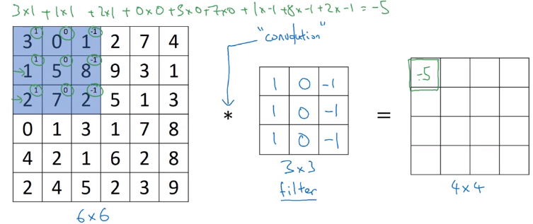

# Convolutional Neural Networks

Computer vision has been advancing rapidly due to Deep Learning.

Examples:

* Self-driving cars
* Facial recognition

DL is even enabling new types of artworks to be created.

What's exciting:

1. Rapid advances allow apps to be built which weren't possible a few years ago
1. Computer vision community is very inventive and creative and ideas can be applied in other areas (Andrew did so with speech recognition)

Even if not working on computer vision, the ideas here will be useful for algorithms and architectures.

## Computer vision problems

* Classification / recognition: Eg, Is this a cat or not?
* Object detection: Where are the objects located?
* Neural Style transfer: repainting a content image in the style of a style image

## Limitation of NNs

Given a 1MP image (3,000,000 values with RGB), and a 1,000 neuron first hidden layer, this will require a `(1_000, 3_000_000)` matrix of weights, or 3 billion parameters.

With that many parameters it's difficult to get enough data to prevent overfitting.

With each parameter being say 4 bytes, that would be 12GB required to represent the weights of only the first hidden layer. The compute requirements will also be infeasible.

To be able to work on larger images, implementing the convolution operation is required.

## Convolutions: edge detection example

Research papers sometimes use "kernel" as another name for a filter. $\text{kernel}(x,y)$ denotes the similarity of point $x$ with another given point $y$.

In the (rare) 1-channel input case, terms *filter* and *kernel* are interchangeable.

In the general case, each filter is a collection of kernels - with one kernel for every input channel.

To detect vertical edges, construct a 3x3 filter, and convolve the image with it:

Each element of the convoluted output is the sum of the element-wise multiplication of part of the image with the filter.

In maths the asterisk: $*$ is a standard symbol for convolution.
Python: `conv_forward` or `tf.nn.conv2d`
Keras: `Conv2D`

Why this works:

## More edge detection

Difference between positive edges (light to dark) and negative edges (dark to light).

With the convolution filter as shown above:
* Positive edges (light to dark) will be get a positive number
* Negative edges will get a negative number

The absolute value could be taken if the type of transition is not important. 

There was a fair bit of academic debate about the best numbers to use in convolutional kernels.

Putting more weight in the centre makes edge detection a little more robust (vertical detection examples):

Horizontal edge detection on a chequerboard pattern:

Instead of hand-picking these numbers, the entries of the filter matrix can be treated as parameters of a NN and learned by backpropagation.  This has been one of the most powerful ideas in computer vision.  The goal is: When taking an image and convolving it with the filter parameters, it outputs a good edge detector.

By learning the entries of the filter, it can also learn to detect edges at $45^\circ$ or even $73^\circ$, or other features that we might not even have a name for.

## Padding

When convolving a $n \times n$ image with a $f \times f$ filter, the output will be $ (n-f+1) \times (n-f+1)$.

[Convolution with a non-square kernel](https://stats.stackexchange.com/questions/351115/convolution-with-a-non-square-kernel)

The corollary of this is that if applying convolution multiple times, the output will eventually shrink down to $1 \times 1$.

Also, pixels in the corners will be considered only once, where as pixels in the middle of the image will be considered $f \cdot f$ times. Much of the information in the edges of the image is effectively thrown away or devalued.

So the two issues with conv nets are:
1. Shrinking output
1. Edge information discounting

To work around both of these issues, before applying convolution, pad the image.

Apply padding before applying the convolution operation to fix both of these problems.

By convention, padding is done with $0$s.

When the number of pixels added to an edge pixel is $p$, the output size formula becomes:

Convolving a $(n + 2p) \times (n + 2p) $ image with a $f \times f$ filter, the output will be $ (n + 2p - f+1) \times (n + 2p - f+1)$.

With a padding of 1, the corner pixels now influence 4 output pixels given a $3 \times 3$ filter.

### Padding choices

There are two common choices called *valid* and *same* convolutions.

* *Valid* - no padding, $p = 0$
* *Same*  - pad so that the output size is the same as the output size

Same padding is achieved by solving for $p$ in $(n + 2p - f + 1) = n$:

$p=\dfrac{f-1} 2$

Same padding requires that $f$ is odd, which is almost always the case in computer vision.

If $f$ were even, then asymmetric padding would be required. Also, using an odd $f$ gives a central pixel which by convention denotes the position of the filter. 

## Strided convolutions

So far, we've been using $\text{stride} = s=1$, moving the filter by one pixel each time. Instead, it is 
Instead of moving

Convolving a $n \times n$ image with a $f \times f$ filter with padding $p$ and stride $s$ gives output size:

$ \left(\left\lfloor\dfrac{n + 2p - f} s + 1\right\rfloor\right) \times \left(\left\lfloor\dfrac{n + 2p - f} s + 1\right\rfloor\right)$

The floor operation is needed as the final stride may be outside the bounds of the (padded) image. By convention, the filter must be fully within the (padded) image to produce an output.

### Cross-correlation vs convolution

In a math textbook, before applying the filter, it is flipped - reversed along both rows and columns.

This gives the property of associativity ie: $(A * B) * C = A * (B * C)$.  This is useful for signal processing for example.

What has been illustrated so far is technically called cross-correlation, but in the ML literature it is by convention called the convolution operation.

## Convolutions over volumes

Generally images have 3 channels for RGB, so the convolution filter will also have 3 as the number of channels.  

By convention, the number of channels in the image must match the channels in the filter, allowing for the general case.

To detect vertical edges only in the red channel, set the filter's other channel's entries to $0$.

The output is still 2-D as the sum operation collapses the input channels into a single output channel.

Channels are a “view” of the image as a whole, emphasising some aspects, de-emphasising others.

### Using multiple filters at the same time

Multiple features can be detected at the same time. The channels of the output will equal the number of filters applied.

The terms *depth* and *channels* are used interchangeably in the literature.

Above, a vertical and horizontal filter are applied at the same time.

## Implementing one layer of a CNN

After convolving as described above, a bias term is added to all elements and a non-linearity applied.

The convolution operation is a linear function, similar to $z = Wa + b$:

If a layer has $n$ filters of size $w \times h \times d$, then it has $n(whd + 1)$ parameters. The $+ n$ is because each filter has a single bias (added after the sum of products).

No matter what size the input image is, the number of parameters remains determined by the number of filters and their size. This property helps reduce overfitting. 

## Notation and dimensions

If $l$ is a convolutional layer:
$f^{[l]} = $ filter size
$p^{[l]} = $ padding
$s^{[l]} = $ stride
$n_c^{[l]} = $ channels / # of filters / depth (perhaps more easily denoted $d$)

### Dimensions

##### Input
The input size is: $\ n_h^{[l-1]} \times n_w^{[l-1]} \times n_c^{[l-1]}$.  (It would be cleaner to use $h^{[l-1]} \times w^{[l-1]} \times d^{[l-1]}$.)

##### Weights and biases
Each filter's weights have dimensions: $\ f^{[l]} \times f^{[l]} \times n_c^{[l-1]} $.

All filters weights have dimensions: $\quad f^{[l]} \times f^{[l]} \times n_c^{[l-1]} \times n_c^{[l]}$.

The biases are a vector of dimension: $\ n_c^{[l]}$, later represented as a tensor of dimension $\ 1 \times 1 \times 1 \times  n_c^{[l]}$

##### Output
The output size is: $\ n_h^{[l]} \times n_w^{[l]} \times n_c^{[l]}$.  (It would be cleaner to use $h^{[l]} \times w^{[l]} \times d^{[l]}$), given by: 

$ \left(\left\lfloor\dfrac{h^{[l-1]} + 2p^{[l]} - f^{[l]}} {s^{[l]}} + 1\right\rfloor\right) \times \left(\left\lfloor\dfrac{w^{[l-1]} + 2p^{[l]} - f^{[l]}} {s^{[l]}} + 1\right\rfloor\right) \times \left(\vphantom{\lfloor\dfrac{x^x}{x^x} } d^{[l]} = \text{# of filters}\right)$

The vectorised output is: $\ m \times n_h^{[l]} \times n_w^{[l]} \times n_c^{[l]}$.

## Simple CNN example
Andrew says that this would be a pretty typical example of a convnet (but the image is tiny):

Note that the size decreases while the number of channels increases.

The final convolutional layer is unrolled into a vector and fed to a logistic or softmax unit.

### Types of layers

* Convolutional
* Pooling
* Fully-connected

It's possible to design a convnet with only convolutional layers, but most will have some pooling and fully connected layers, too.

## Pooling layers

Pooling layers:

* Reduce the size of the representation
* Speed up computation
* Make feature detection more robust

Pooling is done considering each input channel separately.

### Max pooling

Intuition: if a feature is detected somewhere in the pooling region, there will be a high number. The likelihood of the feature will be preserved by taking the maximum of the region.

### Average Pooling

The average of the filter region is used instead of the maximum.

These days, max pooling is used much more often.

Exception: Sometimes very deep in a NN average pooling may be used to collapse a represention from say $ 7 \times 7 \times 1000$ to $ 1 \times 1 \times 1000$. 

### Pooling summary

#### Hyperparameters:

* $f =$ Filter size
* $s =$ Stride 
* Reduction funtion: $\text{max}$ or $\text{avg}$

Common values are $f=2, s=2$. This will reduce the hight and width by a factor of 2.  Andrew has also seen $f=3, s=2$.

Padding is generally not needed (exception: next week).

#### Parameters
There are no parameters to learn via gradient descent. Hyperparameters are set by hand or perhaps by cross-validation.

#### Dimensions
With multiple channels, max pooling is performed independently per channel. The number of output channels is therefore the same as the input.

The same dimensions formulae apply as for convolution.

#### Layers
In the literature, conventions are inconsistent as to what is deemed a "layer".

* Usually, the number of layers is given by those which have parameters / weights, so pooling layers aren't included.
* Sometimes, the pooling layers are also included in the layer count.

## CNN example

The parameter choices here are inspred by LeNet-5 created by Yaan LeCunn "many years ago".

### Architecture

Layer 1 = 6 filters, Layer 2 = 16 filters.

FC3 is 120 neurons fully connected to the unrolled 400 of POOL2.

The architecture CONV POOL CONV POOL FC FC FC SOFTMAX is a very common architecture for convnets.

### Sizes

* The POOL layers don't have any parameters.
* The CONV layers $n_h$ and $n_w$ decrease with depth, while $n_c$ increases.
* The CONV layers have a small number of parameters compared with the FC layers.
* The activation size generally decreases with depth.

| Layer | # of parameters | Explanation |
|-------|-----------------|--------------
| CONV1 | 608 |  $((5 \times 5 \times 3) \times 8) + 8$
| POOL1 | 0
| CONV2 | 3216 | $((5 \times 5 \times 8) \times 16) + 16$
| POOL2 | 0
| FC3 |   48,120 | (400 weights + 1 bias) * 120
| FC4 |   10,164 | (120 weights + 1 bias) * 84
| SOFTMAX | 850 | (84 weights + 1 bias) * 10

## Why Convolutions?

There are two main reasons that convolutional layers have fewer parameters: 

1. Parameter sharing
2. Sparsity of connections

### Comparison with fully connected layers

Errata: above the 156 should be $(5 \times 5 \times 3 + 1) \times 6 = 456$.

Even for the 32 x 32 image above, the number of weights is huge.

##### Summary
Fully connected layer: $n^{[L]} \times (n^{[L-1]} + 1)$
Convolution layer: there's only ${(f^{[L]}}^2 \cdot n_c^{[L-1]} + 1) \cdot n_c^{[L]}$

In the convolutional case, $f$ and $n_c$ are much smaller than say a 3MP image x 3 RGB channels fully connected with a ~3000 neuron 1st hidden layer.

### Parameter sharing

A feature detector that is useful in one part of an image is probably useful in another part of the image. Eg, a vertical edge detector's weights can be used in many positions. The same holds true for higher level features.

### Sparsity of connections

In each layer, the output depends only on a small number of inputs (determined by the filter size).

Due to sparsity of connections, a CNN has a much fewer parameters, allowing it to be trained on smaller training sets, and making it less prone to be overfitting. 

#### Translation invariance

Translation invariance means that a system produces the same response when each point/pixel in the image has been moved the same amount in the same direction.

CNNs are good at capturing translation invariance due to the convolutional process.

Equivariance means that the system works equally well across positions, but its response shifts with the position of the target.

## Putting it together

Compute Loss function as seen previously and use Adam or gradient descent to optimize.

## Tensorflow

In `tf.contrib.layers.fully_connected`, the fully connected layer automatically initializes weights in the graph and keeps on training them as you train the model. Hence, you did not need to initialize those weights when initializing the parameters. 

In TensorFlow, the final softmax and cost function are lumped together into a single function, which you'll call in a different function when computing the cost. 
