# CNN Case Studies

## Why look at case studies?

The best way to gain intuition about what works in CNNs is to look at examples of what worked.

A CNN architecture that works well on one task often works well on other tasks.

## Outline

* Classic effective networks:
  * LeNet-5 (1980s)
  * AlexNet
  * VGG

* ResNet (Residual Network) - very deep - 152 layers
* Inception 

## Classic Networks

General observations:

* $n_h$ and $n_w$ decrease (moving toward the output)
* $n_c$ increases (in the same direction)

Common architecture is:

CONV, POOL, CONV, POOL, FC, FC, OUTPUT

### LeNet-5 (Digit classifier, 1998)

[Y. LeCun, L. Bottou, Y. Bengio, P. Haffner, 1998. Gradient-Based Learning Applied to Document Recognition](http://vision.stanford.edu/cs598_spring07/papers/Lecun98.pdf)

This is one of the hardest papers to read. The architecture is described in section II and results in s. III. The later sections describe the Graph Transformer Network which isn't widely used today.

LeCun et al 1998-Gradient-Based Learning Applied to Document Recognition](http://vision.stanford.edu/cs598_spring07/papers/Lecun98.pdf)

LeNet-5 was trained on greyscale images, so only 1 channel in the input.

When LeNet-5 was written average pooling was much more common. A modern variant would probably use max pooling instead.

In 1998, people used valid rather than same padding which is why the size shrinks every time.

The output layer was a single neuron which represented the 10 possible values for each digit. A modern version would use a softmax layer with 10 neurons in the output layer.

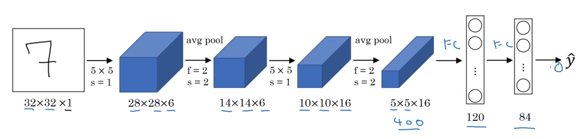

LeNet-5 had about 60,000 parameters, whereas these days one often sees networks with 10M to 100M parameters (1,000 times bigger).

Other things that would be done differently today:

* Sigmoid / tanh was used instead of ReLU
* Filter dimensions were not $f^{[l]} \times f^{[l]} \times n_c^{[l-1]} \times n_c^{[l]}$
  * To save on computation, filters didn't have a kernel for each of the $n^{[l-1]}_c$ input channels.
  * Rather, there was a complicated system where different kernels would look at different input channels.
* Non-linearity after pooling - this wouldn't be done today.

### AlexNet (ImageNET, 2012)

[2012 ImageNet Classification with Deep Convolutional Neural Networks](https://papers.nips.cc/paper/4824-imagenet-classification-with-deep-convolutional-neural-networks.pdf) also [slideshow](http://www.image-net.org/challenges/LSVRC/2012/supervision.pdf) - Alex Krizhevsky, Ilya Sutskever, Geoffrey E. Hinton.

This is one of the easier papers to read. The results convinced the computer vision community to take a serious look at deep learning.  Deep learning then was taken up by other domains.

The paper describes input images of 224 x 224 x 3 but the numbers only make sense if they are 227 x 227 x 3.

* There are many similarites to LeNet-5, but *much* bigger (60,000 vs 60,000,000 parameters)
* ReLU activation function

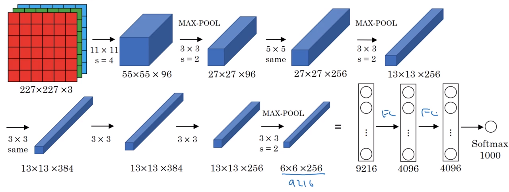

Historical notes:
* GPUs were slower, so there was a complicated way of training on 2 GPUs, with half of each layer compute by each.
* Additional layer called *Local Response Normalisation* (LRN).  LRN looks at a single $(h, w)$ position and normalises across all $c$ channels. The motivation was not having too many neurons with a very high activation for each position.  Subsequently, many researchers have found that this doesn't help that much.  

### VGG-16 

There are 16 layers which have weights, totalling about 138M parameters.

[Very Deep Convolutional Networks for Large-Scale Image Recognition](https://arxiv.org/pdf/1409.1556.pdf). Read after AlexNet.

Compared to the many hyperparameters (filter sizes, strides) of AlexNet, VGG-16 used a much simpler, more uniform and systematic network with:

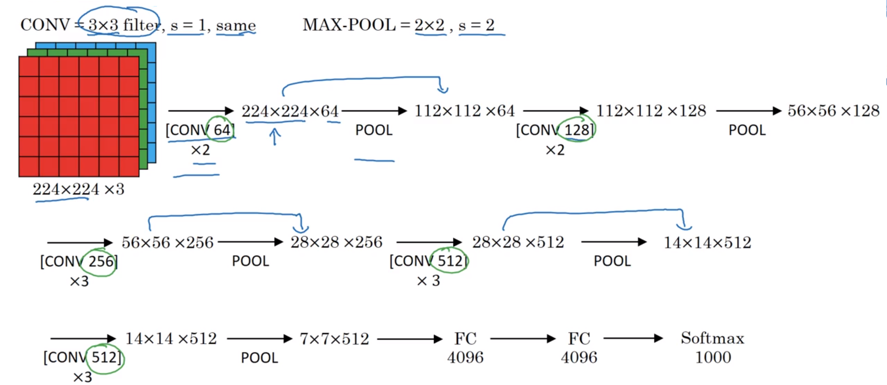

* Conv layers: 3x3 kernels, stride=1, padding=same
  * Channels double on each set of convolutions (except the last)
* Max Pooling layers: 2x2 window, stride=2
  * $h$ and $w$ halve from each pooling layer

VGG-19 was an even larger version in the same paper.  VGG-16 performs almost as well as VGG-19 so many people use the simpler version.

### Residual Neural Networks (ResNets)

Very deep NNs are difficult to train because of vanishing and exploding gradients. Here we learn about *skip connections* which allow us to feed the activation of one layer deeper to another deeper in the network.  This allows us to train very deep networks, sometimes of over 100 layers.

[2015 He et al, Deep Residual Learning for Image Recognition](https://arxiv.org/pdf/1512.03385)

The "main path" is the usual $z^{[l]} = W^{[l]}a^{[l-1]} + b^{[l]}$ then $g(z^{[l]})$ applied layer by layer. 

In a "short cut", we add $a^{[l]}$ to $z^{[l+2]}$ deeper in the network, before the non-linearity, ie, $a^{[l+2]} = g(z^{l+2} + a^{[l]})$.

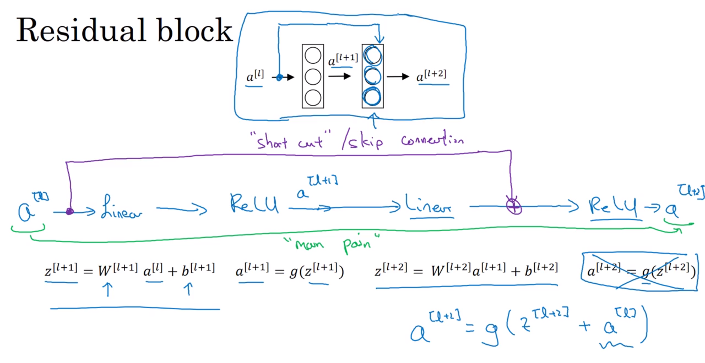

The addition of a short-cut activation makes for a residual block.  The top of the next slide shows 5 residual blocks.

On a very deep plain network, the training the error will start to rise with additional layers (blue line):

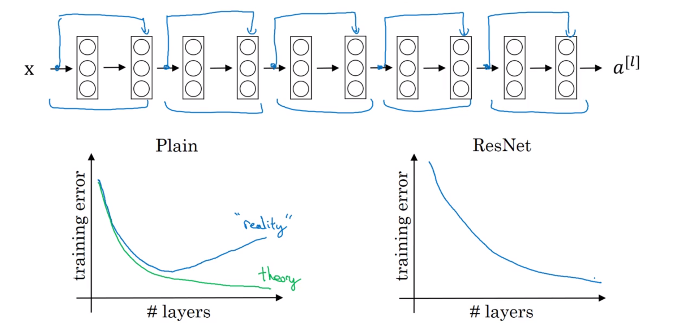

Adding skip connections / residual blocks has the performance be more like the expected theoretical (constantly decreasing cost) green line above.

With ResNets, the training error can still decrease with over 1,000 layers (but these are not used in practice yet) without appreciable loss of performance.

### Why do ResNets work so well?

Why do ResNets allow for deeper networks, solving the vanishing / exploding gradient problem?

L2 regularisation or weight decay will tend to shrink the value of $W^{[l+2]}$ (and possibly $b^{[l+2]}$ if applied there, too).

Assuming ReLU and $W^{[l+2]} = b^{[l+2]} = 0$, then $g(a^{[l]}) = a^{[l]}$ as ReLU is the identity function when the input is $\ge 0$.

This shows that the identity function is easy for a residual block to learn. Adding an additional 2 layers to a network doesn't really hurt the network's ability to do as well as the original "Big NN" case above.

Given that performance won't be hurt when adding residual blocks, if they can learn something useful then adding them will be overall positive. At worst they learn the identity function - there is room for greater upside without penalty.

In plain nets, its difficult for the network to learn parameters which implement even the identity function, which is why layers can make the result worse.

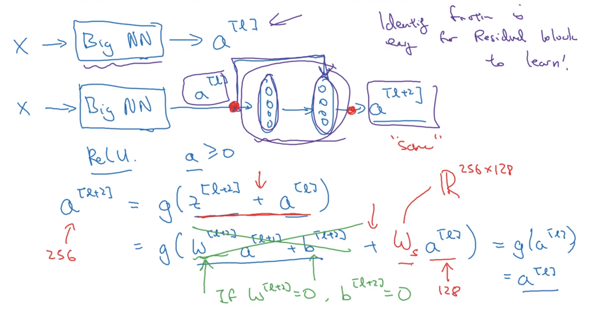

In $a^{[l+2]} = g(z^{l+2} + a^{[l]})$ we assume that the two added terms have the same dimensions. *Same* convolutions are often used to ensure this.

Should the dimensions be different, a matrix $W_s$ above can be multiplied to make the dimensions the same. $W_s$ could be a matrix of parameters to be learned, or a fixed matrix implementing zero padding. 

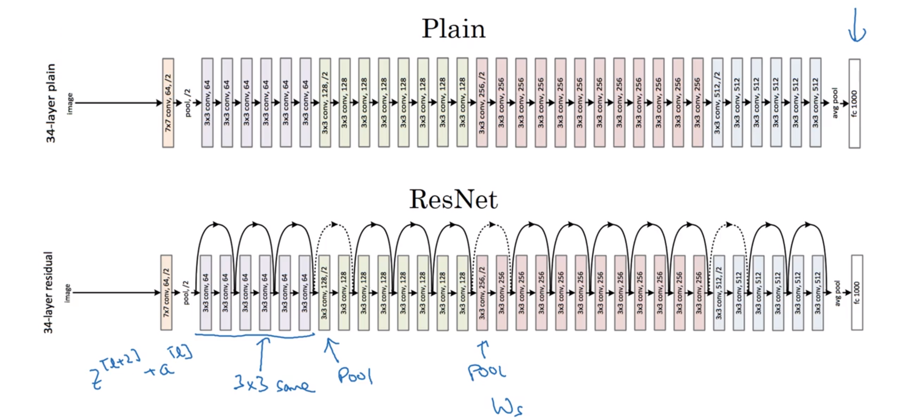

Above, the solid arrows show activations with the same dimension. Dotted arrows use $W_s$ matrices because of the pool-like layers.

## Network in Network and 1x1 convolutions

[2013 Lin Network In Network](https://arxiv.org/pdf/1312.4400)

Even though the details of the architecture aren't used widely, the idea of a 1x1 convolution as influenced many other architectures, including Inception (up next).

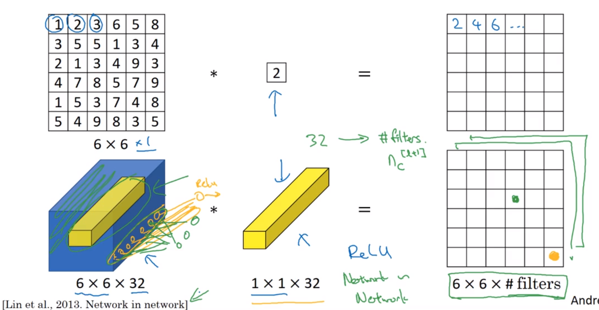

This is similar to a fully connected neural network:

Each element in a Network in Network output is like a single neuron which multiplies a slice in a single $w,h$ position element-wise by the parameters of the filter, then applies ReLU. This is similar to $z=wx$.

Each filters will have a different $w$, much like each neuron has its own $w$ which is element-wise multiplied by its input, summed, then has a non-linearity applied.

Using 1x1 convolutions allows shrinking (or growing) the number of channels, thereby saving computation in some networks. The filter size is $1 \times 1 \times n_{c_{in}}$. The number of such filters gives ${n_c}_{out}$ output channels.

Even keeping the number of channels the same, a 1x1 convolution will add a non-linearity, allowing the network to learn more complex functions. 

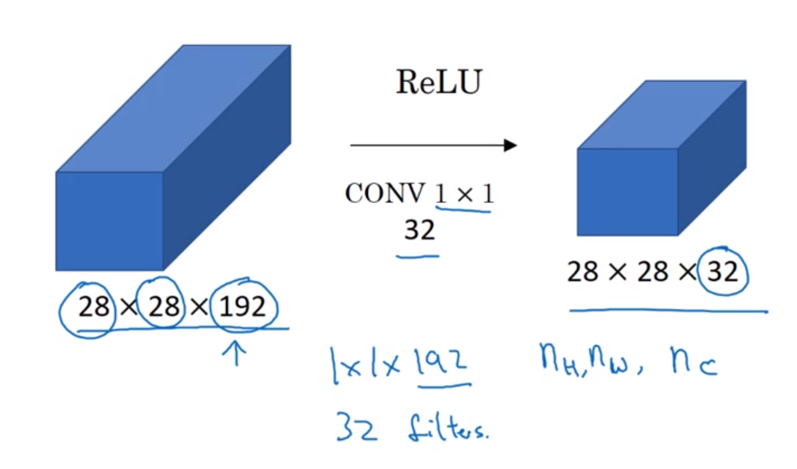

## Inception Network Motivation

[2014 Szegedy Going Deeper with Convolutions](https://arxiv.org/pdf/1409.4842)

Instead of picking a 1x1, 3x3 or 5x5 filter, or deciding between a pooling layer or not, do them all, and concatenate them. Let the network learn the parameters it wants to use whatever combinations are best.

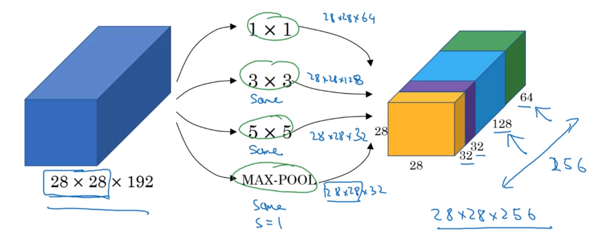

For max pooling to output the same shape as the input, same padding and a stride of 1 is needed. 

### Inception computational cost

This was the purple slice in the previous slide.

The total number of multiplications and additions in an output volume is: (# of output values) x (filter size x # of filters).  $\Big(n_w^{[l]} \times n_h^{[l]} \times n_c^{[l]} \Big) \times \Big(n_f^{[l]} \times n_f^{[l]} \times n_c^{[l-1]} \Big)$.

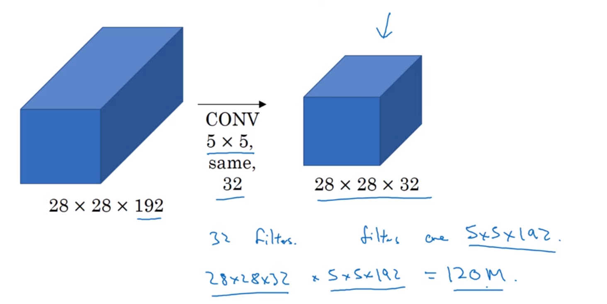
120,000,000 operations is still computationally expensive on modern computers. 

Here, 16 filters of 1x1x192 reduce the input volume as an intermediate step:

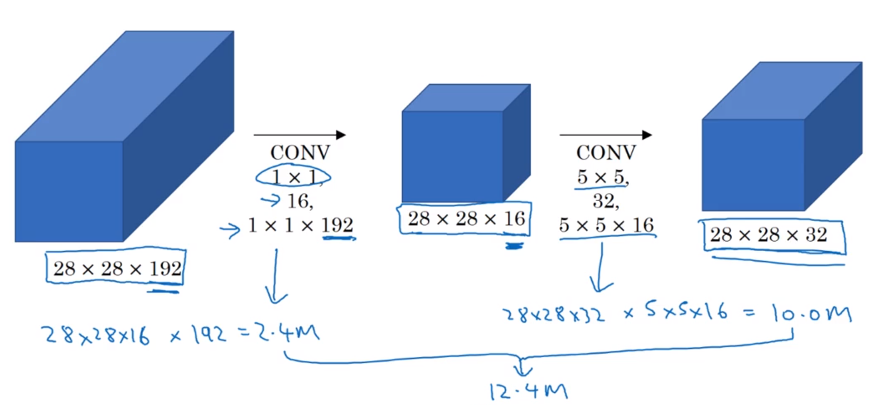

This is sometimes called a *bottleneck layer*.

Here, there are 12.4M operations vs 120M calculated without a bottleneck layer.

Within reason, shrinking down an input with a bottleneck layer doesn't seem to affect performance, but saves a lot of computation.

## Inception Network (aka GoogLeNet)

Based on the "we need to go deeper" from the Inception movie (the meme was referenced in the paper)

The inception network is based on the following architecture repeated multiple times:

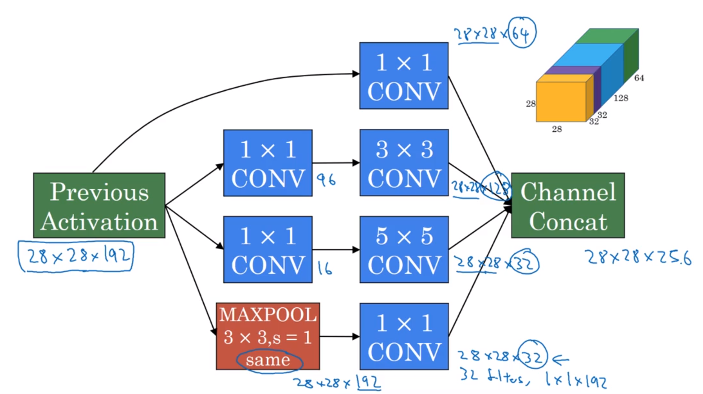

The maxpool is passed through a 1x1 conv so as to be not too heavily represented in the output.

Before some of the blocks is a maxpool to reduce the $h, w$ size of the input. 

As I see it, the first three 1x1 Conv blocks are duplicates of each other.

There are side branches which take a hidden layer and use that to make a prediction. This is done via an average pool, 1x1 Conv, 2x FC layer and then softmax.

The side branches help ensure that the features of the hidden layers are useful in predicting the final classification. They also appear to have a regularising effect, preventing overfitting. 

There are multiple versions, (up to v4), and a version combined with ResNet skip connections which sometimes works even better.

# Practical advice for implementing ConvNets

## Using open-source implementations

Many of the networks above are difficult to replicate due to tuning of the hyperparameters (eg learning rate decay) that make a difference to the performance. It's hard for researchers to duplicate results just from reading research papers. Luckily the source of many implementations is available on GitHub. 

Often pre-trained parameters are also available, saving much time and cost when using transfer learning. 

## Transfer learning

The computer vision research community has been pretty good at posting lots of datasets online. ImageNet, MScoco, pascal.

Training can take weeks or months on multiple GPUs and selecting the right hyperparameters takes time.  The weights calculated in someone else's training can be used a starting point for my own network with transfer learning.

Assume I want to be able to detect photos containing my cats Tigger, Misty or Neither.

Case (1): I won't have many pictures of them, so it's a small training set. 

Download the code and weights for an CNN. Many have been trained on ImageNet which has 1000 classes. 

Replace the final softmax layer with one of my own with the 3 classes.  Consider all the previous layers of the network as frozen.  Train only the parameters associated with the softmax layer. 

The output of the final frozen layer is constant given each input picture. It will save time to pre-calculate all the possible outputs from this function so that all the non-output frozen layers activations don't need to be needlessly calculated. 

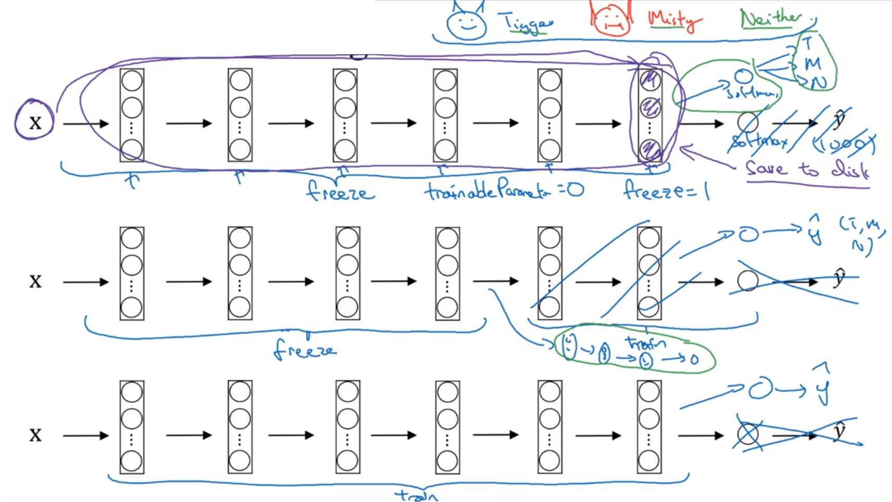

Case (2): If there is a larger training set, then freeze fewer layers and train more layers. There are two options:

1. Take the non-frozen layer's weights as a starting point and continue on with gradient descent
1. Replace the last non-frozen layers and learn the weights from scratch

Case (3): with a ton of data, replace only the output softmax and then retrain all the layers of the network using the pre-trained weights as initialisation.

## Data Augmentation

Computer vision performance almost always improves with more data.  Not true for all applications of machine learning, but true for computer vision. 

Hyperparameters:

* How much colour shifting
* Random cropping parameters

Augmentation helps when learning from scratch or with transfer learning.

Common methods:

* Mirroring
* Random cropping (as long as crop size is a relatively large subset of the original)

These methods are used a bit less in practice:

* Rotation
* Shearing
* Local warping 

**Colour shifting** (eg, adding to R and G channels, subtracting from B).

The shift values of RGB are drawn from some probability distribution.  The motivation is if the lighting is different it could easily change the colour of an image. 

One of the way to sample RGB values is via PCA. The details are given in the AlexNet paper, and it's sometimes called PCA colour augmentation. If an image is mostly purple (R and B values), then this method will change the R and B values more than the G ones, keeping the overall tint of the image the same. 

### Implementing distortions during training

Some CPU threads will:
* Load images
* Augment / distort the data (make mini-batches)

The mini-batches are then passed to other threads for training, be it CPU or GPU.  

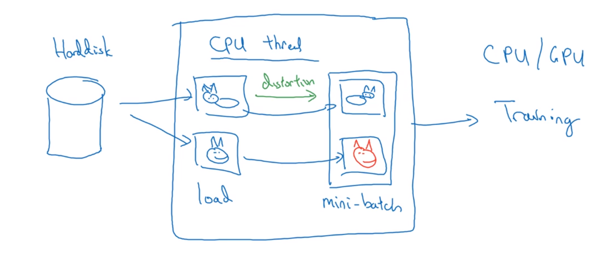

## State of Computer Vision

There are a few things unique when applying deep learning to computer vision.  

With lots of data, one can use simpler algorithms and let the network find out the features. 

With scarce data, there are more hand-engineered features or "hacks".

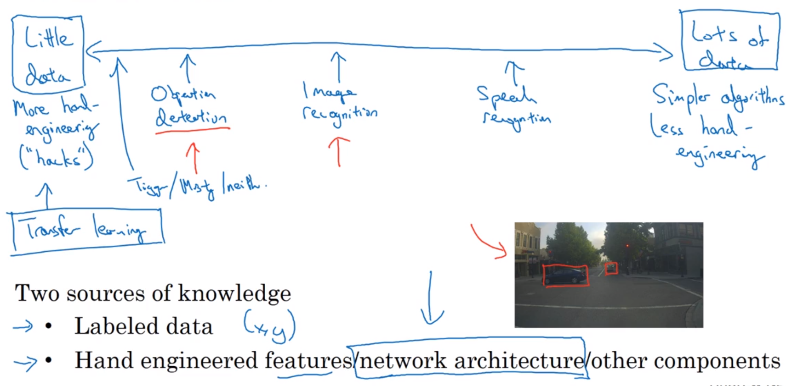

Knowledge can come from the labels, or from the hand-engineered features, network architecture or other components.

Because of the relative lack of data, computer vision has up until now relied on more hand-engineering and complex network architectures.  There are more complex hyperparameter choices than in other deep learning fields. 

Hand-engineering is very difficult and requires a lot of skill and insight.

If there is a lot of data, Andrew wouldn't spend time hand-engineering, but instead building up the learning system. 

## Tips for benchmarks and winning competitions

If one does well on a benchmark, it's easier to get a paper published.

Of course, it's possible to overfit to a benchmark and do things that wouldn't be done in a production system.  Here are some of those things:

* Ensembling
  - Randomly initialise and train several (3 to 15) networks independently, then average their predictions.
  - This may give a 1% or 2% improvement, but at the expense of a 3 to 15 increase in runtime and computer memory.
* Multi-crop at test time
  - Run classifier on multiple versions of test images and average results
  - A form of applying data augmentation to the test image
  - The "10-crop" applies a central and four corner crops to the original and mirrored image
  - Increases runtime but not memory usage.
