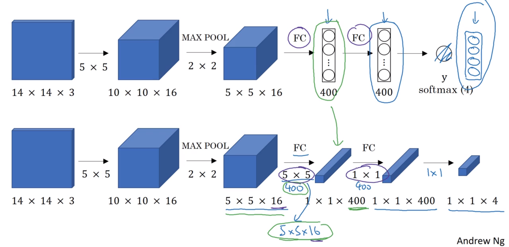

# Detection Algorithms
Object detection is now working far better than a few years ago. 

## Object localisation
Classification with localisation not only classifies an image, but puts a bounding box on where the object is located in the image.

Detection is classifying and localising multiple objects in an image.

### Defining output label $\vec y$
In localisation, apart from outputting a softmax classifier, we also want to output the bounding box parameterised by $b_x, b_y, b_h,$ and $b_w$.

The upper left of an image can be considered $(0, 0)$ and the lower right $(1, 1)$.

The *mid-point* of an object is denoted $(b_x, b_y)$.

Also output $P_C$, or the probability that one of the non-background objects is present.

In the above slide note the Loss function definition.

While the squared error loss is used above, in practice you'd probably use:
* $\log$ likelihood loss for $C_1, C_2, C_3$ with a softmax output
* Squared error or similar for the bounding box coordinates
* Logistic regression loss for $P_C$ (though squared error would probably work ok)

## Landmark detection
Instead of outputting a bounding box, individual $(x, y)$ coordinates could be output for each landmark, eg the corner of an eye, or middle of top lip.

This is a basic building block for recognising emotions from faces, and also for things like augmented reality of drawing a crown on someone's head.

Pose detection is also possible by outputting landmarks representing the joints of the body.

## Object detection
ConvNet with sliding windows detection algorithm:

1. First create closely cropped images of the classes to detect.
1. Train a ConvNet to accurately predict the classes of the images
1. Predict for each small sliding window position in the main image
1. Repeat predictions with a larger window size
1. Repeat again with an even larger window size

Huge disadvantage: large computational cost of making so many predictions for each window size and stride position.

Using a coarser stride will reduce computation but also reduce accuracy.

First create closely cropped images of the classes to detect.

Before the rise of NNs, people used a simple linear classifiers over hand-engineered features to perform object detection. Because each classifier was cheap to compute (being linear), sliding windows detection was feasible.

With ConvNets, running a single classification task is much more expensive, and using sliding windows is indefeasibly slow.

Unless using a fine granularity (small stride), the accuracy also isn't very good.

Luckily, the sliding windows object detector can be implemented convolutionally.

## Convolutional implementation of sliding windows

Fully-connected layers can be transformed into convolutional layers:

The 400 neurons are transformed into 400 layers, each of which take the entire input volume as its filter size.

Assume a ConvNet sliding window 14 x 14 x 3, with 16 x 16 x 3 images. There would be 4 sliding window positions, a huge overlap and many duplicated calculations.

The convolutional implementation of sliding windows allows the 4 positions to share the computation:

Run analogous ConvNet operations on the larger input. Each of the 4 output positions gives the same output as running the entire convolution on each of the 4 corresponding window positions.

The window stride of 2 is defined by the maxpool using a 2 x 2 window.

This technique ensures no duplicated calculations.

[ 2013-12-21 OverFeat: Integrated Recognition, Localization and Detection using Convolutional Networks](https://arxiv.org/abs/1312.6229) (Pierre Sermanet, David Eigen, Xiang Zhang, Michael Mathieu, Rob Fergus, Yann LeCun)

## Bounding box predictions - YOLO
The convolutional implementation of sliding windows may still not be very accurate depending on the sliding window stride.

[ 2015-06-08 You Only Look Once: Unified, Real-Time Object Detection](https://arxiv.org/abs/1506.02640) (Joseph Redmon, Santosh Divvala, Ross Girshick, Ali Farhadi)
This is one of the harder papers to read - Ng had to ask his friends for help.

YOLO will output one bounding box per grid cell (limited to one object per cell).  This is a combination of multiple object localisations and a single convolutional implementation. Because this is a convolutional implementation it runs fast enough for realtime video object detection.

The cell with the centre point of the object is deemed to contain it.  When implementing, a 19 x 19 grid would reduce the chance that the midpoint of two objects falls in the same cell.

Each cell has an 8-element $y$ vector, so the target output here is 3 x 3 x 8.  Choose the network architecture so that the output maps to a 3 x 3 x 8 output volume, with training data to match the output volume.

### Specifying bounding boxes
Instead of the upper left of an image can be considered $(0, 0)$ and the lower right $(1, 1)$, the cell corners are used instead.

By definition, 1 is the height/width of a cell, and the $b_h$ or $b_w$ of a bounding box could be larger than 1 if an object spans multiple cells.

The paper has more advanced parameterisations like sigmoid to ensure that the center point values are in the range $[0, 1]$, and exponentiation on the height and width outputs to ensure non negative values.

## Intersection over Union (IoU)

How do you tell if your object detection is working well?

Intersection over union is used to evaluate the object detection, as well as (next section) adding another component to object detection to make it work even better.

An IoU of 0.5 or greater is used by convention to evaluate if the predicted bounding box is correct.

The higher the IoU, the more accurate the bounding box. IoU < 0.5 is very uncommon.

## Non-max supression

One of the problems with object detection as learned so far is that an object may be detected more than once.  Non-max supression is a way of ensuring that an object is detected only once.

If there is a large object which spans many small cells, then many cells may think they have the midpoint of the object inside them.

### Non-max supression algorithm

For each of the output classes:
1. Get the probabilities associated with each of the detections: $P_C \times C_n$ (where $n$ is the class of the object)
1. Discard all bounding boxes where $P_{C_n} \le 0.6$
1. While there are remaining boxes:
  1. Pick the highest probability and output it as a detection
  1. Discard any remaining box having IoU $ \ge 0.5$ with that detection

This suppresses nearby overlapping detections that are non-maximal.

## Anchor boxes

If there are objects with different bounding box shapes, eg a person (tall) vs a car (wide), then anchor boxes can allow the learning algorithm to specialise in its detection shapes.

Anchor boxes allow each cell to detect more than one object.

The object is assigned to the anchor box with the highest IoU.

This algorithm doesn't handle the cases very well where:

* There are more objects in the grid cell than there are anchor boxes
* There are two objects in the grid cell with the same anchor box shape

In these cases, implement a default tie-breaker.  However, if there are sufficient grid cells, the likelihood of two objects' centre points sharing the same cell will be low.

K-means algorithm can be used to group the bounding box shapes from the multiple different output classes.  5 or more anchor box shapes may be used.

## YOLO algorithm wrap-up

Generating output labels (both training and predictions):

The dimension 8 is 5 ($ P_C, b_x, b_y, b_h, b_w$) plus the 3 classes being detected.

A more realistic output volume would be 19 x 19 x 40 (5 anchor boxes x 8)

Assuming anchor box 2 is a wide shape (purple pen above), then the car will have the higher IoU with this anchor box.

Get all anchored bounding boxes from all cells and run the non-max suppression algorithm.

## Region proposals

[2013-11-11 Rich feature hierarchies for accurate object detection and semantic segmentation](https://arxiv.org/abs/1311.2524) | Ross Girshick, Jeff Donahue, Trevor Darrell, Jitendra Malik

Andrew uses the region proposal algorithms a bit less often than YOLO.

R-CNN means Regions with Convolutional Neural Networks.

This tries to pick only interesting regions to run the ConvNet classifier on.

A segmentation algorithm figures out what could be objects. Generally about 2000 blobs are returned as bounding boxes upon which to run classification. This would require about the same number of predictions as a 19 x 19 x 5 (anchor boxes) = 1805 YOLO arrangement.

* R-CNN doesn't just trust the bounding box it was given by the segmentation algorithm, it detects a more accurate one.  One downside to R-CNN is that it is quite slow.
* Fast R-CNN (Girshick 2015) uses a convolutional implementation of sliding windows to classify all the proposed regions.  The clusting step to propose the regions is still quite slow.
* Faster R-CNN (Ren et al, 2016) uses a CNN to propose regions

Ng says that Faster R-CNN implementations are still quite a bit slower than YOLO.

He believes that not needing 2 steps for region proposal then classifiying seems like a more promising direction in the long term.

## YOLO assignment learnings

* Anchor boxes are defined by a height and width only.
