# Face recognition

## What is face recognition?

Liveness dectection is important so that a photograph is not recognised as a face.

Face verification vs recognition

Verification ($1:1$ problem: Does the face match the claim)
* Input = Image *and* name/ID
* Output = Match / No match

Recognition ($1:K$ problem)
* Database of $K$ persons
* Input = image *only*
* Output = ID of recognised person (or "unrecognised")

Recognition is harder. Assume a 1% error in verification, so 1 in 100 will be in error (not too bad). But with $K=100$, applying the same system there will now be 100x the chance of making a mistake. So instead of 99% accuracy, 99.9% or higher may be needed for good accuracy with 100 people.

We start with face verification, and then can use the same system for recognition if the accuracy is high enough.

## One shot learning

Recognition of a face needs to be possible given a single example of the person's face.

Historically, deep learning algorithms don't work well with only one training example.

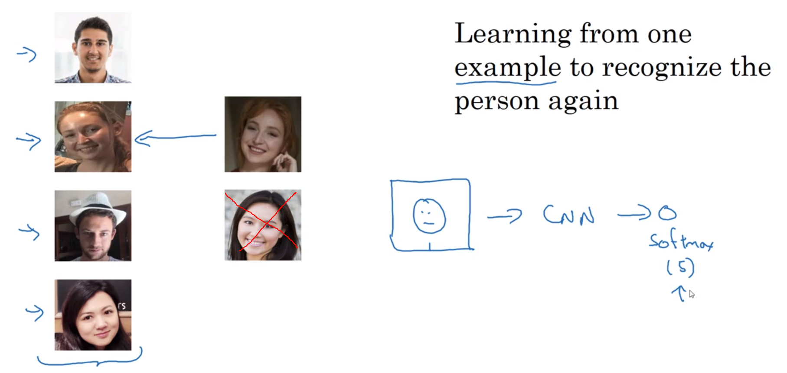
One approach (above) would be to have a CNN output 5 labels (4 employees + unknown), but:

* There is not enough data to train a robust network for this task
* If a new person joins, the network would need to be retrained

Instead, a *similarity function* is learned:

$d(\rm{img_1}, \rm{img_2})$ = degree of difference between two images

Given two photos of the same person, $d$ should be small, and large with photos of two different people.

Given some hyperparameter $\tau$ (tau), if

$d(\rm{img_1}, \rm{img_2}) \le \tau$

then the images are deemed to be of the same person.

This is the verification case.

For recognition, compare the presented image with all images in the database.

## Siamese Network

A Siamese network can be used to learn the difference function $d$.

Instead of taking the final softmax, we instead look at the layer of 128 neurons, representing the "encoding of $x^{(1)}$", or $f(x^{(1)})$. 

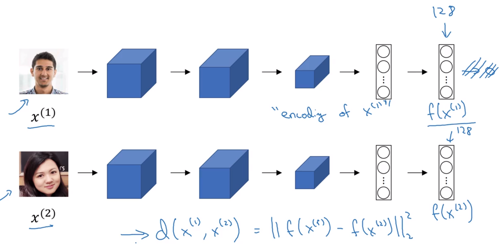

[Taigman et al, 2014. DeepFace: Closing the Gap to Human-Level Performance in Face Verification](https://www.cs.toronto.edu/~ranzato/publications/taigman_cvpr14.pdf)

$d$ is the norm of the difference between two encodings.

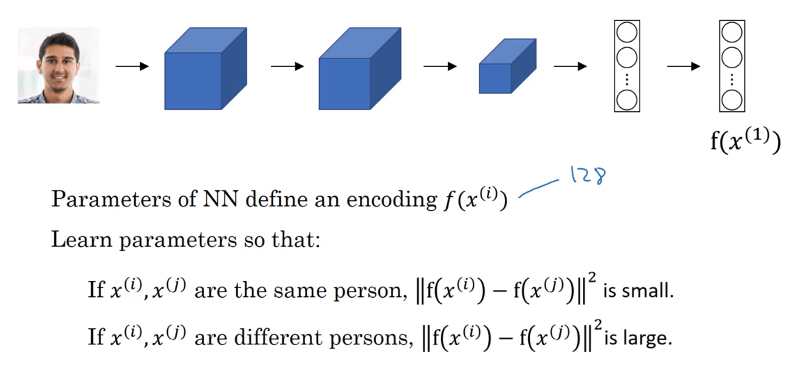

## Triplet loss function

To learn the parameters which satisfy the above slide, do gradient descent on the triplet loss function.

There is one basis or "anchor" image that is compared against a similar image ("positive") and a dissimilar image ("negative")

[Schroff et al 2015. FaceNet: A Unified Embedding for Face Recognition and Clustering](https://arxiv.org/abs/1503.03832)

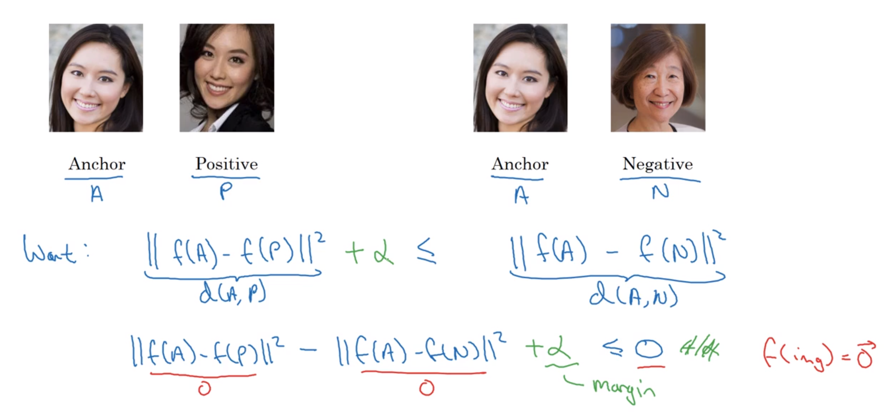

$f=0$ (or any other constant) would suffice the equations above (red). To ensure $d(\rm{A,N})$ and $d(\rm{A,P})$ are not equal or similar, we require that the difference is more than the margin hyperparameter $\alpha$.

### Loss and cost functions

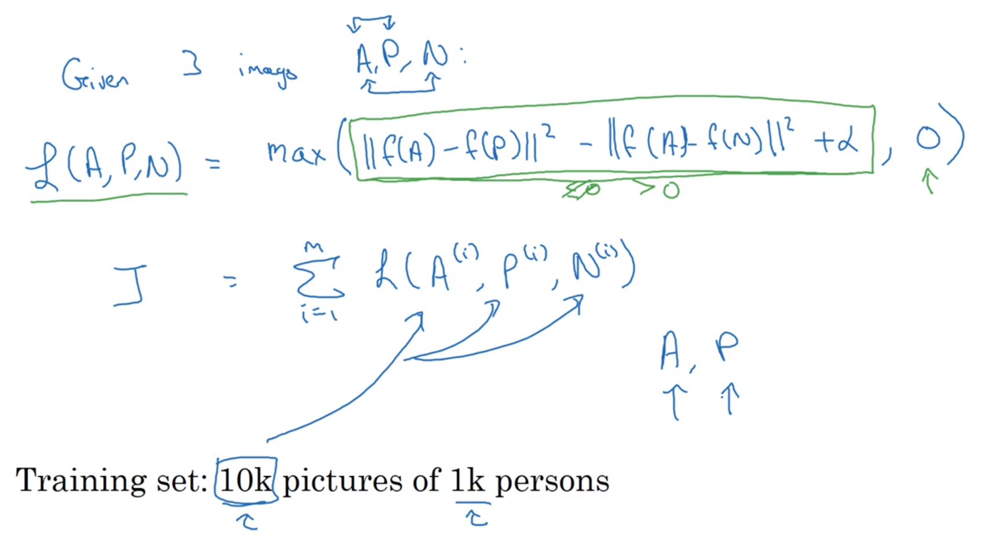

The loss will never be negative because of the $\rm{max}$:

$$\rm{max}(\|d(\rm{A,N})\|_2^2 + \|d(\rm{A,P})\|_2^2 + \alpha, 0)$$

However if the 1st parameter is greater than 0, it will be the loss.

To have an Anchor and Positive, the training set requires multiple pictures of some people.

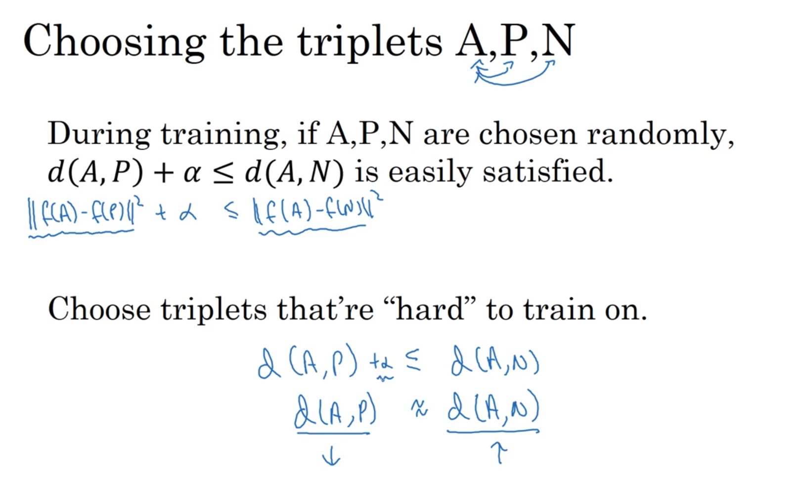

With randomly chosen people, it's very easy to satisfy: $\|d(\rm{A,N})\|_2^2 + \|d(\rm{A,P})\|_2^2 + \alpha \le 0$.

Choosing "hard" or very similar triplets increases the computational efficiency of the learning algorithm.

Commercial face recognitions systems are trained on datsets commonly greater than 1,000,000 images, sometimes > 10,000,000 images, and sometimes even > 100,000,000. These are very large datasets by today's standards, and are not easy to acquire. Fortunately, companies have trained networks on these huge datasets and have shared their parameters.

## Binary classification of faces

Using a Siamese network, get the output vector for two images, and then feed those output vectors to a logistic regression unit.

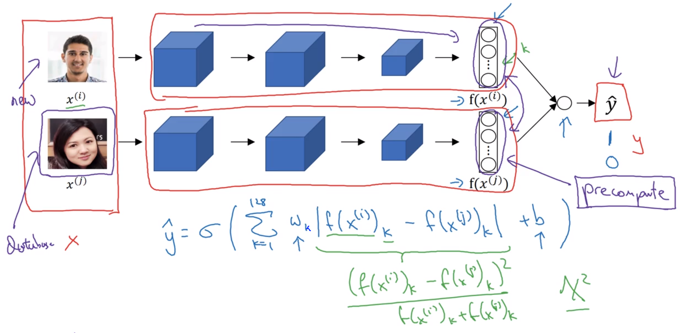

The second formula (green pen) is called the $\chi^2$ or "Chi squared similarity". This and other variations are described in the DeepFace paper (link above).

Note that each $w_k$ in the (example above 128-element vector) $w$ and also $b$ are the parameters to be learned.

The database image's encoding can be pre-computed to speed up the validation process.  This also applies to triplet-loss encodings above.

### Binary classification training data setup

Create pairs of images with the target label $1$ where the images are of the same person, and $0$ otherwise.

# Neural Style Transfer

To generate new images, one needs to look at the features extracted by a ConvNet in the shallower and deeper layers.

## What are the layers of a ConvNet learning?

[Zeiler & Fergus, 2013, Visualizing and Understanding Convolutional Networks](https://arxiv.org/abs/1311.2901)

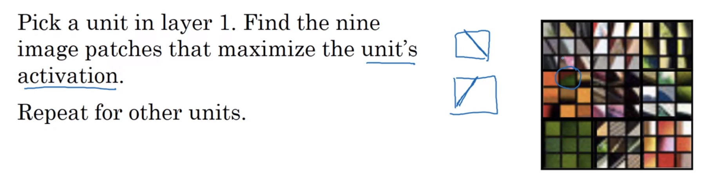

For each unit of interest, find 9 input images that maximise a given hidden unit's activation. (9 units are shown, each with 9 input patches)

The paper has more sophisticated ways of visualising what a hidden unit is learning.

For the first layer, each unit may only "see" a 3x3 grid of pixels, whereas the later layers see more of the input pixels.

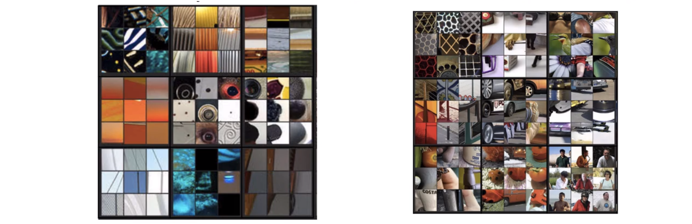

Above: activations of layers 2 and 3

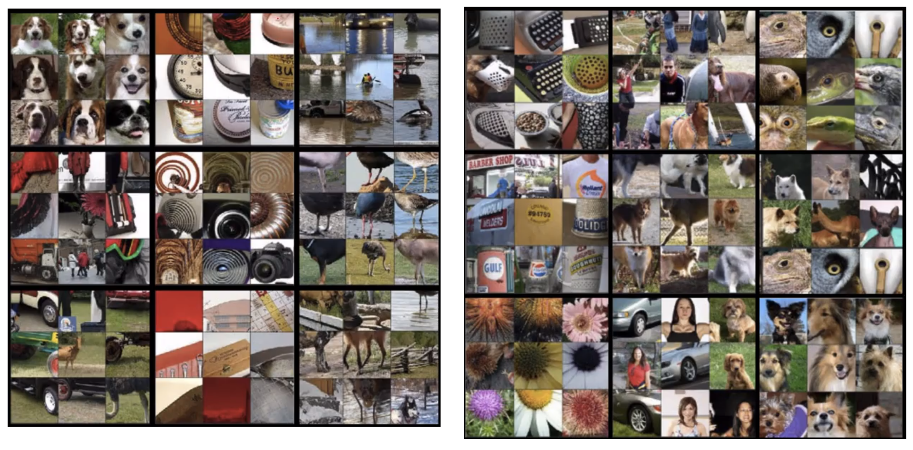

Above: activations of layers 4 and 5

## What is neural style transfer?

[Gatys et al. 2015. A Neural Algorithm of Artistic Style](https://arxiv.org/abs/1508.06576) (Andrew says this paper is quite easy to read)

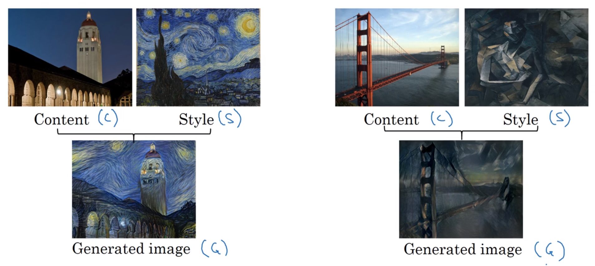

## Cost function for neural style transfer generated images

Cost function:

$$J(G) = \alpha\ J_\rm{content}(C,G) + \beta\ J_\rm{style}(S,G)$$

Where:

* $J_\rm{content}(G,C)$ measures how different the content of $G$ is to $C$.
* $J_\rm{style}(G,S)$ measures how different the content of $G$ is to $S$.

Andrew says that using two hyperparameters ($\alpha$ & $\beta$) seems redundant, but that's the way it was written.

By minimising the cost function $J(G)$ by gradient descent, we can generate better images.

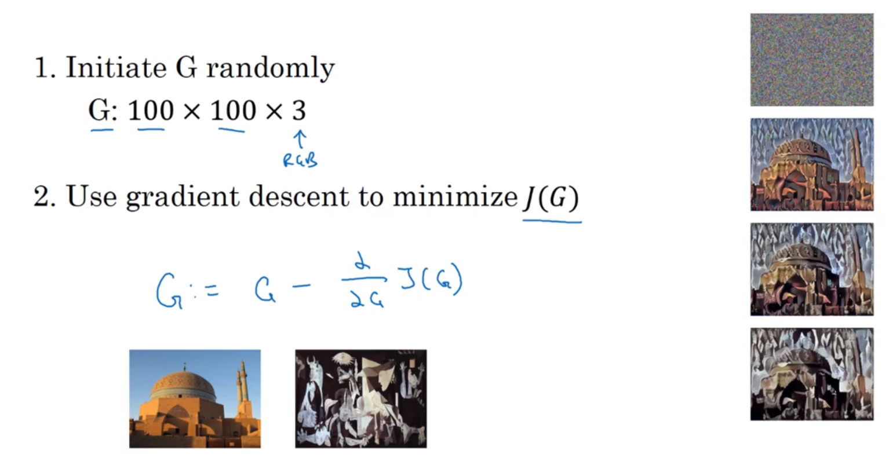

The gradient descent update is done on the pixels of the generated image, as they are the input to $J(G)$.

### Content cost function

Picking the right hidden layer is important. If the layer value $l$ is too small, it will force the generated pixel values to be very similar to the content image. If $l$ is too high, it will say something too high-level like "if there's a dog in the content, make sure there's a dog in the generated".

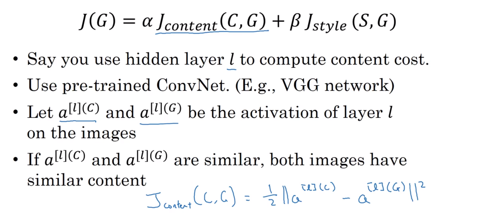

[Differences between L1 and L2 norm loss and L1 and L2 regularisation](http://www.chioka.in/differences-between-l1-and-l2-as-loss-function-and-regularization/)

* L1 or Least absolute deviations is robust in that it is resistant to outliers in the data.
* L2 norm squares any differences, making the model much more sensitive where the difference is $>1$, and less sensitive where the loss $<1$. Any outliers will have a large affect on the model adjustment at the expense of any the errors of the more common examples.

This is really just the element-wise sum of squared differences between a CNN's layer $l$ activation for $C$ and $G$.

### Style cost function

#### Meaning of style

