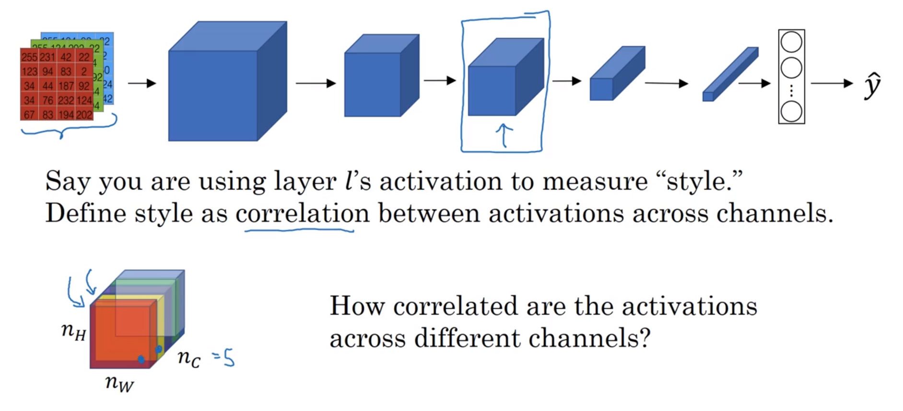
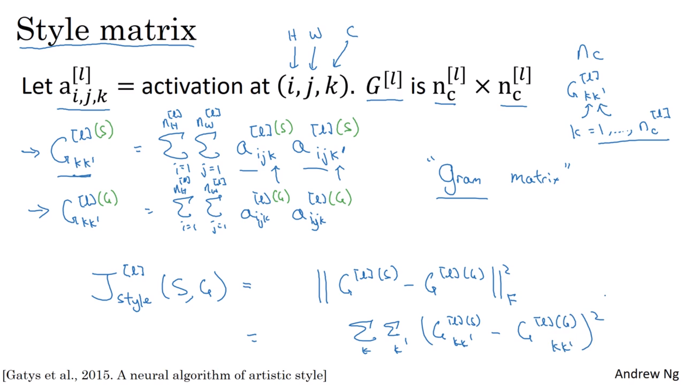
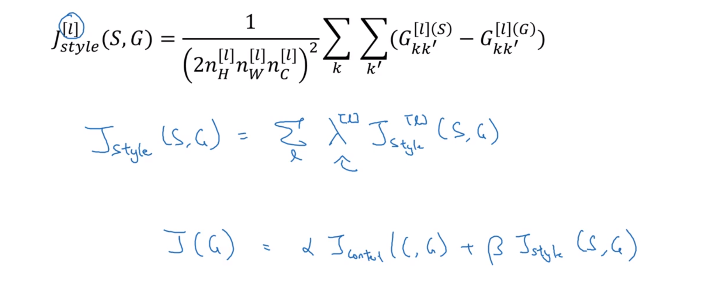
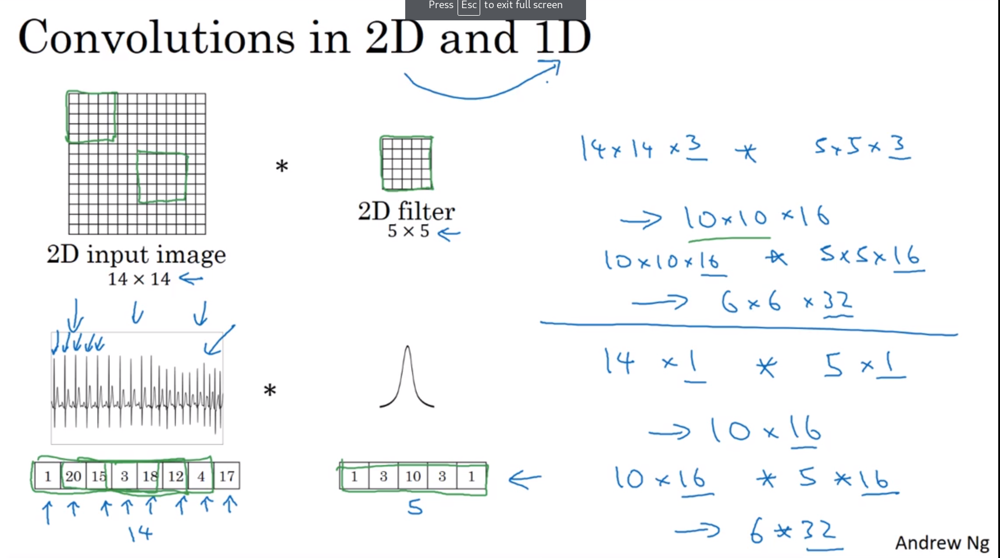
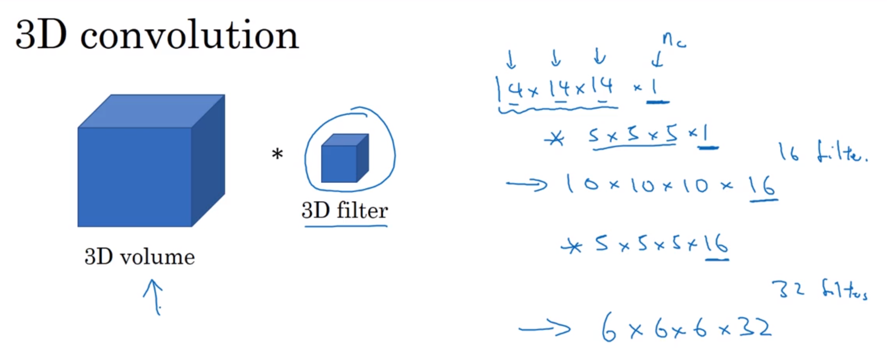

# Face recognition

## What is face recognition?

Liveness dectection is important so that a photograph is not recognised as a face.

### Face verification vs recognition

Verification ($1:1$ problem: Does the face match the claim)
* Input = Image *and* name/ID
* Output = Match / No match

Recognition ($1:K$ problem)
* Database of $K$ persons
* Input = image *only*
* Output = ID of recognised person (or "unrecognised")

Recognition is harder. Assume a 1% error in verification, so 1 in 100 will be in error (not too bad). But with $K=100$, applying the same system there will now be 100x the chance of making a mistake. So instead of 99% accuracy, 99.9% or higher may be needed for good accuracy with 100 people.

Start with face verification, and then use the same system for recognition if the accuracy is high enough.

Below, we describe Recognition, and then tackle Verification.

## One shot learning

Recognition of a face needs to be possible given a single example of the person's face.

Historically, deep learning algorithms don't work well with only one training example.

One approach (above) would be to have a CNN output 5 labels (4 employees + unknown), but:

* There is not enough data to train a robust network for this task
* If a new person joins, the network would need to be retrained

Instead, a *similarity function* is learned:

$d(\rm{img_1}, \rm{img_2})$ = degree of difference between two images

Given two photos of the same person, $d$ should be small, and large with photos of two different people.

Given some hyperparameter $\tau$ (tau), if

$d(\rm{img_1}, \rm{img_2}) \le \tau$

then the images are deemed to be of the same person.

This is the verification case.

For recognition, compare the presented image with all images in the database.

## Siamese Network

A Siamese network can be used to learn the difference function $d$.

The letter $d$ is used to denote distance, and is the L2 norm or length of the vector of the difference between the two image encodings.

Instead of taking the final softmax, we instead look at the layer of 128 neurons, representing the "encoding of $x$", or $f(x)$.

[Taigman et al, 2014. DeepFace: Closing the Gap to Human-Level Performance in Face Verification](https://www.cs.toronto.edu/~ranzato/publications/taigman_cvpr14.pdf)

$d$ is the $L^2$ norm (LSE = square root of the sum of the squared vector values) of the difference between two encodings.

* L1 or Least Absolute Deviations/Errors (LAD/LAE) is robust in that it is resistant to outliers in the data.
* L2 Least Squares Error (LSE) squares any differences, making the model much more sensitive where the difference is $>1$, and less sensitive where the loss $<1$. Any outliers will have a large affect on the model adjustment at the expense of any the errors of the more common examples.

[Differences between L1 and L2 as Loss Function and Regularization](http://www.chioka.in/differences-between-l1-and-l2-as-loss-function-and-regularization/)

This is really just the element-wise sum of squared differences between a CNN's layer $l$ activation for $C$ and $G$.

## Triplet loss function

To learn the parameters which satisfy the above slide, do gradient descent on the triplet loss function.

There is one basis or "anchor" image that is compared against a similar image ("positive") and a dissimilar image ("negative")

[Schroff et al 2015. FaceNet: A Unified Embedding for Face Recognition and Clustering](https://arxiv.org/abs/1503.03832)

$f=0$ (or any other constant) would suffice the equations above (red). To ensure $d(\rm{A,N})$ and $d(\rm{A,P})$ are not equal or similar, we require that the difference is more than the margin hyperparameter $\alpha$.

### Loss and cost functions

The loss will never be negative because of the $\rm{max}$ with 0:

$$\rm{max}\left(\|d(\rm{A,N})\|_2^2 - \|d(\rm{A,P})\|_2^2 + \alpha, 0\right)$$

The "best" parameters will cause the triplet loss to be quite negative, the worst will be $max(\alpha, 0) = 0$.

To have some Anchor and Positive pairings to learn from, the training set requires $\ge2$ pictures of some people.

With randomly chosen people, it's very easy to satisfy: $\|d(\rm{A,P})\|_2^2 + \|d(\rm{A,N})\|_2^2 + \alpha \le 0$.

Choosing "hard" or very similar triplets increases the discrimination of the learning algorithm. Choose A, P, and N such that $d(A,P) \approx d(A,N)$.

Commercial face recognitions systems are trained on datsets commonly greater than 1,000,000 images, sometimes > 10,000,000 images, and sometimes even > 100,000,000. These are very large datasets by today's standards, and are not easy to acquire. Fortunately, companies have trained networks on these huge datasets and have shared their parameters.

## Binary classification of faces

Triplet Loss is one good way to learn the parameters for face recognition. The problem can also be treated as a straight binary classification problem.

Using a Siamese network, get the output vector for two images, and then feed those output vectors to a logistic regression unit.

Each $w_k$ in the (example above each 128-element vector) $w$ and also $b$ are the parameters to be learned.

The second formula (green pen) is called the $\chi^2$ or "Chi squared similarity". This and other variations are described in the DeepFace paper (link above).

The database image's encoding can be pre-computed to speed up the validation process.  This also applies to triplet-loss encodings above.

### Binary classification training data setup

Create pairs of images with the target label $1$ where the images are of the same person, and $0$ otherwise.

# Neural Style Transfer

To generate new images, one needs to look at the features extracted by a ConvNet in the shallower and deeper layers.

## What are the layers of a ConvNet learning?

[Zeiler & Fergus, 2013, Visualizing and Understanding Convolutional Networks](https://arxiv.org/abs/1311.2901)

For each unit of interest, find 9 input images that maximise a given hidden unit's activation. (9 units are shown, each with 9 input patches)

The paper has more sophisticated ways of visualising what a hidden unit is learning.

For the first layer, each unit may only "see" a 3x3 grid of pixels, whereas the later layers see more of the input pixels.

Above: activations of layers 2 and 3

Above: activations of layers 4 and 5

## What is neural style transfer?

[Gatys et al. 2015. A Neural Algorithm of Artistic Style](https://arxiv.org/abs/1508.06576) (Andrew says this paper is quite easy to read)

## Cost function for neural style transfer generated images

Cost function:

$$J(G) = \alpha\ J_\rm{content}(C,G) + \beta\ J_\rm{style}(S,G)$$

Where:

* $J_\rm{content}(G,C)$ measures how different the content of $G$ is to $C$.
* $J_\rm{style}(G,S)$ measures how different the style of $G$ is to $S$.

Andrew says that using two hyperparameters ($\alpha$ & $\beta$) is unnecessary where one is sufficient, but that's the way it was written.

By minimising the cost function $J(G)$ by gradient descent, we can generate better images.

The gradient descent update is done on the pixels of the generated image, as they are the input to $J(G)$.

### Content cost function

Picking the right hidden layer is important. If the layer value $l$ is too small, it will force the generated pixel values to be very similar to the content image. If $l$ is too high, it will say something too high-level like "if there's a dog in the style image, make sure there's a dog in the generated".

The layer chosen is unrolled into a vector, and the square of the $L^2$ norm of the differences is used.

### Style cost function

#### Meaning of style

Channels are correlated if the activations across positions are similar.

An image with a lot of orange and vertical stripes will have a lot of correlation of activations between the red and yellow layers in the LHS example.

The if the correlation of channels is similar for two images, then those two images have the same "style".

Matrix $G^{[l]}$ is $n_c^{[l]} \times n_c^{[l]}$ and gives the correlation between two channels $k$ and $k'$.

If many of the $a^{i,j}$ activation values in channels $k$ and $k'$ are both large, then the double sum (or correlation value) of multiplied elements will also be large. If one channel is large and the other small, then the correlation won't be as large.

The term "correlation" was used for intuition, but it is actually the unnormalised cross co-variance. (The mean is not subtracted)

The matrix $G$ is calculated for both the style image $S$ and generated image $G$.

The matrix is symmetrical as the correlation between a and b is the same as between b and a.

The letter $G$ is used because of the term gram matrix in linear algebra.

A normalisation term is added, but not really required as the style cost is multiplied by a hyperparameter $\beta$.

More visually pleasing results are obtained by summing the style cost function across multiple layers, weighted by different $\lambda$ per layer.  This ensures both low- and high- level correlations are taken into account.

## 1D and 3D convolutions

The same principles apply as with 2D data:

The number of channels in the input must match those in the filter. The number of filters define the number of channels in the output.

Example of 3D data: CT scan (many 2D slices) or a movie.

QUIZ:
https://www.coursera.org/learn/convolutional-neural-networks/exam/HxEwv/special-applications-face-recognition-neural-style-transfer

1 T
2 CD
3 F
$ D
5 T
6T
7 T
8 T
9 B
10 C

https://www.coursera.org/learn/convolutional-neural-networks/notebook/lEthw/art-generation-with-neural-style-transfer

With one-hot encoding, what is this thing about "dependencies" preventing `(duck, beaver, walrus) -> (1, 2, 3)`
