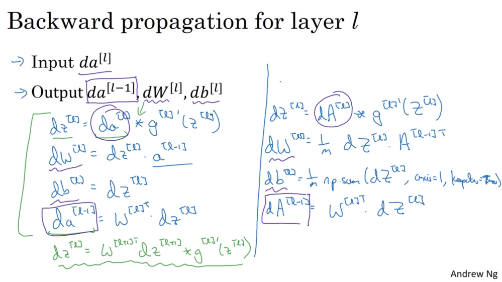

# Week 4 - Deep Neural Networks

Deep learning is simply training a neural network with many hidden layers.

* [Forum](https://www.coursera.org/learn/neural-networks-deep-learning/discussions/weeks/4)

## What is a deep neural network

The depth refers to the number of hidden layers

Deep NNs can learn functions that shallower ones are unable to, however we want the shallowest network possible to reduce training time.

##  Forward Propagation

There is no way to forward propagate without the use of a loop iterating over each layer:

$Z^{[l]} = W^{[l]}A^{[l-1]} + b^{[l]}$
$A^{[l]} = g^{[l]}(Z^{[l]})$

## Getting matrix dimensions correct

The dimensions of $W$  and $b$ are:

$W: (n^{[l]}, n^{[l-1]})$
$b: (n^{[l]}, 1)$

$dW$ and $db$ have the same dimensions as $W$ and $b$ respectively.

The activation $A$ with dimensionality $(n^{[l]}, m)$ should match $Z$ as the activation function $g()$ is an element-wise operation. 

## Why deep representations?

Earlier layers detect simple features (such as edges), later layers detect more complex features such as corners or facial features.

With audio: audio variations (eg rising tones), phonemes, words, sentences.

Circuit theory (thin AND, OR, NOT, XOR gates) says: 
> There are functions you can compute with a small but deep neural network that would require a shallower network exponentially more hidden units to compute.

## Forward and backward propagation

**Forward prop:**
Input: $a^{[l-1]}$
Output: $a^{[l]}$ cached $Z^{[l]}$

**Backward prop:**
Input: $da^{[l]}$, cached $Z^{[l]}$
Output: $da^{[l-1]}$, $dw^{[l]}$, $db^{[l]}$

Implementation: both steps will use $W^{[l]}$ and $b^{[l]}$ and compute/reuse $Z^{[l]}$ and $A^{[l]}$ so store these in a cache to be passed to the back prop function.

[//]: # (Consider deleting this block)


### Forward propagation formulae
$Z^{[l]} = W^{[l]}A^{[l-1]} + b^{[l]}$
$A^{[l]} = g^{[l]}(Z^{[l]})$

### Backward  propagation formulae

Given the loss function (from week 2):
$$ \mathcal L(a,y) = - \Big(y\log a + (1 - y)\log (1 -a)\Big) $$
The [derivative](https://stats.stackexchange.com/questions/278771/how-is-the-cost-function-from-logistic-regression-derivated) for $da^{[L]}$ to begin the backprop process is:
$$\frac{\delta \mathcal L(a, y)}{\delta a} = - \frac y a + \frac{1-y}{1-a}$$

$$dZ^{[l]} = dA^{[l]} * g'(Z^{[l]})$$

The three outputs $(dW^{[l]}, db^{[l]}, dA^{[l-1]})$ are computed using the input $dZ^{[l]}$.

$$ dW^{[l]} = \frac{\partial \mathcal{L} }{\partial W^{[l]}} = \frac{1}{m} dZ^{[l]} A^{[l-1] T}$$
$$ db^{[l]} = \frac{\partial \mathcal{L} }{\partial b^{[l]}} = \frac{1}{m} \sum_{i = 1}^{m} dZ^{[l](i)}$$
$$ dA^{[l-1]} = \frac{\partial \mathcal{L} }{\partial A^{[l-1]}} = W^{[l] T} dZ^{[l]}$$

#### Code:

db:
```
    db = 1/m * np.sum(dZ, axis=1, keepdims=True)
```

Relu:
```
    dZ = np.array(dA, copy=True)
    dZ[Z <= 0] = 0 # When z <= 0, you should set dz to 0 as well. 
    assert (dZ.shape == Z.shape)
```

Sigmoid:
```
    s = 1 / (1 + np.exp(-Z))
    dZ = dA * s * (1 - s)
    assert (dZ.shape == Z.shape)
```

## Parameters vs Hyperparameters

Parameters are the $W$ and $b$ for each layer.

Additionally there are:

 * Learning rate ($\alpha$)
 * Number of iterations
 * Number of hidden layers ($L$)
 * Number of units per hidden layer ($n^{[1]}, n^{[2]}, ...$)
 * Activation functions ($g^{[1]}, g^{[2]}, ...$)

The hyperparameters determine the final values of each layer's $W$ and $b$ that are learned.

Later on we will encounter:

 * Momentum term ($\beta_1$)
 * RMSprop term ($\beta_2$)
 * Learning rate decay
 * Mini-batch size
 * Regularisation parameters

In the earlier days of machine learning, $\alpha$ was simply called a parameter, but we'll refer to it as a hyperparameter as it determines the parameters learned.

Learnings about hyperparameters from one application (eg speech recognition) may or may not translate to another application (eg image recognition).

The next course gives a systematic process for trying out a range of hyperparameters. Consider re-tuning every few months if working on a long-running project as compute platform may have changed.

Applied deep learning is a very emperical process (refining by trials). Repeat:
Idea -> Code -> Experiment

## What does deep learning have to do with the human brain?

The short answer is "not a lot".

There is a very loose correlation with both a neuron and a logistic regression unit having many inputs (dendrites) and a single output (axon). 

Today's neuroscience still doesn't understand exactly what function a neuron is calculating, and how the brain learns. 

## Initialise layer weights

```
for (i in range(1, len(layer_dims))):
  parameter[‘W’ + str(i)] = np.random.randn(layers[i], layers[i-1])) * 0.01
  parameter[‘b’ + str(i)] = np.random.randn(layers[i], 1) * 0.01
```
