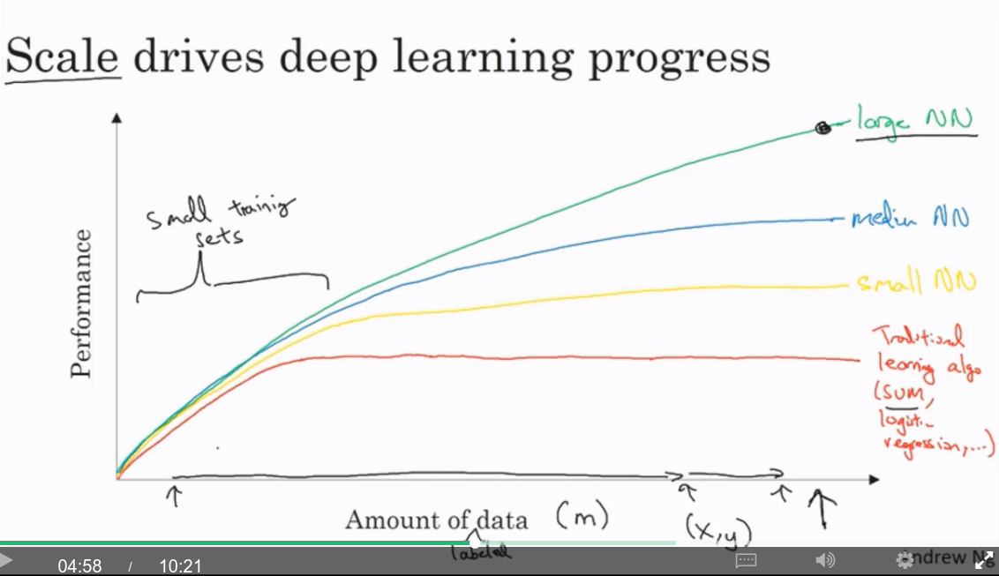

# Coursera Neural Networks and Deep Learning 

## Week 1

### Introduction

Courses:
1. Deep Learning and Neural Networks
 1. Introduction (this week)
 1. Basics of NN programming (fwd & back prop)
 1. Single hidden layer network
 1. Deep NN
1. Hyperparameter tuning, Regularisation, Optimisation
1. Structuring a machine learning project
  * Splitting into Train, Dev / Cross validation, and Test sets
  * End-to-end deep learning
1. Convolutional Neural Networks (CNNs)
1. Sequence data models (RNNs, LSTMs)
  * Natural Language Processing
  * Speech recognition
  * Music generation

### Introduction to Deep Learning

#### What is a neural network?

ReLU = Rectified Linear Unit = $max(0, input)$

#### Supervised learning with Neural Networks
Almost all economic value has been created through supervised learning.

* Images: CNN
* Sequence data (temporal component): RNN

Structured data: Each feature has a well-defined meaning. E.g., Databases
Unstructured data: Images, audio, text

Most economic value so far has been on structured data.

##### Why is Deep Learning taking off?

The amount of available data is ever increasing.

Performance as available labelled data ($m$) increases:
* SVM / logistic regression - performance plateaus very quickly
* Small NNs - performance flattens more slowly
* Large NNs - performance takes a long time to plateau

Scale of both NN size and data set size has been driving NN performance.

On small datasets, it is more the feature selection than the algorithm / network size which is more important.

Eventually a NN becomes so big that it takes too long to train.

Drivers for scale:
* Data
* Computation
* Algorithms (improvements in accuracy or speed)

One algorithmic improvement was replacing the sigmoid activation function with ReLU as sigmoid has a very small gradient with inputs $< -4$ or $> 4$, and suffers from vanishing gradients. This makes gradient descent work much faster.

##### Development Cycle

An iterative approach is required:
* Idea
* Code
* Experiment

Because this cycle needs to be repeated many times, it's important that the computation speed is high, or conversely, the time to run the experiment (train the network) is low.

#### Support

Forum and also feedback@deeplearning.ai
