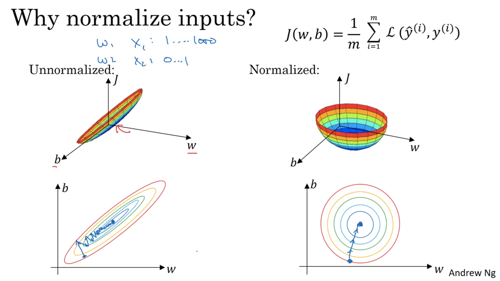

# [Improving Deep Neural Networks: Hyperparameter tuning, Regularization and Optimization](https://www.coursera.org/learn/deep-neural-network/home/welcome)

This course will cover:
* Hyperparameter tuning
* Data setup
* Ensure optimisation algorithm runs quickly

# Week 1 - Practical aspects of Deep Learning
This week:

* Setup of machine learning problems
* Regularisation
* Tricks for ensuring the implementation is correct

## Applied ML is a highly iterative process

Intuitions from one ML domain often don't translate well into a new domain.

Decisions require are:

* Number of layers
* Number of hidden units
* Learning rate
* Activation functions
* ...

Use the Idea -> Code -> Experiment cycle

The rate of progress is determined by how quickly we can iterate this cycle.

Setting up the data well can make this much more efficient.

## Train / Dev / Test sets

To allow:
* Faster iteration of the Idea -> Code -> Experiment cycle
* Measurement of bias and variance of the algorithm

Split the data into:
* Training set
* Hold out cross validation set / "development set"
* Test set

The models are evaluated on the dev set and then the best one is tested against the test set for an unbiased estimate of performance.

Previously data was split 70% train / 30% dev  or 60% train / 20% dev / 20% test. This was considered best practice in machine learning. These ratios still hold for $ 100 < m < 10,000$ examples.

In the modern big data area (eg 1,000,000 data points) the dev and test sets have become a much smaller percentage of the total. The dev set just needs to be large enough to evaluate different algorithm choices. 10,000 examples may be sufficient. Likewise with the test set.

Andrew also mentions a 99.5% / 0.4% / 0.1% split as possible.

More specific guidelines will come later on in this Coursera specialisation.

Not having a test set might be ok if no unbiased estimate of performance is needed. In this case the dev set is generally called the test set, even though it's being used as a hold-out cross validation set and the terminology is confusing. 

### Mismatched train / dev / test distributions

More and more people are using differing train / test data distributions.

Allowing training set augmentation can increase overall performance.

Rule of thumb: Make sure that the dev and test sets come from the same distribution.

Eg, the training set could be pictures from commercial galleries (eg more professional pictures), and the dev and test sets could be from user uploads (happy snaps).

## Bias and Variance

Most of the really good machine learning practitioners have a really good understanding of bias and variance. It's easy to learn but difficult to master - there is a lot of nuance.

The bias / variance trade-off is less of a trade-off in the deep learning area. Understanding the individual terms is still important.

In higher dimensions where decision boundaries can't be visualised, we use the combination of train and dev set errors.

Error is relative to the Bayes or optimal error.

* **High bias / underfitting** - an over simplistic idea of the function which fits the data
 * If the training set error is high then there is high bias. If the dev set error is even higher then there is high variance as well.

* **High variance / overfitting** - a too complex function which fits the training set too well, making the dev set error higher
 * If only the dev set error is high, then there is high variance.

 All the above assumes that the Train and Dev sets are drawn from the same distribution. Otherwise there is a more sophisticated analysis coming later in the course.

 

Here a function with both high bias and high variance has it's decision boundary shown in purple, against training set data with outliers.

With high-dimensional inputs, the example doesn't need to be so contrived - it's more common.

## Basic Recipe for Machine Learning

1. Does the model have high bias (on training set performance)?
 * Bigger network (almost always helps)
 * Train longer (never hurts)
 * Different NN architecture (may help, harder to be systematic in the approch)
 * Try advanced optimisation algorithms

1. Does the model have high variance (ie, increased error on dev set)? 
 * Use regularisation
 * Get more data (often expensive, time consuming)
 * Different NN architecture (may help, harder to be systematic in the approch)

In the pre-deep learning area, bias / variance trade-off meant that decreasing one increased the other.

With deep learning, as long as one can:
 * train a bigger network
 * get more data

then one can be decreased without any increase in the other. This is one reason that deep learning has been so effective for supervised learning.

Using regularisation will increase the bias a little bit, but not too much if the network is large enough. 

## Regularisation

Generally the first thing to try with a high variance problem is to use regularisation. 

Getting more training data is better, but it can be expensive and time consuming.

L2 regularisation is used much much more often.

### L2 regularisation (logistic regression case)

We take the cost function from before and add a new term:

$$\begin{align*}
J(w,b) &= \displaystyle \frac 1 m \sum_{i=1}^{m}{\mathcal L(\hat y^{(i)},y^{(i)})} \\
J^+(w,b) &= \displaystyle \frac 1 m \sum_{i=1}^{m}{\mathcal L(\hat y^{(i)},y^{(i)})} + \frac{\lambda}{2m} \left\Vert w \right\Vert_2^2
\end{align*}$$

Where:
$$ \left\Vert w \right\Vert_2^2 = \sum_{j=1}^{n_x} w_j^2 = w^Tw $$

and $\lambda$ is the regularisation hyperparameter.  (Note `lambda` is a reserved word in Python, so use `lambd` instead)

$w^Tw$ is the squared Euclidean norm of the vector $w$.  This is also called the $L2$ regularisation.

$b$ can also be regularised, but in practice it makes very little difference. Most of the parameters are in $w$ rather than in $b$.

### L1 regularisation (logistic regression case)
Instead, this term can be added:

$$ \left\Vert w \right\Vert_1 = \sum_{j=1}^{n_x} \left|w_j\right| $$

With this method, $w$ will end up being sparse, meaning there are zeros in the vector. This is because the of the additional term gradient doesn't decrease. [More info here](https://stats.stackexchange.com/a/159379/162527) or [secondarily, here](http://www.chioka.in/differences-between-l1-and-l2-as-loss-function-and-regularization/), or the [most intuitive](https://medium.com/mlreview/l1-norm-regularization-and-sparsity-explained-for-dummies-5b0e4be3938a).

### Regularising Neural Networks

For a matrix, it's not called the L2 norm, rather the Frobenius norm, denoted:

$$ \left\Vert W \right\Vert_F^2 = \sum_{i=1}^{n^{[l]}} \sum_{j=1}^{n^{[l-1]}} (W_{i,j}^2) $$

Cost functions:
$$ \begin{align}
J &= -\frac{1}{m} \sum\limits_{i = 1}^{m} \large{ \bigg( }\small  y^{(i)}\log\left(a^{[L](i)}\right) + (1-y^{(i)})\log\left(1- a^{[L](i)}\right) \large{\bigg)} \\
J_{regularized} &= \underbrace{-\frac{1}{m} \sum\limits_{i = 1}^{m} \bigg(\small y^{(i)}\log\left(a^{[L](i)}\right) + (1-y^{(i)})\log\left(1- a^{[L](i)}\right) \bigg) }_\text{cross-entropy cost} + \underbrace{\frac{\lambda}{2m} \sum\limits_l\sum\limits_k\sum\limits_j W_{k,j}^{[l]2} }_\text{L2 regularization cost}
\end{align} $$

This is summed over all layers of the network.

**Backward propagation**

Before we had:
$$ dW^{[l]} = \frac{1}{m} dZ^{[l]} A^{[l-1] T}$$

Now we add the term:

$$ dW^{[l]} = \frac{1}{m} dZ^{[l]} A^{[l-1] T} + \frac \lambda m W^{[l]}$$

The update is the same as before:

$$ W^{[l]} := W^{[l]} - \alpha \cdot dW^{[l]} $$

L2 regularisation is also called "weight decay". This is because $W^{[l]}$ is multiplied by by the less-than-one term $(1 - \frac{\alpha \lambda}{m})$ after factorising for $W^{[l]}$.

## Why does regularisation prevent overfitting?

If $\lambda$ is large, then $W^{[l]}$ values will need to be small to keep the overall cost low.

If $W$ is small, then $z = W^{[l]}a^{[l-1]}$ will also be small. With small values of $z$ and the tanh activation funciton, the output of the tanh will be in the linear section, simplifying the layer to be more like a linear logistic regression unit. Many sequential linear units can be calcuated by a single linear unit. Keeping things more linear reeduces the complexity of the function that the network can calculate, and making for a simpler decision boundary, and less overfitting.

Implementation tip: When plotting $J$, you should see it decrease monotonically after every iteration of gradient descent. If using regularisation, be sure to include the regularisation term in the value of $J$ being plotted.

## Dropout Regularisation

Nodes are randomly dropped with certain keep probablility. All incoming and outgoing links from the dropped nodes are removed, in effect training a much smaller network, which can only represent a more simple function. 

### Inverted dropout

This is by far the most common version of dropout.

Let's use layer 3 as a example:

    keep_prob = 0.8  # 20% dropout
    d3 = np.random.rand(a3.shape[0:2]) < keep_prob  # 0 or 1, keep or drop
    a3 *= d3  # Zero out the dropped elements of a3
    a3 /= keep_prob  # scale upward

The scaling up by (1 / keep_prob) is ensures that the $z$ value of the layer is of the same scale as at test time when all neurons are being used.

A different `d3` is generated on each gradient descent step. It's used for both forward and back propagation.o

** Making predictions at test time **

With the inverted scaling upwared during training, no neurons are dropped at test time (randomness in testing is undesirable), and the scaling has already bee accounted for.

In theory, neurons could be dropped and the result averaged, but this is more computationally expensive and provides no advantage.

### Why does drop out work?

* Builds resilliance - A neuron can't rely on any one feature so weights must be more distributed, thereby shrinking the weights and reducing overfitting.

L2 regularisation is more adaptive to the scale of different inputs.

### Keep probability by layer

Layers with larger $W$ matrices may have a lower keep probability. Where overfitting is not a problem (eg final layers), a keep probabilty of $1$ can be used.

Dropout for the input layer can also be used, with a high probability like $0.9$.

The downside of using a different `keep_prob` per layer is that there are even more hyperparameters to tune. One option is to have a single `keep_prob` hyperparameter and layers which either do or don't use dropout.

### Dropout Implementation notes

Forward pass:

    D1 = np.random.rand(*A1.shape) < keep_prob
    A1 *= D1
    A1 /= keep_prob

Backward pass:

During forward propagation, you had divided `A1` by `keep_prob`. In backpropagation, you'll therefore have to divide `dA1` by `keep_prob` again (the calculus interpretation is that if $A^{[1]}$ is scaled by `keep_prob`, then its derivative $dA^{[1]}$ is also scaled by the same `keep_prob`).

    dA1 *= D1             # Step 1: Apply mask D1 to shut down the same neurons as during the forward propagation
    dA1 /= keep_prob      # Step 2: Scale the value of neurons that haven't been shut down

Dropout was first applied to computer vision. Generally it's hard to get enough data to reduce overfitting, so dropout is more commonly used, even by default.

Ng says not to bother using overfitting unless the model is overfitting, and the computer vision heuristic doesn't necessarily generalise to other areas.

Hinton says that if the network is not overfitting, then use a larger network with dropout, but this could be in the area of computer vision.

The downside of dropout is that the cost function $J$ is no longer well defined as randomness comes into play. $J$ may no longer decrease with every iteration, so set `keep_prob = 1` when checking for this.

## Other regularisation methods

Besides L1, L2 and dropout regularisation there is:

### Augmentation
As getting more training data is expensive, augmentation can be used - tranforming the existing data.

Examples:
* Flipping images horizontally
* Taking random slightly rotated crops
* Distortions / noise

The synthesised training examples don't add as much information as an independent training example, but it's generally much more cost/time effective. 

### Early stopping

While training set error should be monotonically decreasing, the dev set error will decrease and then start to increase.

Since $W$ is initialised to small values close to zero and some of those get bigger as training continues, stopping early will ensure a mid-sized $\left\Vert W \right\Vert_F^2$.

Machine learning has different steps:

1. Optimise cost function $J$
 - Gradent descent
 - RMS, Adam, etc

2. Reduce overfitting
 - Regularise
 - Get more data

Downside: Orthogonalisation means focussing on one task at time (more in a later video). Early stopping means that these can't be worked on independently. Optimising $J$ doesn't fully complete. Specicialised tools are not used for each task.

Andrew finds using L2 regularisation with different $\lambda$ values easier in terms of decomposing and searching hyperparameter space (assuming the extra computation can be afforded).

Upside: Different values of $\lambda$ don't need to be searched for and a similar effect can be obtained.

## Normalising inputs

Normalising speeds up training.

The mean is set to $0$ and the variance to $1$:

1. Subtract the mean:
$ \displaystyle \mu = \frac 1 m \sum_{i=1}^m x^{(i)} \\
x := x - \mu $

1. Scale by the variance:
$ \displaystyle \sigma^2 = \frac 1 m \sum_{i=1}^m x^{(i)} ** 2 \ \mathrm{(element wise)} \\
x /= \sigma^2 $

`sigma` is a vector of variances of each of the features.

Use exactly the same transformation on the train as on the dev and test sets.

Normalisation won't make much difference if the ranges of the data are similar, but will make a big difference if one range is 0 to 1 and another is 1 to 1000. This step may as well be done if there's even a slight chance of a speed increase as it's computationally cheap compared to training.

## Vanishing / exploding gradients

If weights are too large then the flat tail of the sigmoid / tanh activation function will be favoured and the gradients will be almost $0$. This is vanishing graients.

Gradients can grow exponentially as they are cumulatively multiplied in backprop through each layer's activation if they are significantly more or less than 1.

### Weight initialisation

Careful initialisation of the weights can partially solve this problem.

The larger the number of inputs $n^{[l-1]}$ to a layer, the larger the sum of products of the layer will be.  So, scale down the gaussian random initialisation of $W$ by the number of inputs.

The variance of the random distribution is another hyperparameter, but Ng suggests tuning it way down the list of options to consider. Usually set via:

** tanh **
It's reasonable to set the variance of $w_i$ to be $1 \over n^{[l-1]}$, or in code:

    W = np.random.randn(n_l, n_l_prev) * np.sqrt(1 / n_l_prev)

This is called Xavier initialisation.  [Easy undertanding of Xavier initialisation](https://prateekvjoshi.com/2016/03/29/understanding-xavier-initialization-in-deep-neural-networks/).

An alternate is to mutiply by $\sqrt{2 \over n^{[l-1]} + n^{[l]}}$

** ReLU **

For ReLU, setting the variance to $2 \over n$ works better. ([He initialisation](https://arxiv.org/pdf/1502.01852v1.pdf))

    W = np.random.randn(n_l, n_l_prev) * np.sqrt(2 / n_l_prev)

## Numerical approximation of gradients

The two sided difference takes twice as long to calculate, but it's much more accurate so Ng say's it's worth it.

The formal defniniton of a derivative is:

$$\frac{\partial J}{\partial \theta} = \lim_{\varepsilon \to 0} \frac{J(\theta + \varepsilon) - J(\theta - \varepsilon)}{2 \varepsilon} $$

The error of this approximation is $\mathcal O(\epsilon^2) $.

If using the one-sided difference:

$$\frac{\partial J}{\partial \theta} = \lim_{\varepsilon \to 0} \dfrac{J(\Theta + \epsilon) - J(\Theta)}{\epsilon}$$

The error of this approximation is $\mathcal O(\epsilon) $ (which is larger than the previous since $ 0 \lt \epsilon \lt 1$).

## Gradient checking

1. Take all $W$s and $b$s and reshape them into a single vector $\Theta$:
2. Reshape all $dW$s and $db$s and reshape them into a single vector $d\Theta$:
3. For each element $i$ of $\Theta$:
   $\dfrac{\partial}{\partial\Theta_i}J(\Theta) \approx \dfrac{J(\Theta_1, \dots, \Theta_i + \epsilon, \dots, \Theta_n) - J(\Theta_1, \dots, \Theta_i - \epsilon, \dots, \Theta_n)}{2\epsilon}$
4. Check the difference via L2 norm (euclidian distance) ratio: $\displaystyle \frac{\left\Vert d\Theta_{approx} - d\Theta \right\Vert_2} {\left\Vert d\Theta_{approx} \right\Vert_2 + \left\Vert d\Theta \right\Vert_2}$

5. Use $\epsilon = 10^{-7}$ and check that the ratio is also $< 10^{-7}$. If the ratio is $> 10^{-3}$ then worry. Even at $>10^{-5}$ check for a bug, starting where an element of one is very different from an element of another.
    
### Implementing grad check

* Use only to prove the implementation - then turn off
* Remember to include the regularisation term in the gradient too
* Doesn't work with dropout (set `keep_prob = 1`)
* Can pass immediately after initialisation when the parameters are close to 0. Perhaps run again after training if the ratio looks marginal.
 

1c 2a 3d 4b 5b 6a 7a 8bc 9abdf 0c

