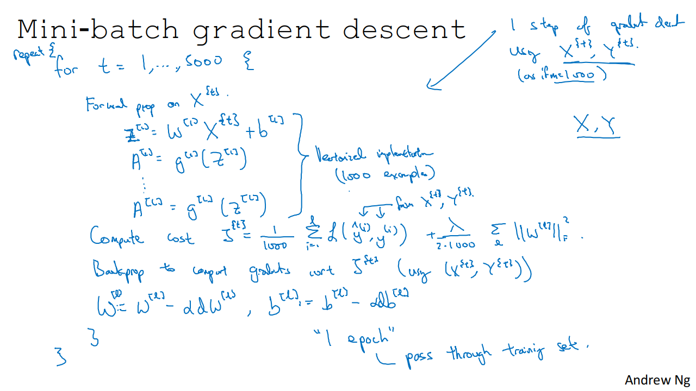
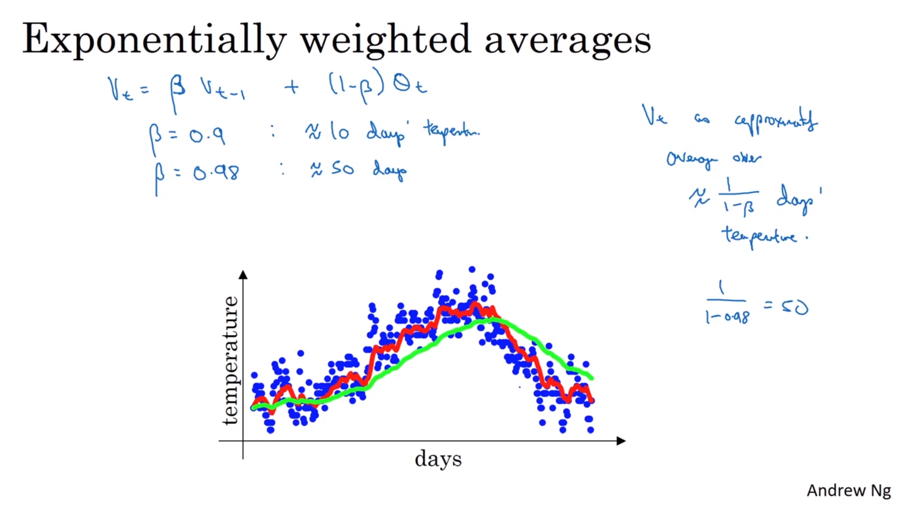
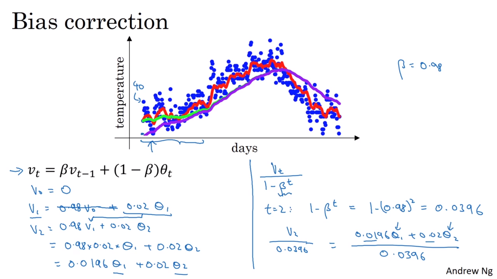

# [Optimisation Algorithms](https://www.coursera.org/learn/deep-neural-network/lecture/qcogH/mini-batch-gradient-descent)

## Mini-batch gradient descent

Applying maching learning is highly empirical / iterative process, so it helps to train models quickly.

Deep learning works best on large datasets where training is slow, so optimisation is important.

### Batch vs mini-batch gradient descent

Intstead of doing using all $m$ training examples (a batch) for gradient descent, smaller (mini-) batches can be used.

With a large training set, mini-batches are almost always used.

$x^{\{t\}}$ denotes the $t$-th mini-batch.

Mini-batch gradient descent with a mini-batch size of $1,000$ examples, and $m = 5,000,000$ differences:
* Outer loop is number of epochs (passes through the whole training set) or until convergence 
* Instead of $1$ epoch taking $1$ step with batch gradient descent, there will be $5,000$ steps (one per mini-batch)
* Inner loop is over the mini-batches
* Both loss term and regularisation terms are divided by the mini-batch size rather than $m$

## Understanding mini-batch gradient descent

Regarding *batch* gradient descent:

> If you plot the cost function J as a function of different iterations, it should decrease on every single iteration, and if it ever goes up, even on one iteration, then something's wrong - maybe the learning rate is too big'

My question on optimisation: [Batch gradient descent: dynamically maximising learning rate](https://stats.stackexchange.com/q/341222/162527)

On *mini-batch* gradient descent, the cost will oscillate but the overall trend should be downwards. Some batches may be "harder" than others, eg having mislabelled examples.

### Mini-batch size implications

* Mini-batch_size $= m$
 * this is the same as batch gradient descent
 * Each step down takes too long on a large training set.

* Mini-batch_size $= 1$
  * This is called *Stochastic Gradient Descent*
  * Each step will wander, sometimes uphill (can be ameliorated by using a smaller learning rate)
  * Stochastic gradient descent will never converge, but will oscilate / wander around the minimum point
  * Any speed up from vectorisation is lost

* Mini-batch_size $= just\_right$
  * The benefits of vectorisation are retained
  * Allows multiple steps per training set pass (epoch)
  * Most steps will be downhill
  * Will oscillate in a very small region rather than converge (see learning rate decay, later on)

### Choosing mini-batch size
Guidelines for choosing mini-batch size:

* For small training set ($m < 2000$)- use batch gradient descetn
* Over 2000 training examples, use 64, 128, 256 or 512 examples per batch for memory alignment. 1024 is less common. 
* Ensure that the entire mini-batch fits in CPU/GPU memory

Try a few different values for the batch size to find out which makes the training fastest.

## Exponentially weighted averages

Exponentially weighted averages are also known as exponentially weighted moving averages in statistics.

(Note: these curves assume that the displayed data is not at the beginning of the series as they would otherwise start almost at $0$ - see bias correction for why)

When using a higher $\beta$, the curve is shifted to the right (higher latency) as more previous values are included, and it adapts more slowly with recent changes.

$$\begin{align}
v_t &=  0.1\theta_t + 0.9v_{t-1}\ \ \mathrm{or}\\
v_t &= (1-\beta)\theta_t + \beta v_{t-1} 
\end{align}
$$

Expanding this out we get:

$$ v_{t}=(1-\beta) \left(\theta_{t}+\beta \theta_{t-1}+\beta^{2}\theta_{t-2}+\cdots + \beta^{t-1}\theta_{1}\right)$$

Note the most recent term gets the largest weight, namely $1 - \beta$. The weights of previous terms decay by $\beta$ each time.

If there are sufficient previous terms, all of the weights add up to very close to $1$. See also *bias correction* (below).

As a example, $0.9^{10} \approx 0.35 \approx \dfrac 1 e$. Generally $(1 - \varepsilon)^{\frac 1 \varepsilon} \approx \dfrac 1 e = 0.37 \approx \dfrac 1 3$ (here we set $\varepsilon = (1 - \beta) = 0.1$)

This means that it will take 10 days for the weight to decay to about $1 \over 3$ or $1\over e$ of the peak (most recent) weight.

So, $v_t$ averages over the last (approx) $\dfrac1 {1 - \beta}$ values.

### Implementation

In most implementations, people don't often bother to implement bias correction, prefering to wait out the initial period. But if the EWMA is important in the early phase, then using bias correction will give a better estimation.

$v_\Theta$ denotes the exponentially weighted moving average of $\Theta$.

$\begin{align}
v_\Theta &:= 0 \\
v_\Theta &:= \beta v + (1-\beta)\Theta_1 \\
v_\Theta &:= \beta v + (1-\beta)\Theta_2 \\
\vdots
\end{align}$

As a loop: 

$ \begin{align*}
& v_\Theta := 0 \\
& for\ \Theta_t\ in\ \Theta \{ & \\
&\quad v_\Theta := \beta v_\Theta + (1-\beta)\Theta_t \\
&\}
\end{align*} $

Andrew says that a better estimate would likely come from keeping the last $k$ values, summing them and then dividing by $k$. But that would be computationally more expensive and also require more memory. I don't understand how this would give exponential discounting though.

## Bias correction in exponentially weighted averages

Dividing an unbiased EWMA by $(1-\beta^t)$ will remove the bias (coming from setting $v_0=0$), and move the purple curve to the desired green curve above.

Note: On the bottom right of the lecture slide, the two $\Theta$ weights sum to the denominator, creating a weighted average of the two, removing the bias towards $0$.

Here's the long story of the derivation of that value:

The weights applied to the values of $\Theta$ are given by:

$\displaystyle (1-\beta),\  (1-\beta)\beta,\  (1-\beta)\beta^2,\ \dots ,\  (1-\beta)\beta^{t-1}$

The idea is that these coefficients should sum up to 1, but they are not (not without the bias correction). Because of this, your averaging is quite biased. If we go ahead and try to add them up as they are now, we have:

$\displaystyle (1-\beta)  ( 1 + \beta + \beta^2 + …. + \beta^{t-1}  ) $

This is known as a geometric sum. To [derive the formula for this](https://en.wikipedia.org/wiki/Geometric_progression#Derivation), first write a general geometric series as:

$\displaystyle  \sum_{k=1}^{n} ar^{k-1} = ar^0+ar^1+ar^2+ar^3+\cdots+ar^{n-1}. $

where $a$ is the initial term ($a = 1$), and $r$ is the common ratio (found by dividing a term by the preceding term) ($r = \beta$).

We can find a simpler formula for this sum by multiplying both sides of the above equation by $(1 − r)$, and we'll see that:

$\displaystyle \begin{align}
(1-r) \sum_{k=1}^{n} ar^{k-1} & = (1-r)(ar^0 + ar^1+ar^2+ar^3+\cdots+ar^{n-1}) \\
 & = ar^0 + ar^1+ar^2+ar^3+\cdots+ar^{n-1} - ar^1-ar^2-ar^3-\cdots-ar^{n-1} - ar^n \\[6pt] 
  & = a - ar^n \\[6pt] 
  & = a(1 - r^n)
  \end{align}$

since all the other $r$ terms cancel.

If $ r \ne 1$ , we divide by the $(1 - r)$ we multiplied by earlier to obtain the formula for a geometric series that computes the sum of $n$ terms:

$\displaystyle \sum_{k=1}^{n} ar^{k-1} = \frac{a(1-r^n)}{1-r}.$

Substituting $a = 1$, and $r = \beta$, we get:

$\displaystyle  \frac{(1-\beta) (1 - \beta^t )} {(1-\beta)}  =   (1 - \beta^t) $

So in order for the whole series of coefficients to sum to $1$, we simply re-scale this by dividing by $(1-\beta^t)$, which is the bias correction we need. Note carefully that this division is done to $v_t$ AFTER you have summed that series, which is still the same old iteration formula, 

$ \begin{align*}
v_t &= \frac { v_{t\text{ (no bias correction)}} } { (1-\beta^t) } \\[6pt]
v_{t\text{ (no bias correction)}} &= \beta v_{t-1} + (1-\beta) \theta_t \\[6pt] 
v_t &= \dfrac { (1-\beta) (\theta_t + \beta \theta_{t-1} + \beta^2 \theta_{t-2} + … + \beta^{t-1} \theta_1) } { (1-\beta^t) }\\[6pt] 
\end{align*}$

