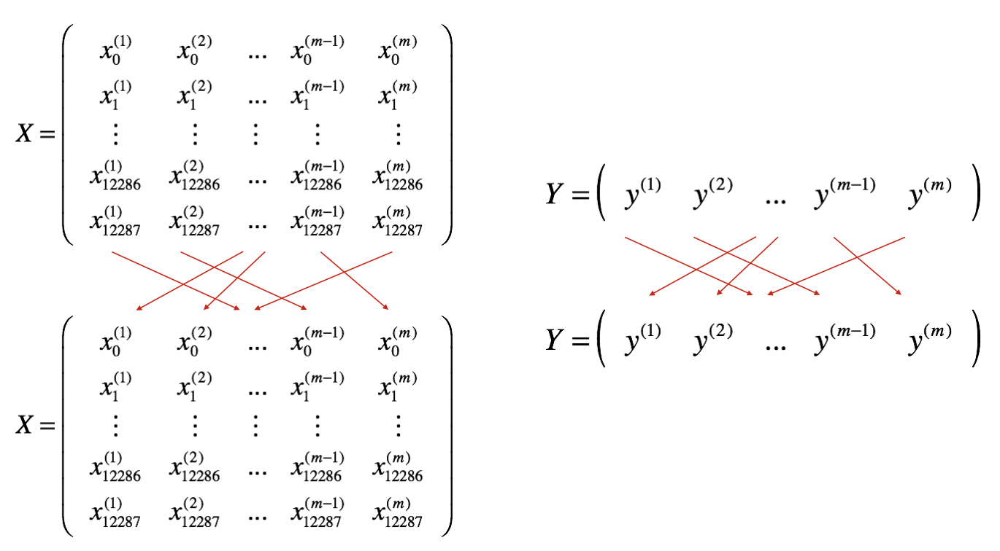

# [Optimisation Algorithms](https://www.coursera.org/learn/deep-neural-network/lecture/qcogH/mini-batch-gradient-descent)

Links:
* [Overview of gradient descent algorithms](http://ruder.io/optimizing-gradient-descent/)

## Mini-batch gradient descent

Applying maching learning is highly empirical / iterative process, so it helps to train models quickly.

Deep learning works best on large datasets where training is slow, so optimisation is important.

### Batch vs mini-batch gradient descent

Intstead of doing using all $m$ training examples (a batch) for gradient descent, smaller (mini-) batches can be used.

With a large training set, mini-batches are almost always used.

$x^{\{t\}}$ denotes the $t$-th mini-batch.

Mini-batch gradient descent with a mini-batch size of $1,000$ examples, and $m = 5,000,000$ differences:
* Outer loop is number of epochs (passes through the whole training set) or until convergence 
* Instead of $1$ epoch taking $1$ step with batch gradient descent, there will be $5,000$ steps (one per mini-batch)
* Inner loop is over the mini-batches
* Both loss term and regularisation terms are divided by the mini-batch size rather than $m$

## Understanding mini-batch gradient descent

Regarding *batch* gradient descent:

> If you plot the cost function J as a function of different iterations, it should decrease on every single iteration, and if it ever goes up, even on one iteration, then something's wrong - maybe the learning rate is too big'

My question on optimisation: [Batch gradient descent: dynamically maximising learning rate](https://stats.stackexchange.com/q/341222/162527)

On *mini-batch* gradient descent, the cost will oscillate but the overall trend should be downwards. Some batches may be "harder" than others, eg having mislabelled examples.

### Mini-batch size implications

* Mini-batch_size $= m$
 * this is the same as batch gradient descent
 * Each step down takes too long on a large training set.

* Mini-batch_size $= 1$
  * This is called *Stochastic Gradient Descent*
  * Each step will wander, sometimes uphill (can be ameliorated by using a smaller learning rate)
  * Stochastic gradient descent will never converge, but will oscilate / wander around the minimum point
  * Any speed up from vectorisation is lost

* Mini-batch_size $= just\_right$
  * Will outperform both stochastic and batch gradient descent with a large dataset
  * The benefits of vectorisation are retained
  * Allows multiple steps per training set pass (epoch)
  * Most steps will be downhill
  * Will oscillate in a very small region rather than converge (see learning rate decay, later on)

### Choosing mini-batch size
Guidelines for choosing mini-batch size:

* For small training set ($m < 2000$)- use batch gradient descent
* Over 2000 training examples, use 64, 128, 256 or 512 examples per batch for memory alignment. 1024 is less common.
* Ensure that the entire mini-batch fits in CPU/GPU memory

Try a few different values for the batch size to find out which makes the training fastest.

### Implementation

At the beginning of each epoch:

**Shuffle**: Create a shuffled version of the training set (X, Y) as shown below. Each column of X and Y represents a training example. Note that the random shuffling is done synchronously between X and Y. Such that after the shuffling the $i^{th}$ column of X is the example corresponding to the $i^{th}$ label in Y. The shuffling step ensures that examples will be split randomly into different mini-batches. 

- **Partition**: Partition the shuffled (X, Y) into mini-batches of size `mini_batch_size` (here 64). Note that the number of training examples is not always divisible by `mini_batch_size`. The last mini batch might be smaller, but you don't need to worry about this. When the final mini-batch is smaller than the full `mini_batch_size`, it will look like this: 

## Momentum
Momentum is based upon EWMAs.

## Exponentially Weighted Moving Averages

Exponentially weighted averages are also known as exponentially weighted moving averages in statistics.

(Note: these curves assume that the displayed data is not at the beginning of the series as they would otherwise start almost at $0$ - see bias correction for why)

When using a higher $\beta_1$ ($\beta_2$ is the term used in RMSprop (see later)), the curve is shifted to the right (higher latency) as more previous values are included, and it adapts more slowly with recent changes.

$$\begin{align}
v_t &=  0.1\theta_t + 0.9v_{t-1}\ \ \mathrm{or}\\
v_t &= (1-\beta)\theta_t + \beta v_{t-1} 
\end{align}
$$

Expanding this out we get:

$$ v_{t}=(1-\beta) \left(\theta_{t}+\beta \theta_{t-1}+\beta^{2}\theta_{t-2}+\cdots + \beta^{t-1}\theta_{1}\right)$$

Note the most recent term gets the largest weight, namely $1 - \beta$. The weights of previous terms decay by $\beta$ each time. $\beta = 0$ disables momentum entirely.

If there are sufficient previous terms, all of the weights add up to very close to $1$. See also *bias correction* (below).

As a example, $0.9^{10} \approx 0.35 \approx \dfrac 1 e$. Generally $(1 - \varepsilon)^{\frac 1 \varepsilon} \approx \dfrac 1 e = 0.37 \approx \dfrac 1 3$ (here we set $\varepsilon = (1 - \beta) = 0.1$)

This means that it will take 10 days for the weight to decay to about $1 \over 3$ or $1\over e$ of the peak (most recent) weight.

So, $v_t$ averages over the last (approx) $\dfrac1 {1 - \beta}$ values.

### Implementation

In most implementations, people don't often bother to implement bias correction, prefering to wait out the initial period. But if the EWMA is important in the early phase, then using bias correction will give a better estimation.

Common values for $\beta$ range from 0.8 to 0.999.  If you don't feel inclined to tune this, $\beta = 0.9$ is often a reasonable default.

$v_\Theta$ denotes the exponentially weighted moving average of $\Theta$.

$\begin{align}
v_\Theta &:= 0 \\
v_\Theta &:= \beta v + (1-\beta)\Theta_1 \\
v_\Theta &:= \beta v + (1-\beta)\Theta_2 \\
\vdots
\end{align}$

As a loop: 

$ \begin{align*}
& v_\Theta := 0 \\
& for\ \Theta_t\ in\ \Theta \{ & \\
&\quad v_\Theta := \beta v_\Theta + (1-\beta)\Theta_t \\
&\}
\end{align*} $

or: 

$ \begin{alignat}{0}\
dW & \begin{cases}
v_{dW^{[l]}} &:= \beta v_{dW^{[l]}} + (1 - \beta) dW^{[l]} \\
W^{[l]} &:= W^{[l]} - \alpha v_{dW^{[l]}}
\end{cases}
\\[6pt]
db & \begin{cases}
v_{db^{[l]}} &:= \beta v_{db^{[l]}} + (1 - \beta) db^{[l]} \\
b^{[l]} &:= b^{[l]} - \alpha v_{db^{[l]}} 
\end{cases} \
\end{alignat} $

Andrew says that a better estimate would likely come from keeping the last $k$ values, summing them and then dividing by $k$. He says that would be computationally more expensive and also require more memory. I don't understand how this would give exponential discounting though.

## Bias correction in exponentially weighted averages

Dividing an unbiased EWMA by $(1-\beta^t)$ will remove the bias (coming from setting $v_0=0$), and move the purple curve to the desired green curve above.

Note: On the bottom right of the lecture slide, the two $\Theta$ weights sum to the denominator, creating a weighted average of the two, removing the bias towards $0$.

Here's the long story of the derivation of that value:

The weights applied to the values of $\Theta$ are given by:

$\displaystyle (1-\beta),\  (1-\beta)\beta,\  (1-\beta)\beta^2,\ \dots ,\  (1-\beta)\beta^{t-1}$

The idea is that these coefficients should sum up to 1, but they are not (not without the bias correction). Because of this, your averaging is quite biased. If we go ahead and try to add them up as they are now, we have:

$\displaystyle (1-\beta)  ( 1 + \beta + \beta^2 + …. + \beta^{t-1}  ) $

This is known as a geometric sum. To [derive the formula for this](https://en.wikipedia.org/wiki/Geometric_progression#Derivation), first write a general geometric series as:

$\displaystyle  \sum_{k=1}^{n} ar^{k-1} = ar^0+ar^1+ar^2+ar^3+\cdots+ar^{n-1}. $

where $a$ is the initial term ($a = 1$), and $r$ is the common ratio (found by dividing a term by the preceding term) ($r = \beta$).

We can find a simpler formula for this sum by multiplying both sides of the above equation by $(1 − r)$, and we'll see that:

$\displaystyle \begin{align}
(1-r) \sum_{k=1}^{n} ar^{k-1} & = (1-r)(ar^0 + ar^1+ar^2+ar^3+\cdots+ar^{n-1}) \\
 & = ar^0 + ar^1+ar^2+ar^3+\cdots+ar^{n-1} - ar^1-ar^2-ar^3-\cdots-ar^{n-1} - ar^n \\[6pt] 
  & = a - ar^n \\[6pt] 
  & = a(1 - r^n)
  \end{align}$

since all the other $r$ terms cancel.

If $ r \ne 1$ , we divide by the $(1 - r)$ we multiplied by earlier to obtain the formula for a geometric series that computes the sum of $n$ terms:

$\displaystyle \sum_{k=1}^{n} ar^{k-1} = \frac{a(1-r^n)}{1-r}.$

Substituting $a = 1$, and $r = \beta$, we get:

$\displaystyle  \frac{(1-\beta) (1 - \beta^t )} {(1-\beta)}  =   (1 - \beta^t) $

So in order for the whole series of coefficients to sum to $1$, we simply re-scale this by dividing by $(1-\beta^t)$, (which is less than $1$) and the bias correction we need.
Note carefully that this division is done to $v_t$ AFTER you have summed that series, which is still the same old iteration formula, 

$ \begin{align*}
v_{t\text{ (no bias correction)}} &= \beta v_{t-1} + (1-\beta) \theta_t \quad && \text{# on each iteration of gradient descent} \\[6pt] 
v_t^{corrected} &= \frac { v_{t\text{ (no bias correction)}} } { (1-\beta^t) }  && \text{# apply bias correction}\\[6pt]
v_t^{corrected} &= \dfrac { (1-\beta) (\theta_t + \beta \theta_{t-1} + \beta^2 \theta_{t-2} + … + \beta^{t-1} \theta_1) } { (1-\beta^t) } && \text{# the expanded formula}\\[6pt] 
\end{align*}$

## Gradient descent with momentum

Using momentum almost always works faster than gradient descent without momentum.

Instead of the usual weight update with the current gradient, the EWMA of the gradient used to update the weights.

Think of a ball rolling down a hill. Then $dW$ and $db$ are the the accelerations provided by one gradient descent iteration. $vdW$ and $vdb$ are the velocity the ball already has.

The term $\beta$ (a bit less than $1$) acts as friction, preventing speeding up without limit.

$\beta = 0.9$ is the recommended robust and commonly used value. With this value, after about 10 iterations the EWMA will have warmed up (purple line above moved to the green), so not many people bother implementing bias correction.

    vdW = zeros(shape(dW)) # same shape as dW and W
    vdb = zeros(shape(db)) # same shape as db and b

In the literature, sometimes instead of:

$ \begin{alignat*}{1}
v_{dW} &:= \beta_1 \cdot v_{dW} &&+ (1-\beta_1) \cdot dW\\
v_{db} &:= \beta_1 \cdot v_{db} &&+ (1-\beta_1) \cdot db
\end{alignat*}$

You may see:

$ \begin{alignat*}{1}
v_{dW} &:= \beta_1 \cdot v_{dW} &&+ dW\\
v_{db} &:= \beta_1 \cdot v_{db} &&+ db
\end{alignat*}$

In this case, $v_{dW}$ ends up being scaled down by $\dfrac 1 {1 - \beta}$ and $\alpha$ needs to also be divided by $(1-\beta)$. Both work fine but this version affects the value of $\alpha$. It's less intuitive though: if the value of hyperparameter $\beta$ is tuned, then this will affect the value of $v_{dW}$ and also may also require $\alpha$ to be re-tuned.

## RMSprop

"Root Mean Squared prop". The term $\beta_2$ is used to distinguish from the other term, $\beta_1$, which is used in gradient descent with momentum.

On each iteration of gradient descent:

Calculate the squared EWMAs:

$ \begin{alignat*}{8}
S_{dW} &:= \beta_2 \cdot S_{dW} & &+ (1-\beta_2) \cdot dW^{\odot 2} \hspace{20pt} \\[6pt]
S_{db} &:= \beta_2 \cdot S_{db} & &+ (1-\beta_2) \cdot db^{\odot 2} \hspace{20pt} \\
\end{alignat*}$

Note: $A^{\odot 2}$ raises $A$ to the 2nd [Hadamard Power](https://math.stackexchange.com/q/2749723/389109), a.k.a. `dW ** 2`.

Update the weights, scaling down with the square root:

$\begin{alignat}{1}
W &:= W - \alpha \frac {dW} {\sqrt{S_{dW}} + \varepsilon} \\[6pt]
b &:= b - \alpha \frac {db} {\sqrt{S_{db}} + \varepsilon} 
\end{alignat} $

To prevent division by $\approx 0$, $\varepsilon \approx 10^{-8}$ is added to the denominator.

The square root of a squared number ensures a positive number, so that the update direction is still determined by the sign of the derivitive. Where the derivitive is larger, the divisor is also larger, making the updates smaller, damping the oscillating down a canyon effect.  This allows a larger learning rate, ($\alpha$) without diverging.

## [Adam](https://arxiv.org/abs/1412.6980) optimisation agorithm

Adam = Adaptive Moment estimation

Not all optimiation algorithms work well across a wide range of deep learning architectures. Adam is one that does - it takes momentum and RMSprop and puts them together.

$ \begin{alignat}{1} \
v_{dW}, S_{dW} &:= 0 \\
v_{db}, S_{db} &:= 0 \\
\end{alignat}$

$
\text{for each iteration t using the current mini-batch}\ \{ \\
\quad \text{Calculate each layer's } dW \text{and } db \text{ from the batch} \\
\begin{alignat*}{99} \
\quad v_{dW} &:= \beta_1 \cdot v_{dW} + (1-\beta_1) \cdot dW,\           \quad && v_{db} := \beta_1 \cdot v_{db} &&+ (1-\beta_1) \cdot db \quad && \text{# momentum EWMA} \\[6pt]
\quad S_{dW} &:= \beta_2 \cdot S_{dW} + (1-\beta_2) \cdot dW^{\odot 2},\ \quad && S_{db} := \beta_2 \cdot S_{db} &&+ (1-\beta_2) \cdot db^{\odot 2} \quad && \text{# RMSprop} \\[6pt]
\quad v_{dW}^{corrected} &:= \frac { v_{dW} } { 1-(\beta_1)^t },\  \quad v_{db}^{corrected} := \frac { v_{db} } { 1-(\beta_1)^t } \quad && && &&\text{# EMWA bias correction}\\[6pt]
\quad S_{dW}^{corrected} &:= \frac { S_{dW} } { 1-(\beta_2)^t },\  \quad S_{db}^{corrected} := \frac { S_{db} } { 1-(\beta_2)^t } \quad && && &&\text{# RMSprop bias correction}\\[6pt]
\quad W &:= W - \alpha \frac {v_{dW}^{corrected}} {\sqrt{S_{dW}^{corrected}} + \varepsilon},\  \quad b := b - \alpha \frac {v_{db}^{corrected}} {\sqrt{S_{db}^{corrected}} + \varepsilon} && && &&\text{# update weights}
\end{alignat*} \\
\} $

Note that the inner loop to update each of the $L$ layers is not shown above.

Hyperparameter choices:

* $\alpha$ - Needs to be tuned
* $\beta_1 = 0.9$ (weighted average momentum-like term - a good default value) ($dW$)
* $\beta_2 = 0.999$ ($dW^{\odot2}$)
* $\varepsilon = 10^{-8}$ ($dW^{\odot2}$)

Sometimes $\beta_1$ and $\beta_2$ are tuned, but people generally use the default values as given above.  Andrew knows of nobody turning $\varepsilon$.

$\beta_1$ is called the first moment and $\beta2$ is called the 2nd moment. 

## Learning rate decay

Mini-batches don't converge on the minimum point, but instead wander around it. Decreasing the learning rate will have the wandering be in a tighter area, closer to the actual minimum.

Above: Blue - no decay, Green - learning rate decay

Learning rate decay formula:

$\alpha := \dfrac 1 {1 + \text{decay_rate} * \text{epoch_num}} \cdot \alpha_0$

with the above, $\alpha$  will decrease hyperbolically. 

Or exponential decay:

$\alpha := r^{\text{epoch_num}} \cdot \alpha_0$

Where learning rate decay $ 0 < r \le 1$.

Other options:

$\alpha := \dfrac k {\sqrt{\text{epoch_num}}}\cdot \alpha_0 \quad $ or  $\quad \alpha := \dfrac k {\sqrt{\text{t}}}\cdot \alpha_0$

Where $t$ is the mini-batch number.

There's also discrete staircase where $\alpha$ is halved every $k$ iterations:

Note that the decay rate is yet another hyperparameter.

$\alpha$ can also be manually reduced when training takes a long time, and there is a small number of models to train.

## The problem of local optima

In the early days of deep learning people used to worry about the optimisation algorithms getting stuck in local optima. 

These days we understand that in very high dimensional spaces (ie a large neural network), it's far more likely to run into saddle points rather than a true local optima (where *all* of the many dimensions will need to be increasing away from the point)

With $n$ dimensions, the probability of a point being a local optima is (Andrew says maybe) in the order of $2^{-n}$

### Plateaus

Plateaus are a problem as with a very small gradient, the algorithm can take a long time to move toward the minima.

Momentum, RMSprop or Adam can really help in this case. Eg, Adam will increase the rate of moving down the plateau.

-----------

[Credit for some images](http://x-wei.github.io/Ng_DLMooc_c2wk2.html)
