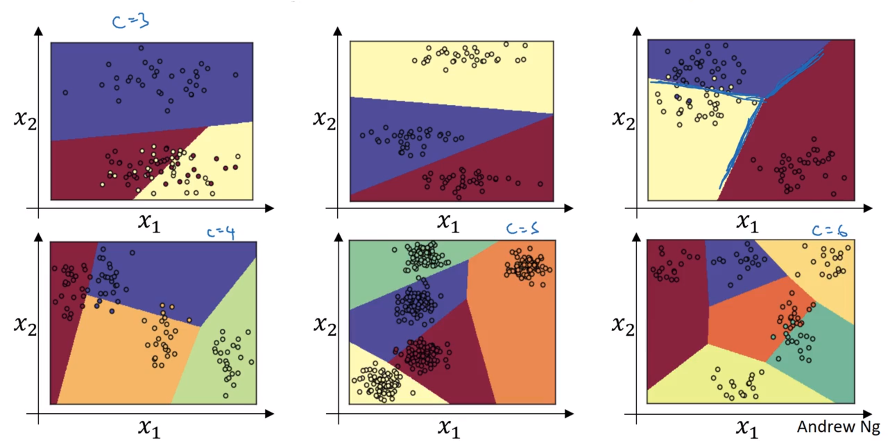

# [Week 3 - Hyperparameter tuning, Batch Normalization and Programming Frameworks](https://www.coursera.org/learn/deep-neural-network/lecture/dknSn/tuning-process)

* [Forum](https://www.coursera.org/learn/deep-neural-network/discussions/weeks/3)
* [mx's notes](http://x-wei.github.io/Ng_DLMooc_c2wk3.html)

## Hyperparameter tuning process

How to systematically organise the hyperparameter tuning process.

The hyperparameters determine the final values of each layer's $W$ and $b$ that are learned. There are many:

 * Learning rate ($\alpha$)
 * Mini-batch size
 * Number of iterations
 * Activation functions ($g^{[1]}, g^{[2]}, ...$)
 * Regularisation parameters
 * Number of hidden layers ($L$)
 * Number of units per hidden layer ($n^{[1]}, n^{[2]}, ...$)
 * Learning rate decay
 * Momentum term ($\beta$)
 * Adam terms ($\beta_1, \beta_2, \varepsilon$)

 Andrew recommeds the following order of tuning:

### First tune
The learning rate, $\alpha$ is the most important hyperparameter to tune. 

### Second tune
After $\alpha$, Andrew looks at:

 * Momentum term ($\beta_1$)
 * Mini-batch size
 * Number of hidden layers ($L$)

### Third tune
 * Number of hidden layers ($L$)
 * Learning rate decay

### Fourth tune
 * Adam default parameters - Andrew doesn't bother tuning these.

### Searching the parameter space

Don't use a $n$ x $n$ grid. Instead use $n^2$ random values:

* Grid search: only $n$ distinct values are tried in one dimension
* Random choice: can have $n^2$ distinct values per dimension

### Coarse to fine

Zoom in to smaller performant regions of hyperparam space and re-sample more densely.

## Using an appropriate scale for picking Hyperparameters

Sample at random, but at appropriate scale, not uniformly.

Sampling uniformly at log scale is more resonable as there are equal samples taken from each part of the scale.

This method is not so important when using coarse to fine as that method will home in on values selected by the poorer selection of uniform search space.

Example: choice of alpha in $[0.001, 1]$:

In general, when searching for $\alpha$ between $10^a$ and $10^b$, then set $r \in [a, b]$, and then set $\alpha = 10^r$.

In the above example:

    r = -4 * np.random.rand()  # -4 < r <= 0, uniformly at random
    alpha = np.exp(10, r) # 10e-4 < alpha <= 1.0

### Picking $\beta$ for exponentially weighted averages

Instead of searching in $[0.9, 0.999]$, subtract from $1$ and search $r \in [0.1, 0.001]$:

$ \begin{alignat}{1}
r &\in [-3, -1] \\
1 - \beta &= 10^r \\
\beta &= 1 - 10^r \\
\end{alignat}$

Or:

    r = np.random.rand()
    beta = 1 - 10**(-r - 1)  # But this may be a specific example not general

It's important to do this as the formula for the approx number of datapoints averaged over, namely $\dfrac 1 {1- \beta}$ is very sensitive in changes when $\beta$ is close to $1$.

Eg, when searching $\beta \in [0.9000, 0.9005]$, both ends of the range average over $\approx 10$ datapoints.
However, searching $\beta \in [0.999, 0.9995]$ will average over $1000$ at the low end to $2000$ at the high end.

The above technique will sample more intensely in the regime when $\beta$ is close to $1$ (or when $1 - \beta$ is clost to $0$).

## Hyperparam tuning in practice: Pandas vs Caviar

Deep learning is applied to many different domains and intuitions about hyperparams from one domain may not transfer to another.

Hyperparam choice can get stale, even in the same domain. The algorithm, data or compute available may change and it's good to re-evaluate at least once every several months.

In terms of hyperparam search, there are two schools of thought:

### Panda
* Babysit a single model, tuning parameters daily, weekly as learning progresses
* Usually done with a huge dataset but not a lot of compute
* When one can only afford to train one model, or a very small number

### Caviar
* Train many models in parallel
* Usually done when there is more compute available and the dataset isn't too huge
* Pick the one which performs the best

## Batch normalisation

Batch normalisation was developed by Sergey Ioffe, Christian Szegedy in [this paper](https://arxiv.org/abs/1502.03167).

It makes hyperparameter search much easier and the network more robust to the choice of hyperparameters (a larger range will work well).

Previously, we saw how to normalise the input layer:

$ \begin{alignat}{1} \displaystyle
\mu &= \dfrac 1 m \sum_{i=1}^m z^{(i)} \\[6pt]
\sigma^2 &= \dfrac 1 m \sum_{i=1}^m \left(z^{(i)} - \mu \right)^2 \quad \text{# element-wise for matrix} \\[6pt]
\overset z z^{(i)} &:= \dfrac {z^{(i)} - \mu } {\sqrt{\sigma^2 + \varepsilon}} \\[6pt]
\end{alignat}$

Above I am using $\overset z z$ as [notation for the normalised value of $z$](https://stats.stackexchange.com/q/343306/162527).

The same process can be applied to the output of any hidden layer. Normalisation can be done on either $z$ or $a$, but is much more often done on $z$.

The above gives mean $\mu = 0$ and variance $\sigma^2 = 1$. To tune the mean and variance, we use:

$\tilde z^{(i)} = \gamma \overset z z^{(i)} + \beta $

Where $\tilde z$ is the batch normalised value of $z$, and $\gamma$ and $\beta$ are learnable parameters of the network, updated by gradient descent just like the $W$s and $b$s.

$\gamma$ sets the mean and $\beta$ sets the variance. (Note this is a different $\beta$ to EWMA - both papers' authors used the same symbol which is mimiced here)

If $\gamma = \sqrt{\sigma^2 + \varepsilon}$ and $\beta = \mu$ this inverts the normalisation so that $\tilde z^{(i)} = z^{(i)}$.

As input to the activation function, use $\tilde z^{(i)}$ instead of $z^{(i)}$.

Batch norm is applied per-mini-batch if mini-batches are in use.

Previously $z^{[l]} = W^{[l]}a^{[l-1]} + b$. Batch norm calculates and then subtracts the mean ($\mu$), cancelling out any addition of $b$, so $b$ is not added with batch norm. $\beta^{[l]}$ will set the mean of the layer's activations instead.

The shape of $\beta$ and $\gamma$ are both $(n^{[l]}, 1)$, identical to the shape of $b$.

$d\beta$ and $d\gamma$ are both calcuated in gradient descent and updated just like the $dW$s.

### Why does Batch Norm work?

Like input normalisation, batch norm standardises the mean and variance for faster learning.  There are some further intuitions as to why batch norm speeds learning, though.

#### Batch norm reduces covariate shift

It makes weights of later layers more robust to changes in earlier layers of the network. 

If you learn some $X \to Y$ mapping and the distribution of $X$ changes, you may need to retrain your learning algorithm. An example is training a cat / non-cat classifier only on black cats, and then trying to classify ginger cats. The ground truth function ("cat or not") remains the same. The data distribution changing is called "covariate shift".  

A deep NN layer also suffers from covariate shift - the distribution of its input will constantly change as the earlier layer's weights and bias terms are learned. (Note again the function trying to be learned by the later layers remains the same, like in the cat case).

With BN, a layer's input distribution will have optimal (tuned over time) and consistent mean ($\beta$) and variance ($\gamma$), meaning that the learning of later layers can be less dependent on the changing values of weights in previous layers. BN weakens the coupling between the earlier and later layers, allowing for more efficient independent learning.

#### Batch norm as regularisation

Each mini-batch's $z$ or weighted sum is scaled by mean/variance of just that minibatch.  The non-exact mini-batch means and variances adds noise to $\tilde z^{[l]}$.

Similar to dropout (multiplying by either $0$ or $1$), this adds noise to each layer's activations.

Therefore BN has a slight regularization effect (which gets smaller as minibatch size grows). The slight regularisation is only a side effect - use other methods if there is overfitting.

### Batch norm at test time

Batch norm processes examples one mini-batch at a time, but at test time, you may need to process one example at a time.

Taking the mean and variance of just one example doesn't make sense. 

The test-time $\mu$ and $\sigma^2$ are estimated using an EWMA across the training set mini-batches.

For each mini-batch ($t$) and each layer ($l$), an EWMA is calculated for $\mu^{\{t\}[l]}$ and ${\sigma^2}^{\{t\}[l]}$. These two EMWA values are then used at test time.

In the formula $\tilde z^{(i)} = \gamma \overset z z^{(i)} + \beta $, the $\gamma$ and $\beta$ values used to calculate $\tilde z$ are the ones learned from the training set.

One could in theory run the entire training set through the trained network to get a precise $\mu$ and $\sigma^2$, but in practice what people usually do is implement a EWMA (sometimes called a running average) to get a rough estimate of the values to use at test time.  In practice the process is pretty robust to the exact method used to get the test-time $\mu$ and $\sigma^2$.  The deep learning framework will have a default which should work pretty well. 

## Multi-class classification with Softmax

Instead of binary classification which detects the presence / absence of something, multi-class classification classifies the input into one of $C$ classes.

If the output layer is interpreted as a probability, then softmax is good activation function to choose.

Notation:

$C$ = number of classes

Softmax generalises logistic regression to $C$ classes. If $C = 2$, [softmax reduces to logistic regression](https://stats.stackexchange.com/questions/233658/softmax-vs-sigmoid-function-in-logistic-classifier).

The [name softmax](https://math.stackexchange.com/questions/1888141/why-is-the-softmax-function-called-that-way) is a contrast to "hardmax", ie argmax, or one-hot encoding.

Unlike other activation functions so far, softmax takes a vector as input and outputs a vector of the same size.

$\begin{align}
\displaystyle t &= e^{z^{[L]}} & \quad \text{# temporary variable, shape same as } a^{[L]} \\[6pt]
a^{[L]} &= \frac {t_i} {\sum_{i=1}^{n^{[L]}} t_i }
\end{align}$

Raising $e$ to the power of $z$ spreads out the values, making the gaps between them larger. Dividing by the sum of all elements of $t$ has the individual probabilities sum to $1$.

For a single layer network, the decision boundary looks like:

Ie, softmax creates linear decision boundaries between the different classes.

### Training a softmax classifier

For a vectorised implementation, both $y$ and $\hat y$ will have shape $(C, m)$.

#### Loss function

$\displaystyle \mathscr L(\hat y, y) = - \sum_{i=1}^{C} y_i \log \hat y_i$

Where the ground truth values $y_i$ are 0, this will add nothing to the sum.

Where the ground truth $y_i = 1$, the loss is $-1 \cdot \log \hat y_i$.

To minimise this loss, $\hat y_i$ needs to be as large as possible, ie, as close to $1$ as possible.

This turns out to be a form of maximum likelihood estimation in statistics.

#### Cost function

$J(W^{[1]}, b^{[1]}, W^{[2]}, b^{[2]}, \cdots) = \displaystyle \frac 1 m   \sum_{i=0}^m \mathscr L (\hat y, y)$

#### Derivatives

$dz^{[l]} = \hat y - y$

## Deep learning programming frameworks

Andrew lists the following as credible choices (for some subsets of applications) of DL frameworks with a dedicated user / developer community.

* Caffe / Caffe2
* CNTK
* DL4J
* Keras (wraps Tensorflow and Theano)
* Lasagne
* mxnet
* PaddlePaddle
* Tensorflow (python)
* Theano (python)
* Torch (lua)

When choosing a DL framework, consider:

* Ease of programming (development and deployment)
* Speed
* Openness (licence, governance, trustworthiness to remain open)

### Tensorflow

The heart of a TensorFlow program is something to compute a cost. TF automatically figures out the deriviatives and how to minimise that cost.

Motivating problem: minimize cost function $J(w) = (w-5)^2$

    import tensorflow as tf

Define parameter to optimize:

	w = tf.Variable(0, dtype=tf.float32)  # (<initial-value>, name=<optional-name>)

Define cost function:

	cost = tf.add(tf.add(w**2), tf.multiply(-10., w)), 25) # w^2 - 10w + 25
	# It's also possible to use tf-reloaded operators:
	# cost = w**2 - 10 * w + 25

Now the computation graph is defined. Backward propagation derivatives are auto-computed.

Tell TF to minimize the cost with GD optimizer:

	train = tf.train.GradientDescentOptimizer(0.01).minimize(cost)  # alpha = 0.01<F24><F25>

To start the training:
Initialize vars → create session → run operations in session 

	init = tf.global_variables_initializer()  
	session = tf.Session()  
	session.run(init)  # initialise global variables
	session.run(train) # run 1 iteration of training

Alternative format:

	with tf.Session() as session:  
		session.run(init)  
		session.run(train)

This allows for a better clean-up if there is an exception in the block.

To inspect the value of a parameter:

	print(session.run(w))

Run 1000 iterations of training (here, gradient descent):

	for i in range(1000): session.run(train)

When the loss function depends on training data, define a placeholder for training data. A placeholder is a variable whose value will be assigned later.

	x = tf.placeholder(tf.float32, [3,1])
	cost = x[0][0] * w**2 + x[1][0] * w + x[2][0]

To feed actual data value to placerholder: use `feed_dict` in `session.run()`:

    coefficients = np.array([1., -10., 25.]).reshape((3,1)
    session.run(train, feed_dict={x: coefficients})

Also use `feed_dict` to feed in mini-batches.
