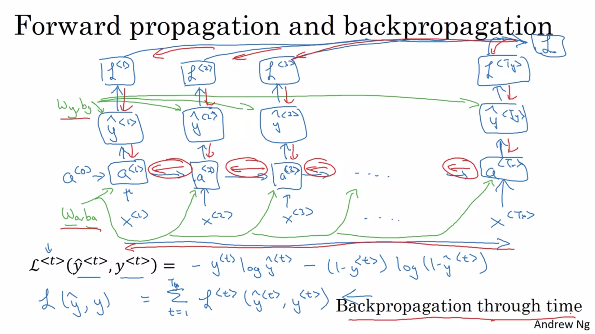

# Week 1 - Recurrent Neural Networks

### Papers

[Jeffrey L. Elman. 1990 Finding Structure in Time](https://onlinelibrary.wiley.com/doi/abs/10.1207/s15516709cog1402_1) 1/5 but long, [wikipedia summary](https://en.wikipedia.org/wiki/Recurrent_neural_network#Elman_networks_and_Jordan_networks)

[Werbos 1990, Backpropagation through time: what it does and how to do it](https://www.researchgate.net/publication/2984354_Backpropagation_through_time_what_it_does_and_how_to_do_it) 2/5 difficulty

[Sepp Hochreiter, Jürgen Schmidhuber 1997: Long Short-term Memory](https://www.researchgate.net/publication/13853244_Long_Short-term_Memory) 4/5 and longish. Goes into depth on theory of vanishing gradients.

### Notation

$Tx^{(i)}$ = length of $i$-th sequence example from dataset $x$

$x^{(i)<t>}$ = the $t$-th element of temporal or sequenced data from the $i$-th example in the dataset $x$

Vocabulary is also called a dictionary - a mapping of words to one-hot encodings.

100,000 word dictionaries are not uncommon, even 1M words.

### RNN model


If each input was was a one-hot encoding of length 100,000, the input layer would be enormous.

We want information about one part of the input to be available to be useful in the context of another part of the input, like a kernel in CNNS.


$W_{ya}$ means it produces a $y$-like value, and is multiplied by an $a$-like value.

Vector of 0s for the Time 0 activation is the most common choice.

On the right, the shaded box denotes a time delay of one step.

Classic RNNs only get information from earlier in the sequence.


The activation function for outputting $y$ is often a sigmoid or softmax, and for $a$ often tanh or ReLU.


Two parameter matrices can be joined into a single one, using the addition of the dot product to add the two terms explicitly added previously.

Here the notation changes such that $W_y$ outputs a $y$-like quantity.

### Backward propagation through time



Green = weights, Red = backprop, Blue = forwards.

Element-wise loss: logistic regression loss a.k.a cross entropy loss.

#### Different Types of RNNs

This section was inspired by [Karpathy's "The Unreasonable Effectiveness of Recurrent Neural Networks"](http://karpathy.github.io/2015/05/21/rnn-effectiveness/).

Types of architectures:
* One-to-one:  Standard neural network, one input vector creates one output vector
* Many-to-one:  Example: movie classification (number out of 5)
* One-to-many:  Example: music generation given a seed vector
* N-to-N: Example: Is this word a name?
* Many-to-many:  Translation from one language to another
* Attention-based (week 3)


#### Language model and sequence generation

A language model gives P(sentence) = probability that a sequence of words would occur based on what it has learned.

Less common words not in dictionary are replaced with a token symbolising <unknown>.

Tokens can also be created for punctuation, or <end of text>.


Initial inputs are both $\vec 0$.

$\hat y^{<1>}$ is the softmax probability of the first word being any of the possible first words.

$\hat y^{<2>}$ is the softmax probability of the second word given that the first actually occurred.

Individual timestep loss function is the softmax loss function (zero loss when $\hat y = 1$, almost infinite when $=0$)

Overall loss is the sum of all timestep losses.

The proabability of a sentence of 3 words is given by the multiplication of probabilities in the bottom right.

#### Sampling novel sequences


Use `np.random.choice()` to sample from the dictionary based on the probabilities of $\hat y$ at that timestep.

Feed the word that was used as input in the next step.

If getting an <unknown> token, then sample again.  Iterate until you get a <end of sentence> token.

Character-level language models never generate a unknown word token, and can generate even very uncommon words as their characters have some non-0 probability of occuring.

The disadvantage is that sequence is much longer, and long range dependencies can be lost (how later part of sentence is influenced by beginning of sentence).  Also more expensive to train. 

#### Vanishing / exploding gradients with RNNs


Purple shows the locality effect caused by vanishing gradients.

The basic RNN presented so far isn't good at capturing long-term dependencies such as plurality of pronouns.

Vanishing gradient problems occur as the "depth" of the network is large, the number of "layers" is many, because sequences can be very long.  Gradients can increase or decrease exponentially.

The error in the gradient at the end may become minuscule or unrepresentable or effected by representation issues by the time it propagates back to time step 0.

RNNs output is mostly determined by the last few timesteps.

Vanishing gradients tend to be a bigger problem sith training RNNs, but exploding gradient issues are catastrophic, causing parameters to go to NaN.

Gradient clipping sets the maximum that a gradient can be, to avoid exploding gradients.

### Simplified GRU

GRUs modify the hidden layer of RNNs to enable them to better capture long-term dependencies.

[On the Properties of Neural Machine Translation: Encoder-Decoder Approaches](https://arxiv.org/abs/1409.1259) - 1/5 difficulty

[Empirical Evaluation of Gated Recurrent Neural Networks on Sequence Modeling](https://arxiv.org/abs/1412.3555) - 1/5 difficulty

The functions from Andrew Ng are given along with their names from the [Pytorch `nn.GRU` class documentation](https://pytorch.org/docs/master/nn.html#torch.nn.GRU)

$c$ is the memory cell.

$\tilde c^{<t>} =$ candidate for overwriting $c^{<t>}$.

GRU will output $a^{<t>} = c^{<t>}$.  (LSTMs output a different value)


Assume the memory cell is a vector of 100 dimensions. Then all the red boxes will be of the same dimensions.

The green boxes show what happens when $G_u$ is either 0 or 1 for a particular element. If $G_u$ is 0, then we get $c^{<t>} = c^{<t-1>}$.  This relates to the green in the sentence "cat...was" (singular).

$\Gamma_u$ or $G_u$ is the update gate, with a value $[0..1]$.  It's calculated via a sigmoid, and for most of the domain, the values are either very close to either $0$ or $1$.  For intuition, think of it being either 0 or 1.

### Full GRU

$\Gamma_r$ is added - it determines the relevance of $c^{<t-1>}$ for computing $\tilde c$.  It determines how heavily the candidate hidden memory cell will be based upon the new input.

$\tilde{c}_t = \tanh(W_c [G_r \odot c_{t-1}, x_t ] + b_c) \qquad $   (torch $n_t$, candidate or new value of memory)

$ G_u = \sigma(W_u [ c_{t-1}, x_t ] + b_u) \qquad $  (torch $z_t$)

$ G_r = \sigma(W_r [ c_{t-1}, x_t ] + b_r) \qquad $  (torch $r_t$, relevance of old memory)

$ c_t = G_u \odot \tilde{c}_t + (1 - G_u) \odot c_{t-1} \qquad $  (torch $h_t$, cell memory or hidden state)

$ a_t = c_t $

Here we say that the internal activation $a$ of a RNN is denoted $c$ to transition easier to LSTMs later.  $h$ is often used in the literature instead of $c$.

For ease of understanding, consider the update gate term $\Gamma_u$ to be either $0$ or $1$.

Because $\Gamma_u$ comes from a sigmoid, it will often be very close to $0$.  If it is indeed $0$, there will be no update coming from candidate memory $\tilde c$, so the remembered value $c$ will just propagate to the next time step.  This propagation without change addresses the vanishing gradient problem.


### LSTMs

The LSTM is a more powerful and general version of a GRU.

Seminal paper:
[Sepp Hochreiter, Jürgen Schmidhuber 1997: Long Short-term Memory](https://www.researchgate.net/publication/13853244_Long_Short-term_Memory) 4/5 and longish. Goes into depth on theory of vanishing gradients.

[colah's "Understanding LSTMs"](http://colah.github.io/posts/2015-08-Understanding-LSTMs/)

Historically, LSTMs came much earlier than GRUs.  Some applications get better accuracy with GRUs, some with LSTMs.  Andrew prefers the GRU as it is simpler, computationally faster and scales to building bigger models.

LSTM differences:

* $\tilde c$ calculation drops $\Gamma_r$. $\Gamma_r$ can be used in the $\tilde c$ formula like in GRUs, but this is not as common. 
* $\tilde c$ calculation is based on $a^{<t-1>}$ as now $a \ne c$
* Forget gate is added to replace the $(1-G_u)$ term
* Output gate $G_o$ is added
* Outputs both $a$ and $c$.

$ \tilde{c}_t = \tanh(W_c [ a_{t-1}, x_t ] + b_c)$

$ G_u = \sigma(W_u [ a_{t-1}, x_t ] + b_u) $

$ G_f = \sigma(W_f [ a_{t-1}, x_t ] + b_f) $

$ G_o = \sigma(W_o [ a_{t-1}, x_t ] + b_o) $

$ c_t = G_u * \tilde{c}_t + G_f * c_{t-1} $

$ a_t = G_o * tanh \ c_t $

[Data Science: When to use GRU over LSTM?](https://datascience.stackexchange.com/questions/14581/when-to-use-gru-over-lstm)

Adds $\Gamma_o$ for the output gate.  $a^{<t>} = \Gamma_o \odot tanh\left(\tilde c^{<t>}\right)$

Andrew Ng's picture of a LSTM cell is based on Chris Olah's [Understanding LSTMs](http://colah.github.io/posts/2015-08-Understanding-LSTMs/).

Sometimes $c^{<t-1>}$ is also fed into the formula for update/forget/output gates, and the $W$ matrix expanded to match.  This is called a "peephole connection".

LSTMs came first in history, then GRUs came later, perhaps as a simplification of the LSTM.

Some types of problem favour a GRU over a LSTM, and vice versa.

Andrew feels that the simplicity and computational savings of the GRU is better when scaling out to building bigger networks.  But then he says that LSTM is more powerful and flexible.

### Bidirectional RNNs

Sometimes context requires later sequenced information.


Above shows direction of forward propagation for output of $\hat y^{<3>}$.  (Formula at top).

Bidirectional RNNs using LSTM blocks are quite common.

The disadvantage is that the entire sequence of data is required before any predictions can be made.

### Deep RNNs


Notation:  $a^{[l]<t>}$ is the activation of the $l$-th layer at time $t$.

Each layer has it's own weights, shared over time.

There can be multiple layers of neurons either in creating the activation $a$ which is passed forward in time, or in outputting $y$ given $a$.

Having 3 layers in a deep RNN "is already quite a lot", because each layer also includes a temporal dimension.

Sometimes there is a conventional Deep Neural Network which takes the output from the RNN layers for further transformation.

The blocks can be RNN, LSTM, GRU or BRNN.


### Quiz

```
1 (i)<j>
2 x=y
3 Sentiment, gender
4 P(t|t-1)
5 randomly sample, chosen word
6 Exploding
7 100
8 Betty, 0
9 G & 1-G
10 Unidirectional, 1..t
```


# TODO add to papers list
