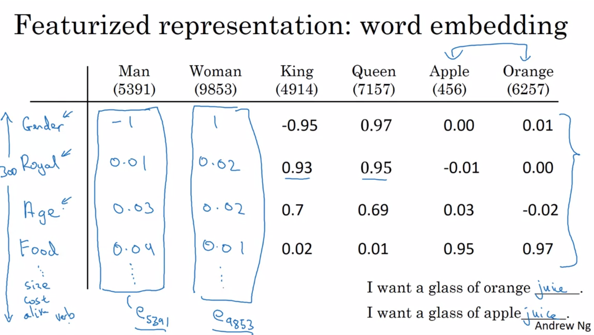
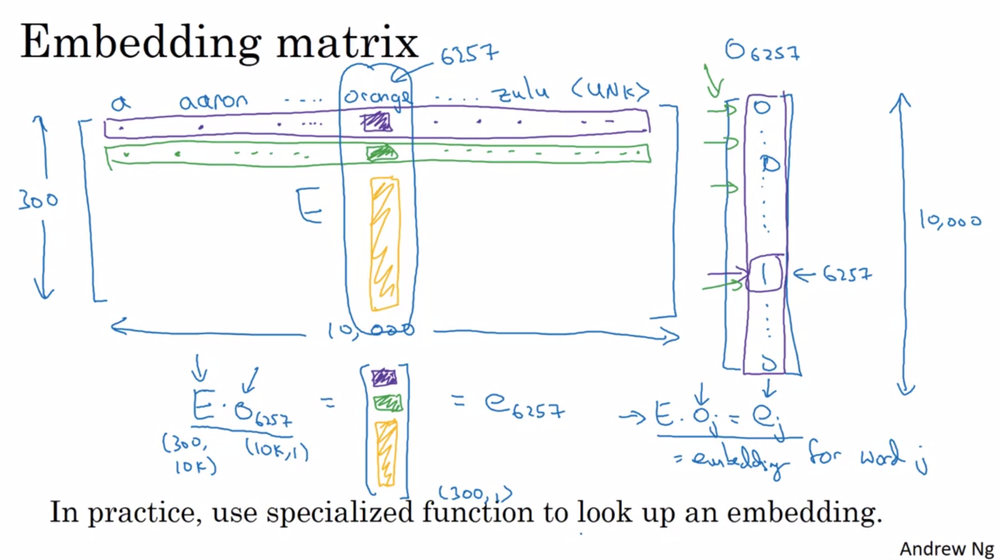
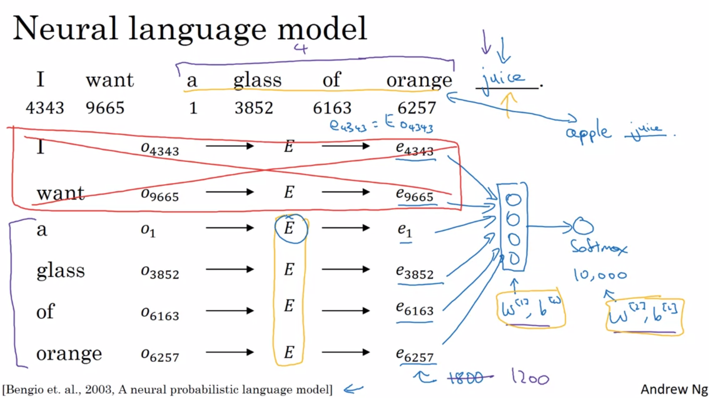
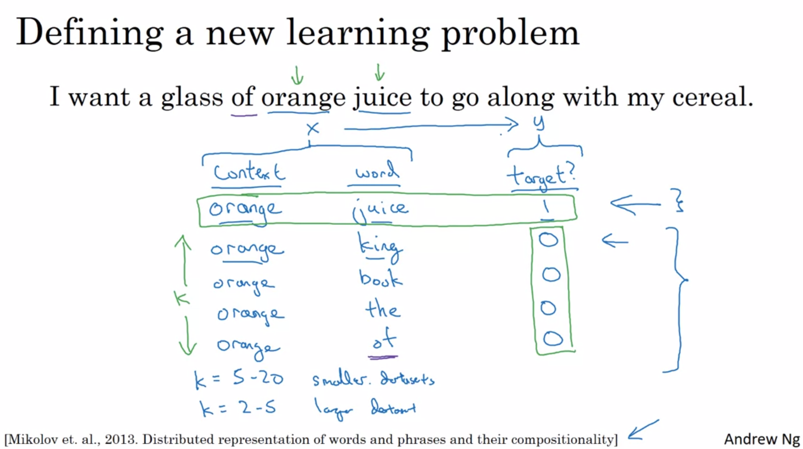
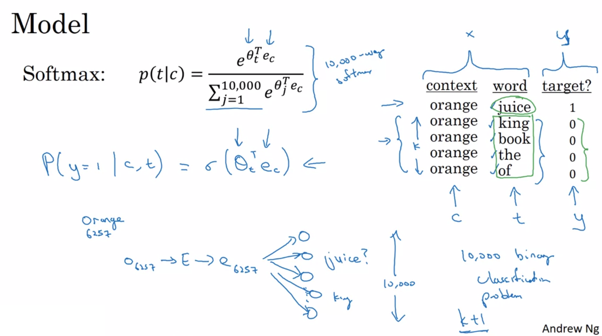
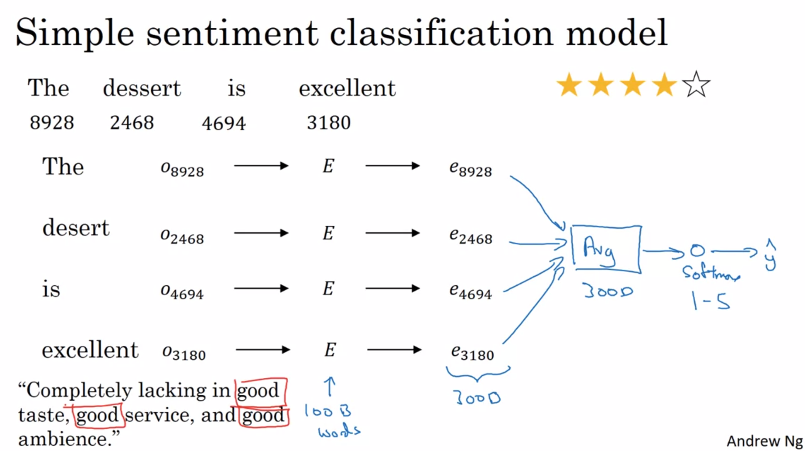
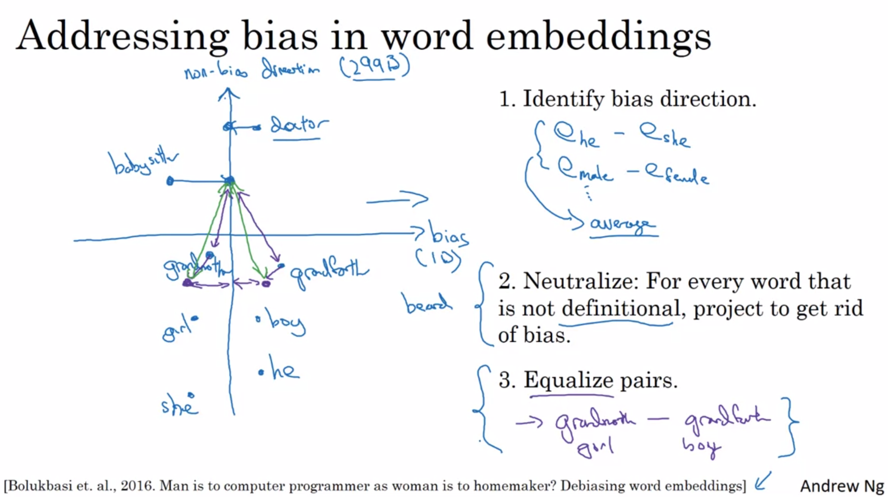

# Week 2 - Intro to word embeddings

## Word representation
Word embeddings captures analogies like that man $\mapsto$ king, and woman $\mapsto$ to queen.

The problem with one-hot vectors is that their inner product = $\vec 0$, so no similarity between vectors can be extracted.



Embeddings above a matrix of $(word \times concept)$ which captures the relatedness of a words to concepts. Eg, Gender, food, action, expensive.

$e_i$ is the $i$-th embedded encoding.

Many of the embedding features of orange and apple are similar, encoding that the two share a degree of commonality.

Word embeddings allow NLP models with relatively small datasets.

[Laurens van der Maaten, Geoffrey Hinton, 2008: Visualizing Data using t-SNE](http://www.jmlr.org/papers/volume9/vandermaaten08a/vandermaaten08a.pdf)

## Using word embeddings

1. Use dense word embeddings as input to RNNs to more better capture relationships between words.
1. Learn embeddings from massive datasets. (1 billion to 100 billion words)
1. Use transfer learning to train a smaller training set for the specific task
1. (Optional) fine-tune word embeddings with new data (if dataset for specific task is large)

Word embeddings are very useful when there is a smaller-sized labelled training set.  Has been used in: name entity recogniton, parsing, text summarisation, co-reference resolution. Less useful for language modelling machine translation especially given a large dataset.

Whereas the encoding an never-seen-before face as a 128-dimensional vector, word embeddings use a pre-defined dictionary size of say 10,000 words, and learn an embedding for each of the words.

## Properties of word embeddings

[Tomas Mikolov, Wen-tau Yih, Geoffrey Zweig, 2013: Linguistic Regularities in Continuous Space Word Representations](https://www.aclweb.org/anthology/N13-1090)  1/5 difficulty

Embeddings have the property such that:

$e_{man} - e_{woman} \approx e_{king} - e_{queen}$

King is to $x$ as man is to woman:

$\underset{x}{\mathrm{argmax}}\ similar(e_{x} ,\  e_{king} - e_{man} + e_{woman})$

This gives a 30-75% accuracy on predicting the expected word exactly.

To find the vector with the highest similarity, either the $cos$ of the vectors can be used (seeking the highest value), or the euclidean distance (seeking the lowest value). $cos$ is used more often, and normalises the lengths of the vectors.

Cosine similarity: $ \displaystyle \frac {uv} { {\Vert u \Vert _2 \cdot \Vert v \Vert _2  }} = cos \theta$



$E$ = Embedding matrix.  $o_j$ is the one-hot representation for the $j$-th word.

Use a column lookup or other optimized lookup (maybe which is computational-graph reversible?) instead of the far less efficient $E \cdot o_j$ to get the embedding for the $j$-th word in the dictionary.

## Learning word embeddings

The more complex algorithms came first in time, and then progressively simpler ones were developed.  The older, more complex are presented first for intuition.



The above 1800 = 6 x 300 assumes that the embeddings for each word are 300-dimensional.

Alternatively, a hyperparameter can be set for the historical window (4 above).  This allows for arbitrarily long sentences.

Yellow indicates the parameters of the model to be learned.

Similar embeddings for "apple" and "orange" are encouraged by learning to predict "juice" for both.

#### Context / target pairs
1. The last $n$ words can be used for learning.
1. $n$ words on both left and right of target
1. Last 1 word
1. Nearby 1 word (skip-gram)

For a language model, is natural to use the last $n$ words as context. For learning word embeddings, the contexts 2-4 can be used also.

### Word2Vec (skip-gram and CBOW)

[Mikolov et al, 2015. Efficient Estimation of Word Representations in Vector Space](https://arxiv.org/abs/1301.3781) 1/5

Select a random target word nearby or with $\pm [5,10]$ words of the context word, and try to predict it.

This is a very difficult task to get right, but the goal isn't to predict nearby words, but to learn good word embeddings.

Expensive because of calculating denominator of softmax.

1. Get one-hot encoding for word ($o_c$)
1. Get embedding by multiplying / lookup Embedding matrix $E \mapsto e_c$
1. Pass through softmax to obtain $\hat y$

Given context word $c$ and target word $t$:

[//]: # ( $\displaystyle \mathrm{softmax} \ p(t|c) = \frac {exp({\Theta_t e_c + b_t})} {\sum_{i=1}^V exp(\Theta_t e_c + b_t)}$ )

$\displaystyle \mathrm{softmax} \ p(t|c) = \frac {exp({\hat y_i})} {\sum_{j=1}^V exp(\hat y_j)}$

The problem with this is the computational requirements of the softmax denominator: ${\sum_{j=1}^V exp(\hat y_j)}$.

Given vocab size $V$ can be 1 billion words this is extreme, and still onerous for only 10K words.

A hierarchical classifier built from a tree of binary classifiers can be used instead, and this is $\mathcal O log|V|$ where $V$ is the vocab size.

An unbalanced tree can be used with the more common word leaves closer to the top requiring fewer traversals.

How to select context word, $c$?  To prevent over-training of very common words ("and", "the", …), and to ensure more training of very infrequent words, a non-uniform selection of context word is used.

The Continous Bag Of Words (CBOW) was also described in the paper. It uses a sliding window of context words to predict the target word.

When you define the window size parameter, you only configure the maximum window size. The actual window size is randomly chosen between 1 and max size for each training sample, resulting in words with the maximum distance being observed with a probability of 1/c while words directly next to the given word are always(!) observed.

The model is fed the embedding of the context word $x$, to a single softmax which predicts the target word $y$.

* Skip-gram: works well with small amount of the training data, represents well even rare words or phrases.
* CBOW: several times faster to train than the skip-gram, slightly better accuracy for the frequent words

### Negative sampling

The softmax function in the skip-gram is still expensive to compute even with a heirarchical classifier.

[Mikolov et al, 2013. Distributed Representations of Words and Phrases and their Compositionality](https://arxiv.org/abs/1310.4546)  1/5

In this method, we build a table of (this word), (other word) and (is context).



If (other word) could have been picked in a skip-gram, then (is context) gets 1, else it is a 0.

Apart from the (is context = 1) words sampled from the $\pm 10$ context words, pick $k$ words at random from the dictionary to fill out (other words) with (is context = 0).

We pick one (is context = 1) word, and then $k$ words where (is context = 0).

In purple, some randomly picked words with (is context = 0) from the dictionary may have been part of (this word)'s surrounding context. This is ok.

Choose $k \in [5,20]$ for small datasets, and $k \in [2,5]$ for larger datasets.

There are then $k:1$ negative:positive examples from which to train this model.



Given:  
$c$ = context word (this word)  
$t$ = target word (other word)  
$y$ = label $\in {0, 1} (is_context)$  
$e_c$ = the embedding of $c$  
$\theta_t$ = parameter vector (one logit for each target word)  

Then this turns into a logistic regression:

$P(y=1|c,t) = \sigma(\theta_t^Te^c)$

The network structure is simple: a single layer of $V$ (vocab size) logits with $e_c$ is input.

Instead of training all $V$ logits, only the $1$ positive example, and $k$ negative example logits are trained on each iteration.

#### Selecting negative examples

If selecting based on the frequency of occurrence, then the most common words will be excessively represented.

If using $P = \frac 1 {|V|}$, less common words will not be trained much.

Through experiment, the authors chose: $\displaystyle \frac {f(w)^{3/4}} {\sum_{j=1}^V f(w)^{3 / 4}}$, where $f(w)$ is the probability of the word appearing based on frequency of occurrence.

### GloVe

While skip-grams with negative sampling are used more commonly, GloVe has a following due to its simplicity.

[Jeffrey Pennington, Richard Socher, and Christopher D. Manning. 2014. GloVe: Global Vectors for Word Representation](https://nlp.stanford.edu/projects/glove/) 3/5

Let $X_{ij}$ be the number of times that the word $j$ (target) appears in the context of the word $i$ (context).

Using "within n words" as the definition of context, then $X_{ij} = X_{ji}$ (a symmetrical relationship). If the context is "the word preceeding", then not.

The algorithm:

$ \displaystyle min \sum_{i=1}^V \sum_{j=1}^V (\theta^T_i e_j      -\log X_{ij})^2$

This learns vectors $\theta_i$ and $e_i$ such that their inner product is a good predictor of how many times word $i$ appears in the context of $j$.

$log(0)$ is undefined as $-\infty$, so we won't sum where $X_{ij} = 0$.

To prevent this, weighting term $f(X_{ij})=0$ when $X_{ij} = 0$, and use the convention that $0 \log 0 = 0$.

The weighting term $f(X_{ij})$ gives more weight for less commonly appearing words while demoting the weight for stop words (the, of, a, is).

$ \displaystyle min \sum_{i=1}^V \sum_{j=1}^V f(X_{ij}) (\theta^T_i e_j + b_i + b'_j -\log X_{ij})^2$

We want the vector inner product $\theta^T_i e_j$ to be large if the two words are related, ie, $\log X_{ij}$ is large.  So we want the difference $\theta^T_i e_j - \log X_{ij}$ to be small, and the $()^2$ ensures that the cost is always positive.

In the formula, $\theta_i$ and $e_j$ are symmetric (swappable).  So, initialise $\theta$ and $E$ uniformly random, run gradient descent, then take the average: $ \displaystyle e_w^{\text{(final)}} = \frac {\theta_w + e_w} {2}$.

Individual components of the embeddings generated by GloVe may not represent a single variable like they do in the other methods, but the parallelogram math will still work:

King is to $x$ as man is to woman: $\underset{x}{\mathrm{argmax}}\ similar(e_{x} \approx e_{king} - e_{man} + e_{woman})$


### Sentiment analysis

Word embeddings allow sentiment predictors to be trained with modestly sized labelled datasets of about 10-100K examples.



Sum or average the embedding of each word, then pass to a softmax classifier.

Arbitrary lengths are supported.  Problem: lacks information coming from word order (eg bottom left above)

Better: Use a many-to-one RNN: feed in each word sequentially, then softmax on the output.

# Debiasing word embeddings

[Bolukbasi et al. 2016. Man is to Computer Programmer as Woman is to Homemaker? Debiasing Word Embeddings](https://arxiv.org/abs/1607.06520) 2/5

Word embeddings reflect the biases inherent in the text used to train them.

ML algorithms are influencing college admissions, jobs, loan applications, and criminal sentencing guidelines.



1.  Find the directionality of the bias:

    Average related pairs: she - he, grandmother - grandfather, he - him.

    If the bias is across more than one axis, singular value decomposition (SVD) is used (similar ideas to PCA).

1. Neutralise: for every word that is not definitional, project to the mid-point to get rid of the bias.  (Eg "doctor", "babysitter")

1. Centre gendered pairs around the gender axis mid-point, by shifting them both equally (purple pen)

Step 3 is needed as after step 2, "grandmother" would be closer to the centered "babysitter".  Green shows the desired equal distances.

## Quiz

```
1. False
2. non-linear dimensionality reduction
3. True
4. boy girl brother sister   boy brother girl sister
5. Wasteful
6. True
7. nearby
8. 500 Adam
9. All except init 0
0. >>
```
