# Week 3 - Sequence models & Attention mechanism

This week is about sequence to sequence models, used in translation and speech recognition.

## Basic models


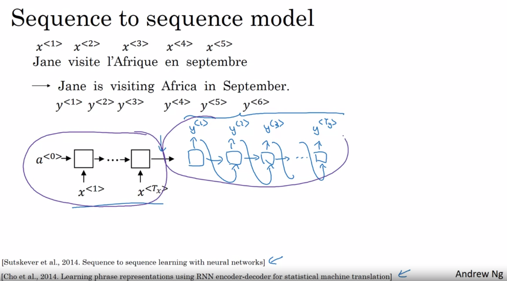

In machine translation, there are two networks, encoder and decoder.

Output of encoder is a vector representing the input sentence.

With enough pairs of Englsh $\mapsto$ French sentences, this will work reasonably well.

A language model estimates the probability of a sentence, and allows generating novel sentences.

Translation is called a "Conditional Language Model", estimating the probability of a target language sentence conditioned on a particular input language sentence.

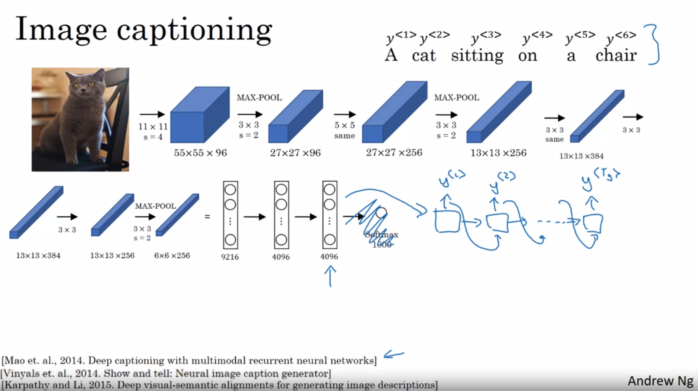

For describing an image, use an image without the classifier (Alexnet above) as the encoder.

## Picking the most likely sentence

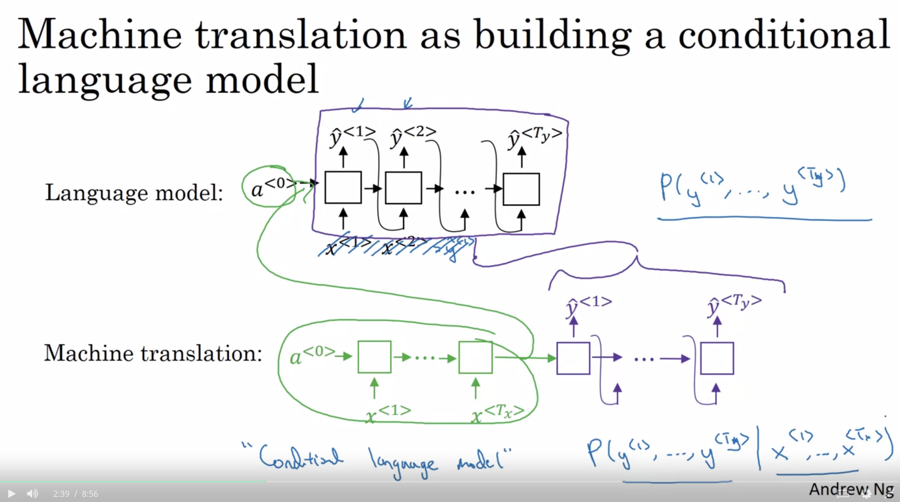

Instead of sampling randomly but following the distribution (like novel sentence generation), here we want to maximise the probability of the entire output sentence being a translation on the input.

Greedy search is using the highest probability predicted word at each time step.  But we want to maximise the joint probability.

Above, given the first two words, "going" is a higher probability word than "visiting" as it's more common, but leads to a worse translation overall.

If there is a vocab of 10,000 words, and translations up to 10 words long are considered, there are $10000^{10}$ 10-word translations.

An approximate search algorithm isn't guaranteed to find the maximum proability, but generally does a pretty good job.

## Beam search

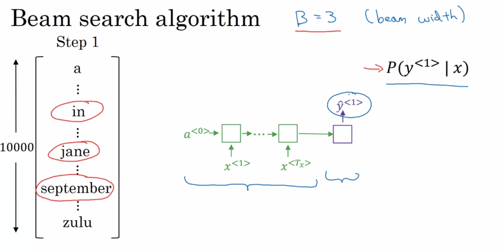

Beam width means that that many possibilities are considered as being the first word.

Eg, if $\hat y^{<1>}$ is a 10000 dimension softmax, then take the 3 with the highest probability.

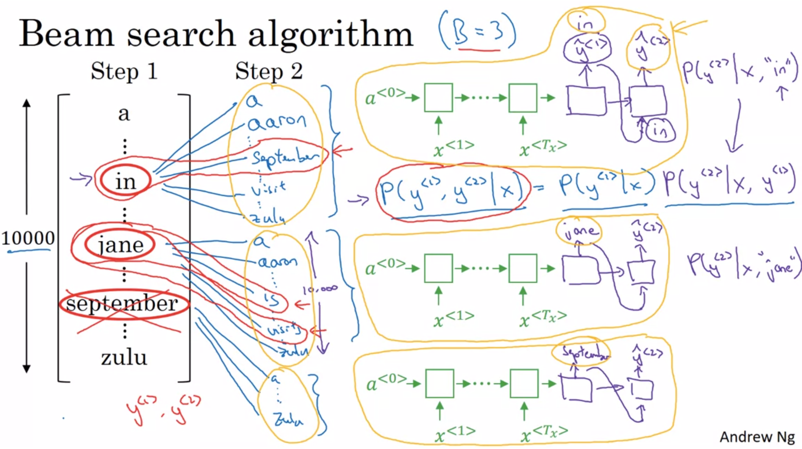

The decoder is run <beam width> times, with the first output word selected as from step 1.

Red: The probability of the 2nd word is obtained by multiplying by the probability of the first with the probability of the 2nd, given the 1st.

If the 3 best 2-word probabilities are "In September", "Jane is", and "Jane visits", the first word "September" is then discarded.

With a beam width of 3 and vocab of 10000, the 2nd step considers 30,000 possible 2nd words.  Only 3 sentence beginnings are then selected.

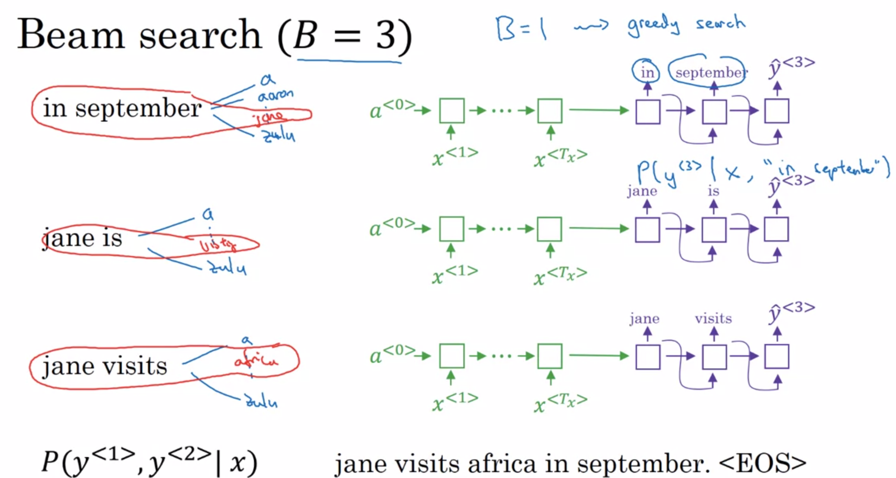

The decoder is again run <beam width> times, with the first two output words selected from step 2.

With a beam width of 1, this collapses to be the same as greedy search.

## Refinements to beam search

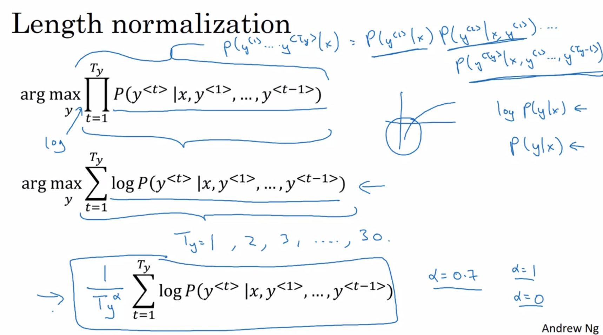

Each of the terms multiplied in the product formula are less than one, often very very small quantities, and multipying these small numbers together gives a really tiny number, leading to numerical underflow (cannot be represented/calculated accurately).

For numerical stability, we take the log of each probability, and sum the logs instead of multiplying. (Log of a product is the sum of logs)

Because log is a strictly monotonically increasing function, maximising $P(y|x)$ will give the same result as maximising $log\ P(y|x)$.

With a very long sentence, the probability will be low as many terms $<1$ get multiplied together.  This means that shorter translations are preferred.

We are in the negative range of the log graph with probabilities as $x < 1$.  Dividing a negative number will make it smaller, making argmax happier.

To neutralise the bias toward shorter sentences, normalise by multiplying by $1 \over T_y$, or soften by $1 \over {T_y}^\alpha$.

$\alpha = 1$ normalises based on the length, $\alpha = 0$ gives $1 \over 1$ or no normalisation.  Tune $\alpha$ to get best results.

Wrap up:

Beam search is done once for each sentence length from 1 .. <max len> (30 above).  Keep track of the top 3 possible sentences for each of these sentence lengths.

Pick the sentence with the highest score based on the normalised log probability/likelihood objective

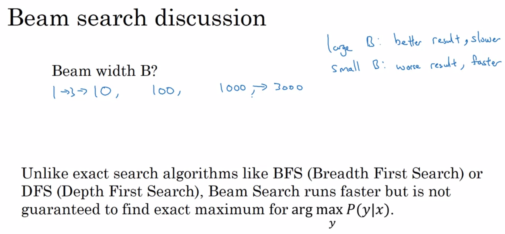

Beam width of 10 is common, and 100 for a large production system.  For best performance (eg publishing paper results), 1000-3000.

There are diminishing returns as B gets very large.

## Error analysys applied to approximate optimisation algorithm (ie, Beam)

Use this whenever there is a approximate optimisation algorithm working to optimise some sort of objective or cost function.

Beam is an approximate or heuristic search algorithm and doesn't always output the best translation.

How to determine if it's worth optimising beam search vs the RNN model?

Let the human translation be $y^*$.

Use the model to compute $P(y^*|x)$ and $P(\hat y|x)$ and find which is greater.

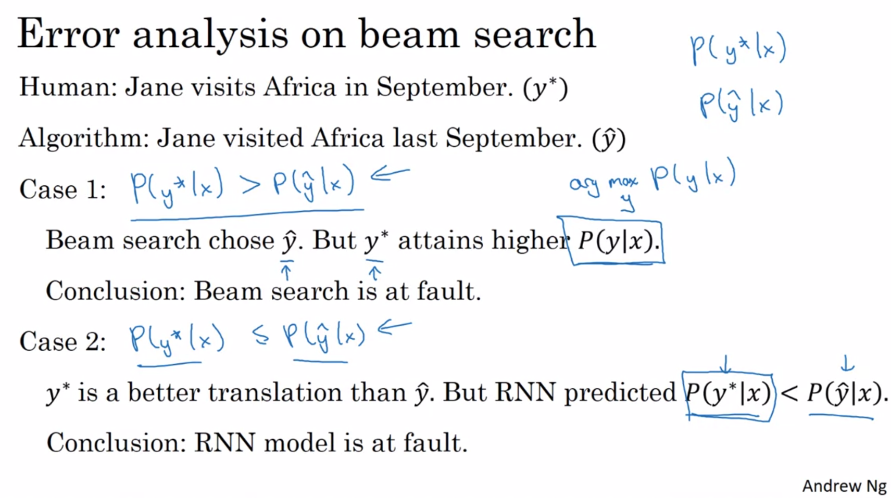

Some subtleties regarding length normalisation have been glossed over - use the normalised log likelihood objective function instead.

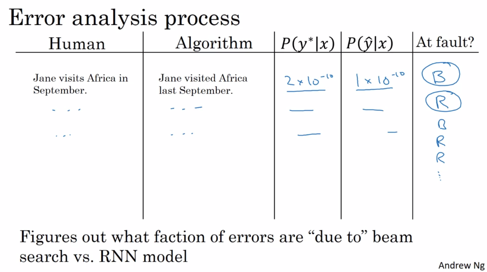

## Bleu score

How to measure accuracy when there are multiple correct translations?

Bleu score is a single metric which allows us to measure how good a computer translation is.  If it's close to any of the reference translations, it will have a high bleu score $\approx 1$.

(BiLingual Evaluation Understudy.  Understudy meaning substitute for humans actor)

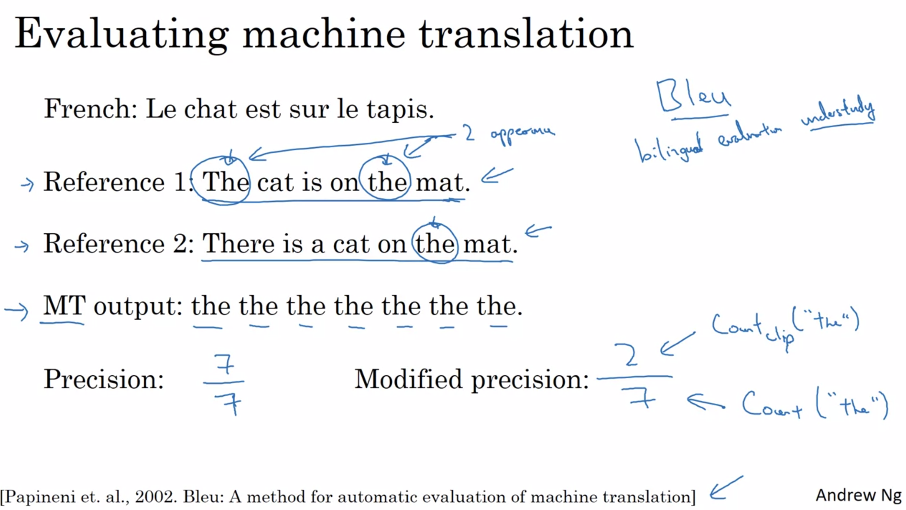

Individual words:

One way: Precision: What fraction of the words appear in each of the reference translations?

But above this is $7 \over 7$ for both reference sentences, which is too good for a terrible translation.

Instead, use modified precision: Give a word credit only up to the maximum number of times it appears in the reference sentence.  "The" appears a maximum of 2 times in a reference sentence.

$\displaystyle \mathrm{ modified\ precision = \frac {max\ reference\ occurances} {translation\ occurrences}} $


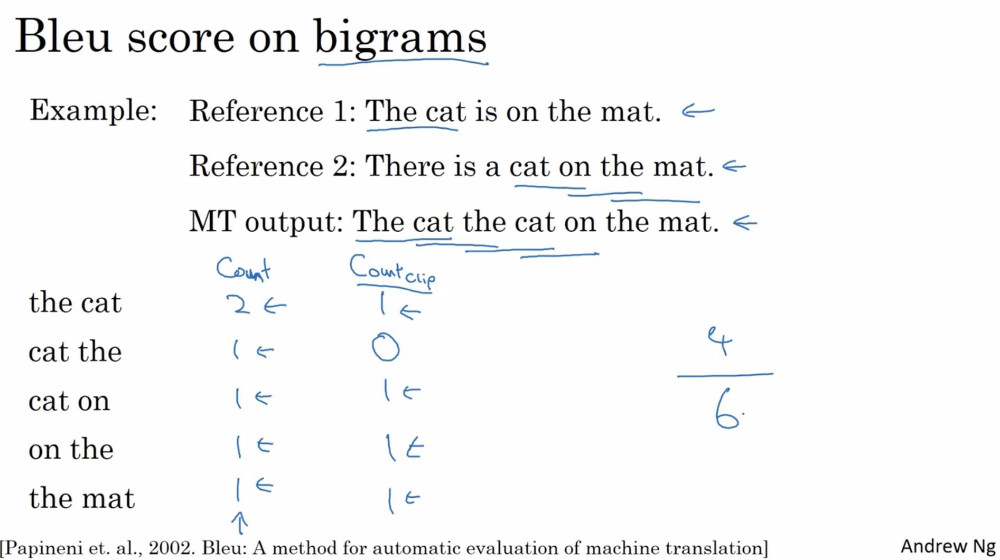
$\mathrm{count_{clip}}$ is clipped to the max number of times the bigram appears in a reference sentence.

Modified precision above is sum of $\mathrm{count_{clip}}$ over sum of $\mathrm {count}$.

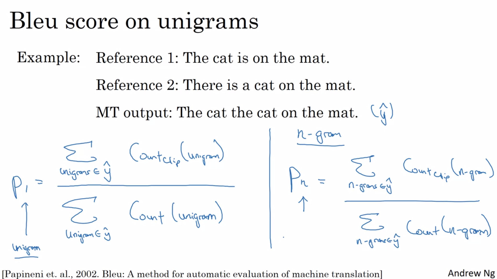

If all MT output is exactly the same as a reference sentence, then the bleu score will be 1.  It's also possible to get bleu of 1 without being equal to any particular reference, but hopefully combines them in a way that gives a good translation.

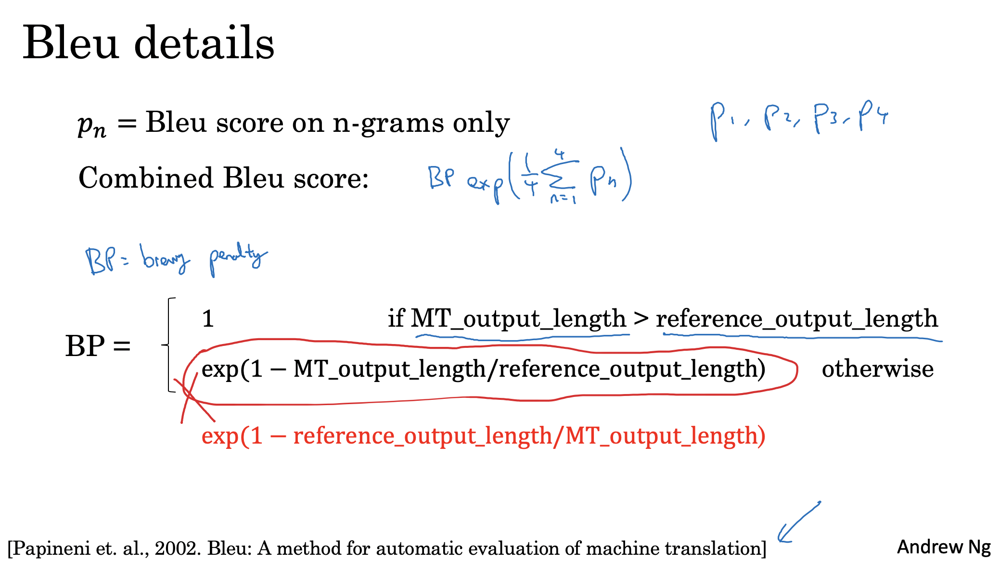

Red text is correct.

Compute the bleu score on 1, 2, 3, and 4-grams, then average them.

BP = brevity penalty. Very short sentences have high precision as it's very easy to get a single word to appear once in a reference sentence.

No brevity penalty if the MT output is not shorter.

Above is still not correct (missing $log$ in $\Sigma$), see [the paper](https://www.aclweb.org/anthology/P02-1040.pdf):

$ BP = \begin{cases} \
1 & \ \mathrm{if}\quad  c \gt r \
\\ e^{(1-r/c)} & \  \mathrm{if}\quad c \le r \end{cases} $

$ \displaystyle \mathrm{bleu} = BP \cdot exp \left(\sum_{n=1}^N w_n\ log\ p_n\right) $

Where N is the number of n-grams, $r$ is the effective reference corpus length, $c$ is the candidate translation, and all the $w_n$ are weights which sum to 1.

## Attention model intuition

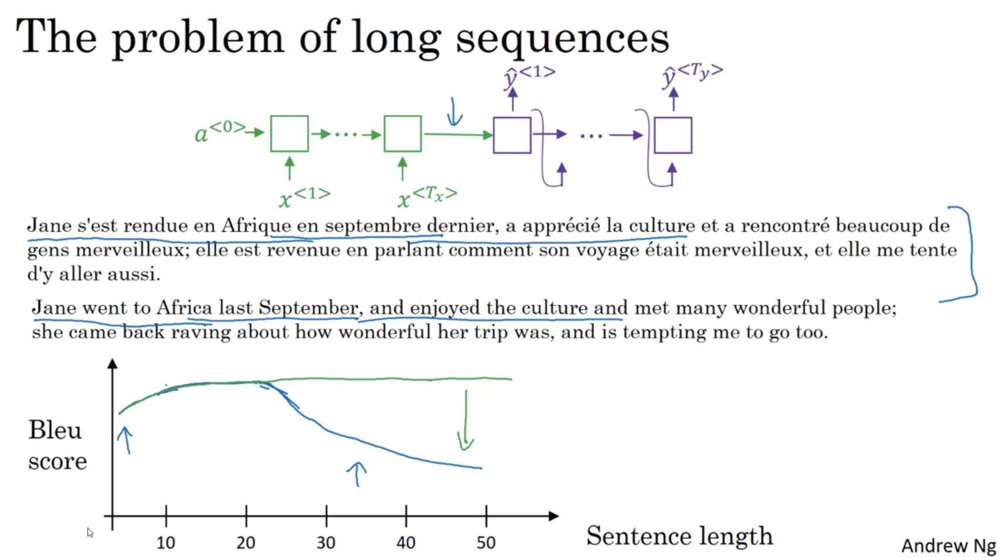

Encoder / decoder architecture works well for shorter sentences, but the bleu score starts to drop off at about 30 words.

Short sentences are hard to get all the words right.  Long sentence performance drops as it difficult to get an RNN to memorise a super-long sentence. (Blue line)

A human translator would work through the translation of a long sentence piece by piece, rather than memorising the whole sentence and then outputting the translation is a single pass.

Attention model also works part of a sentence at a time, and the bleu score for long sentences does not drop off (green line).

While developed for translation, attention models spread to other application areas.

This paper above was a seminal paper.

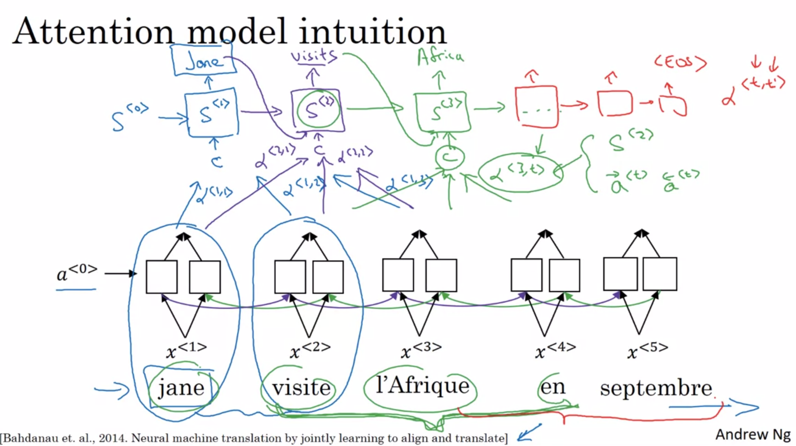

Follow the colours for the timesteps: blue, purple, green. Red is the continuation until <EOS> token.

When outputting the first word, it's unlikely that the model needs to be looking at the final encoded words.

When generating an output word, we want to know which parts of the input sentence to be favoured as context.

$s$ is used at the top for the activation to distinguish from $a$ in the lower part.

With weights $\alpha^{<t, t`>}$, $t$ is the output word, $t'$ is the input word. The weights of all $<t'>$ sum to 1, and are used at each step for how much attention should be paid to each encoder activation. The context is a weighted sum (use `.dot`) of the (input activations multiplied by their particular $\alpha$).

The combined weights and activations form a context, $c$ (don't confuse with LSTM memory cell $c$!), that is fed to the RNN decoder to generate the first word.

The $\alpha$ for a particular input word is based on it's BRNN output as well as the previous activation $s$.

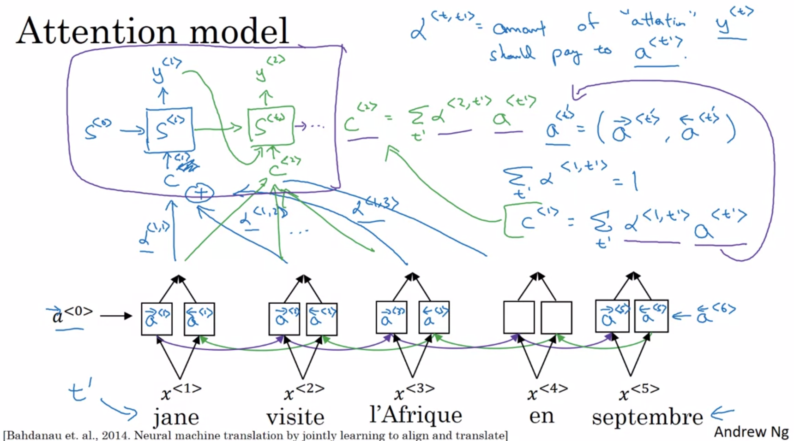

$a^{<t'>} $ is the two output activations of the forward and backward RNNs concatenated together.

The sum of $\alpha$s at output time $<t>$ is always 1 (softmax).

Context at time $<t>$ is a weighted sum of the $a^{<t'>}$ activations, where $\alpha$ gives the attention weights.

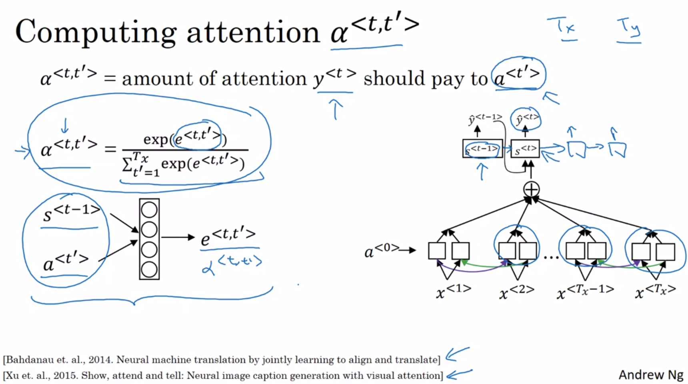

Note the difference between $a$ and $\alpha$ above.

$\alpha$ is a softmax of $e^{<t, t`>}$.  $e^{<t, t`>}$ (energies activation) is a scalar saying how much attention to pay to a particular $\langle t' \rangle$ activation, based on the previous hidden state $s$ (where we are in the translation process) and how relevant that $\langle t' \rangle$ activation is to $s$.

We train a very simple neural network to learn how to compute $e$ from $s$ and $a^{\langle t' \rangle}$.  This is often only one hidden layer as this needs to be computed a lot.

Downside: it takes quadratic time and cost to run this algorithm.  With $T_x$ input words and $T_y$ output words, there will be $T_x \cdot T_y$ number of $\alpha$ calculations.

In translation where neither input nor output sentence are too long, it's not so bad.

A very similar architecture can be used to look at a picture and pay attention to only parts of a picture at a time while writing a caption.


Above, the outputs of the dense layer are the $e^{<t, t`>}$ values.


The attention box is as shown in the previous image.

Errata: as the post-attention RNN is a LSTM, it will pass both $s$ hidden state and $c$ memory cell to the next timestep.

Note above the output of the previous step $y^{<t-1>}$ is not fed as input to the next LSTM cell:  "We have designed the model this way because unlike language generation (where adjacent characters are highly correlated) there isn't as strong a dependency between the previous character and the next character in a YYYY-MM-DD date."

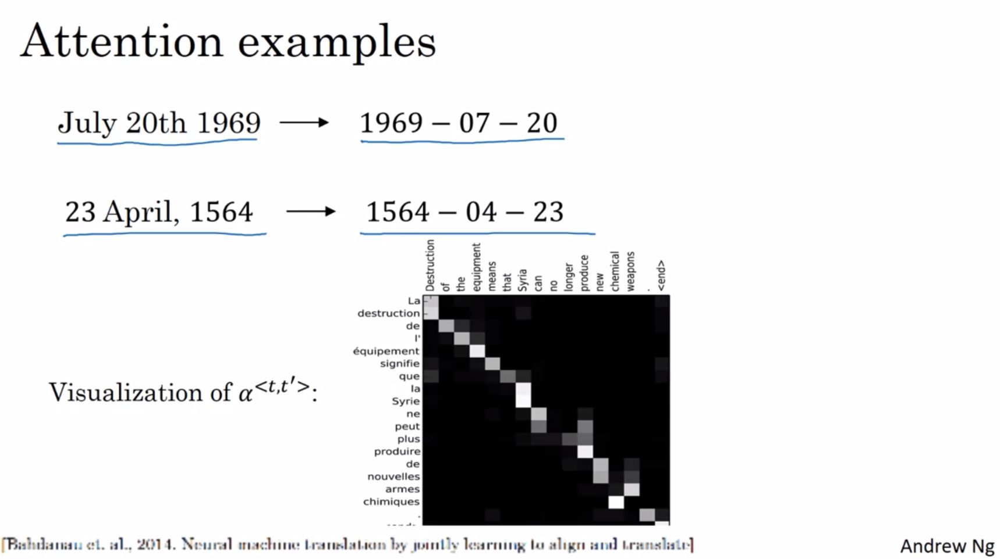

### Assignment learnings

The attention step should use shared layer objects (ie, weights) across all time steps, so declare them non-local to the `single_attention_step()` function.


## Speech recognition

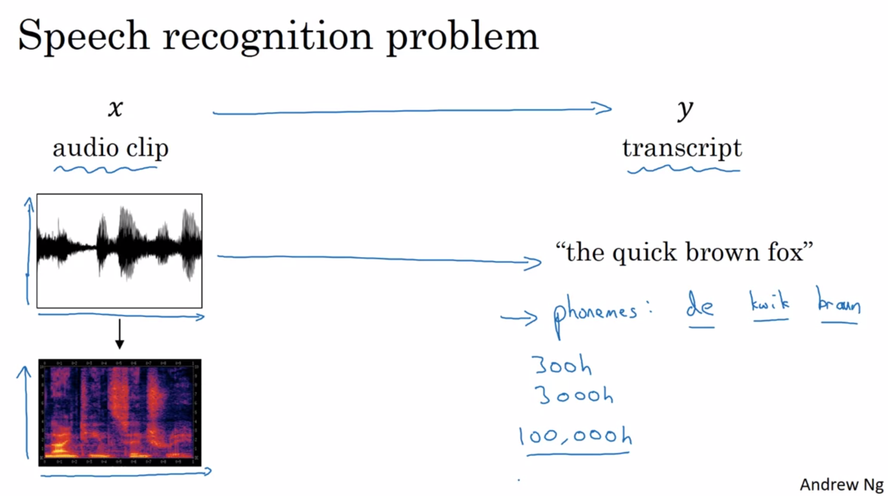

Given audio clip $x$, generate transcript $y$.

The human ear has structures which measure the intensity of different frequencies.

A common preprocessing step is to generate a spectrogram where horizontal is time, vertical is frequencies and the colour shows the energy (loudness).

One of the most exiting trends of speech recognition was moving away from phonemes, or hand engineered basic units of sounds.  One thing that made this possible was moving to larger datasets.

Best commercial systems are now trained on over 100,000 hrs of audio.

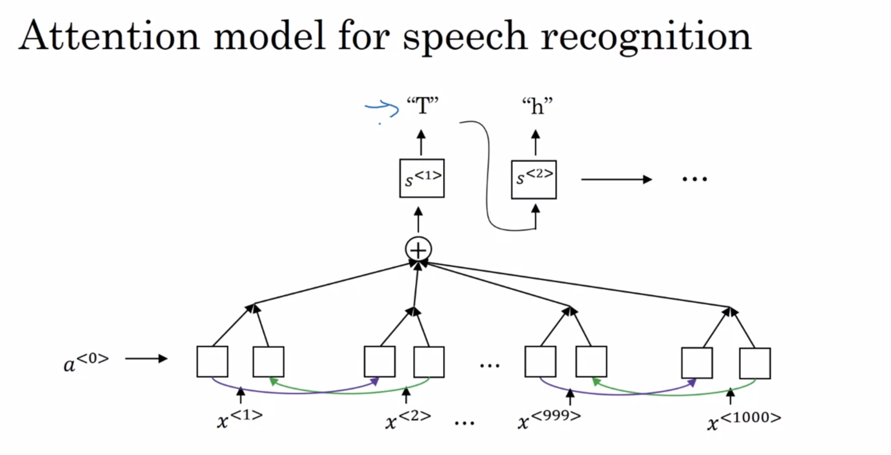

In practice, a deep BRNN would be used.

I assume that what is output at the top is not actually letters, but phonemes, and then another model translates these to words.

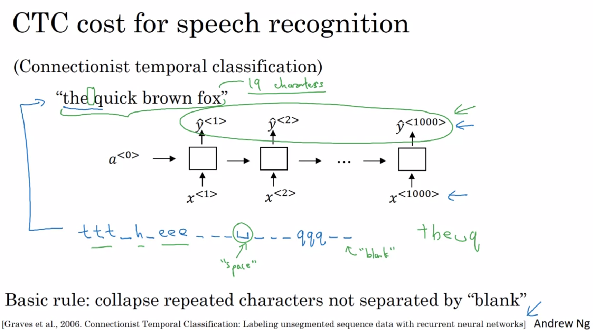

Timesteps with audio are very large, and input timesteps are much more than output phonemes.  10s of audio at 100Hz is 1,000 samples.

To allow the number of outputs to equal inputs, repeated outputs are generated, and also blanks.

Output processing:
1. Collapse repeated chars not separated by blanks
1. Remove blanks

## Trigger word detection

Problem: detect "Hey Siri" or "Okay Google".

At time of recording, literature was still evolving, so no wide consensus on an algorithm to use.

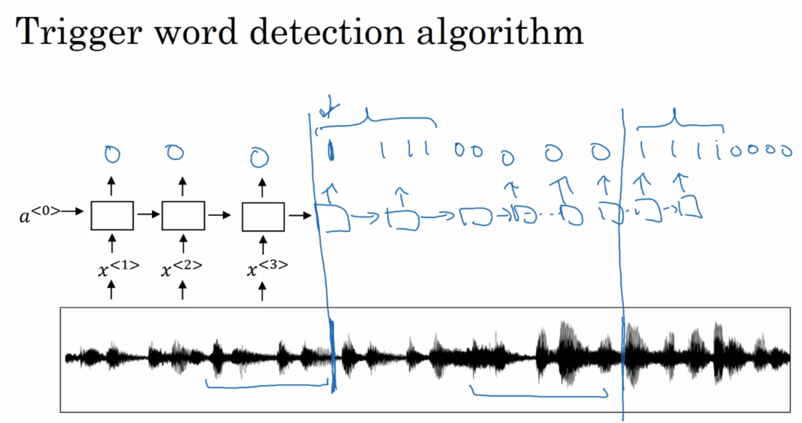

1. Create spectrogram
1. Output a single 1 *after* trigger word is said (creates unbalanced dataset), or a hack: output a series of 1s.


Andrew says:

> I hope that you will find ways to use these ideas to further your career, to pursue your dream, but perhaps most important, to do whatever you think is the best of what you can do of humanity. The world today has challenges, but with the power of AI and power of deep learning, I think we can make it a much better place. Now that you have this superpower, I hope you will use it to go out there and make life better for yourself but also for other people.


## TODO:
* Add RNN papers to papers list.

## Quiz

```
1. False
2. More mem, slower, better
3. True
4. No, RNN
5. True
6. Larger for t', sum over t'
7. True
8. Large
9. cookbook
0. spectogram
```
