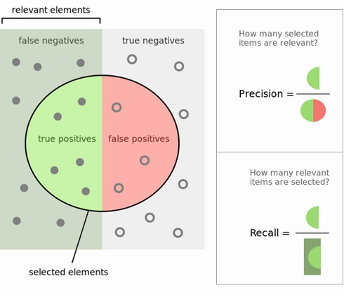
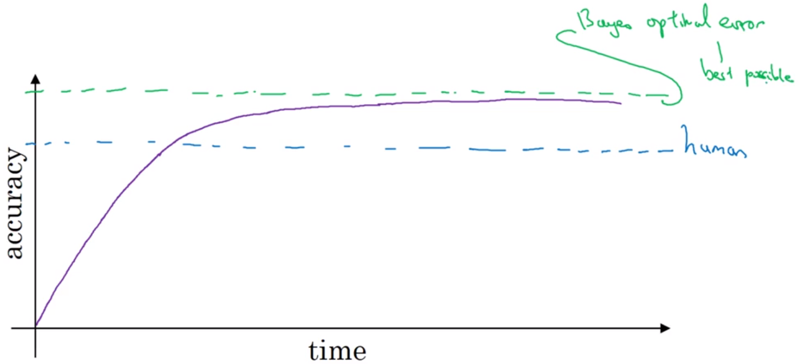

# Structuring Machine Learning Projects

# Week 1 - ML Strategy

Learning Objectives

* Understand why Machine Learning strategy is important
* Apply satisficing and optimizing metrics to set up your goal for ML projects
* Choose a correct train/dev/test split of your dataset
* Understand how to define human-level performance
* Use human-level performance to define your key priorities in ML projects
* Take the correct ML Strategic decision based on observations of performances and dataset

# Setting up your goal

## Why ML Strategy?

Quickly and efficiently get machine learning systems working.

Motivating example: Cat classifier with 90% accuracy.

Ideas: 

* Collect more training data?
* Collect more diverse cats or more diverse negative examples?
* Train longer with gradient descent
* Try different optimization algorithm
* Dropout
* $L_2$ regularisation
* Network architecture
  * Try bigger / smaller network
  * Activation functions
  * Hidden units per layer

If the wrong choice is made, much time can be wasted before realising that it didn't help.

This course is about what ideas are worth pursuing, and which ones can be discarded.

This course teaches strategies for analysing machine learning problems which point in the direction of the most promising things to try.

Andrew will also share lessons learned building and shipping a large number of deep learning products.

These ideas are quite unique to this course. Andrew doesn't see them being taught elsewhere.

## Orthogonalisation

One of the challenges is that there are so many things that could be tuned. 

The most effective people are very clear about what to tune in order to achieve what effect.

### Chain of assumptions in ML

For supervised learning to work well, there are a chain of assumptions, each building on the other:

1. Fit training set well based on cost function (possibly comparable to human performance)
1. Fit Dev set well based on cost function
1. Fit Test set well based on cost function
1. Performs well in the real world

**Suggestions**:
Training fit: Bigger network, Adam algorithm
Dev set fit: Regularisation, get bigger training set
Test set fit: Get bigger dev set (probable cause is overtuning to the dev set)
Real world: Change dev set or cost function. (Dev/Test set distribution isn't set correctly, or cost function isn't measuring the right thing)

More details on the above later. 

Andrew tends not to use early stopping in training as it is not an orthogonal technique - it simultaneously reduces the fit the training set while increasing the dev set performance.

## Single number evaluation metric

It's important to be able to easily compare performance of different models, or iterations through the Idea, Code, Experiment cycle.

$\begin{align}
\text{Precision} &= \text{percentage correct of the recognised} \\
\text{Recall} &= \text{percentage correctly recognised of the actual} \\[12pt]
\
\text{Precision} &= \dfrac{\text{True positives}} {\text{Reported positives}} \\[6pt]
\text{Recall} &= \dfrac{\text{True positives}} {\text{Actual positives}}\\
\end{align}$

Precision can be seen as a measure of exactness or quality, whereas recall is a measure of completeness or quantity.

Precision is also called the positive predictive value.
Recall is also called sensitivity, true positive rate, or probability of detection.

The problem is that one classifier may do better on precision, the other on recall.

Instead, pick a single metric which combines precision and recall. 

The $F_1$ score is the harmonic average of the precision and recall, where an $F_1$ score reaches its best value at 1 (perfect precision and recall) and worst at 0.

${\displaystyle F_{1}={\frac {2}{{\tfrac {1}{\mathrm {recall} }}+{\tfrac {1}{\mathrm {precision} }}}}=2\cdot {\frac {\mathrm {precision} \cdot \mathrm {recall} }{\mathrm {precision} +\mathrm {recall} }}}$

What's important is having a:
* Well defined Dev set (on which Precision and Recall are measured)
* Single real number evaluation metric

This will speed up the iterative process of machine learning.

Another example of a single number evaluation metric is taking the (possibly weighted) average errors across multiple geographic regions.

## Optimising and Satisficing Metrics

When it's difficult to pick a single real number evaluation metric, then set up satisficing and optimizing metrics.

This still allows automatic comparison and selection of algorithms.

**Example:** accuracy & run time trade-off.

Instead of doing a weighted linear combination of them both, use satisficing optimising metrics.

Generally we want to maximise accuracy, so this is an *optimising* metric.

As long as the run time is less than a threshold this is ok, meaning it is a *satisficing* metric.

Generally, if there are $n$ metrics, pick $1$ to be optimizing, and $n-1$ to be satisficing.

**Example:** wake words / trigger words, eg "Ok google"

Important metrics are accuracy and the false wake ups.

The optimise accuracy and set the threshold for satisficing false wake ups at (e.g.) less than 1 per 24 hours.

## Train / Dev / Test set distributions

Setting these up incorrectly can really impede the progress of a deep learning project.

Dev = Development set, or sometimes the "holdout cross validation set".

The Dev set is used to evaluate the performance of the models and improve them.

When iteration finishes, the winning algorithm on the Dev set is then finally evaluated on the Test set for it's final performance.

Dev and Test sets must come from the same distributions. 

All the data should be shuffled with the same distribution into both Dev and Test sets.

The Dev set and the evaluation metric(s) set the target bull's-eye.  The Test set should have the target in the same place.

Guideline:

> Choose a dev and test set to reflect the data:
>  * Expected in the real world
>  * That is important to perform well on

This puts the target in the right place.

## Size of Dev and Test Sets

The old split was 70/30 Train/Test or 60/20/20 Train/Dev/Test. This was pretty reasonable when data set sizes were smaller. 

Now, working with much larger data sets, with say 1,000,000 examples, a 

98 / 1 / 1% split across Train / Dev / Test makes more sense. (1% = 10,000 examples)

The test set needs to be big enough to give high confidence in the overall performance of the system.

For some applications, there isn't a need in high confidence in the overall performance of the system, so just a Train / Dev split may be sufficient. In this case, a larger Dev set is desirable to not overfit the Dev set. Andrew doesn't recommend this though, as there is no unbiased estimate of the system's performance.

## When to change Dev / Test sets or Metrics

If some way through the iterative process to a performant solution there comes the realisation that the target is indeed in the wrong place, what to do?

Assume there is a cat classifier (1) with 3% error which includes pornographic pussy pictures, and another cat classifier (2) with 5% error with no porn images.

The evaluation metric is currently:

$ \mathrm{Error} = \displaystyle \frac 1 m \sum_{i=1}^{m} \mathcal I(\hat y^{(i)} \neq y^{(i)})$

Where $m$ is the number of examples in the dev set and $\mathcal I$ is an indicator which counts (0 or 1) whether included statement is true.

This metric and dev/test sets prefer classifier (1), with only 3% error.

But now the project learns that pornographic images are unacceptable.

So the evaluation metric is no longer correctly rank ordering preferences between the algorithms. This is an indication to change the evaluation metric or perhaps the dev / test sets.

The problem with the evaluation metric is that it treats pornographic and non-pornographic pictures alike.  

So add a weighting $w$:

$ \mathrm{Error} = \displaystyle \frac 1 {\sum_i w^{(i)}} \sum_{i=1}^{m} \mathcal w^{(i)} \cdot I(\hat y^{(i)} \neq y^{(i)})$

Where $w^{(i)} = \begin{cases}
    1 & \text{if } x^{(i)} \text{ is non-porn} \\
    10 & \text{if } x^{(i)} \text{ is porn} \\
\end{cases}$

This will have the error increase by a much larger amount on porn false positives, ie, if it misclassifies a porn image as a cat.

Changing the $\frac 1 m$ normalisation constant is necessary to keep the error between $0$ and $1$.

Orthogonalisation dictates that the metric is first defined well, then the next step is to improve performance on this improved metric. (The first knob is placing the target, the 2nd knob is aiming and shooting at it).

### Another example

Suppose there is a cat classifier (1) with 3% error, and cat classifier (2) with 5% error. These are from high-quality posed, cute cat pics taken from the internet.

But when deployed in the real world, it's found that users are uploading low-quality candid cat pictures, and algorithm (2) is performing better.

Guideline: 

> If doing well on the evaluation metric on dev / test set's distribution doesn't correspond to doing well in the real world, change the metric and/or the dev / test sets.

### Implementation advice

Quickly setup an evaluation metric and dev / test set, even if it's not perfect. This will allow the team to begin confidently and efficiently iterating toward a solution (as best as it is understood at the time).  

Later on, if there is a need to change the evaluation metric or dev / test sets, this can be done.

# Comparing to Human-Level Performance

There is an increased discussion of human-level performance.

With algorithmic and computational advances, human-level performance is becoming more feasible in more areas. 

Also, the workflow of designing and building a machine learning system is much more efficient when trying to do something that humans can also do.

ML progress usually slows down after surpassing human-level performance.

* Usually human-level performance is not far from Bayes optimal
* As long as ML performance < human, there are tools to improve performance which are harder to use otherwise

The performance asymptotically approaches an optimal level of performance, called the Bayes optimal error.

Bayesian optimal error / Bayes optimal error / Bayes error rate   -  all mean the same thing - the theoretical minimum error rate.

As long as performance is worse than human-level, you can:

* Get labelled training data from humans
* Gain insight from manual error analysis: Why did a human get this right?
* Better analysis of bias / variance (see later)

Because of this, machines can quickly meet and slightly surpass human performance.

## Avoidable bias

It's important that the learning algorithm does well on the training set, but not too well at the expense of overfitting.

Knowing human-level performance informs how well the algorithm should perform on the training set.

In a classification task, if:
* Human error - 1%
* Train error - 8%
* Dev   error - 10%

Then the gap between human and Train performance shows that the algorithm isn't even fitting the training set well. Therefore address the bias problem (bigger network, run GD longer).

In the previous examples in this course, the assumption was that the tasks had a Bayes error of almost $0$.

In a different classification task, assume:
* Human error - 7.5%
* Train error - 8%
* Dev   error - 10%

In this case the Train error is acceptable, and the biggest thing to focus on is reducing the variance which produces the larger Dev error (eg by regularisation / drop out). Getting better than human-level performance will likely mean overfitting the training set.

In the last example above, think of human level error as an estimation of Bayes error. (This is especially true in computer vision applications.) Doing better than Bayes error indicates overfitting.

Terminology:

* *Avoidable bias* - the gap between training error and Bayes error
  Interpretation: some level of error is unavoidable because Bayes err is not 0
* *Avoidable Variance* -  the gap between training error and dev error

