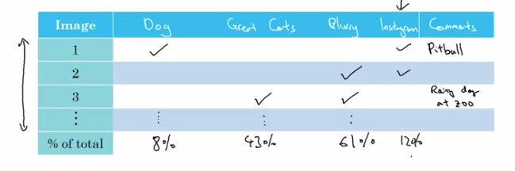
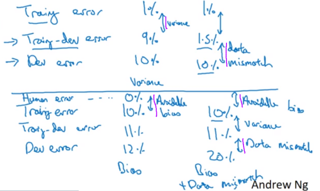
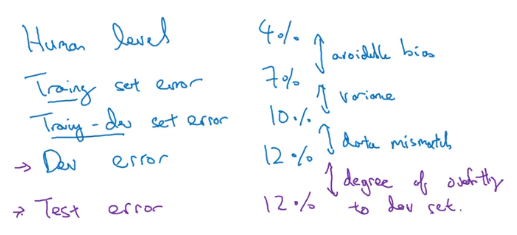
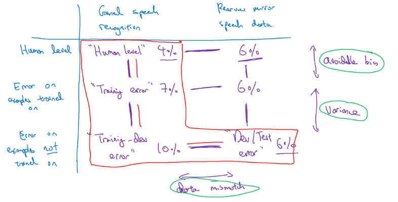

# Week 2

## Learning Objectives
* Understand what multi-task learning and transfer learning are
* Recognize bias, variance and data-mismatch by looking at the performances of your algorithm on train/dev/test sets

## Error Analysis

If performance is not yet human level, then manually examining mistakes can give insights as to what to do next. This process is called *error analysis*.

Example: Classifier with 10% error is misclassifying some dogs as cats.

What path to take?
* Collect more dog pictures?
* Design features specific to dogs?

It could take months to work on the dog problem, and there may not be sufficient benefit.

Error analysis can tell whether or not it is worth the effort.

Error Analysis:
1. Get about 100 mislabeled Dev set examples
1. Manually count up how many are dogs

Suppose 5 mislabelled images are dogs. This means that even if the dog problem were solved, it would only affect 5 out of 100 misclassifications.

The best error reduction based on dogs would be from 10% down to 9.5%, or a 5% relative decrease in error.

This 5% gives a ceiling or upper bound on how much performance can be increased by working on dog misclassifications.

It may well be worth while working on the largest case of misclassifications reather than dogs.

Sometimes in ML it is disparaged to hand engineer things, but if building applied systems, this simple counting procedure can save a lot of time deciding what is the most important problem to focus on.

### Error analysis on multiple ideas in parallel

Ideas for improving cat detection:

* Fix dogs being recognised as cats
* Fix big cats (lions, etc) being misrecognised
* Improve performance on blurry images

Create a spreadsheet with columns:

Count up how many fall into each class to get a percentage. Make up new classes of error if useful if there seems to be more commonality.

The above analysis will take a maximum of a couple of hours, but could save months of working on something that may only make a minor difference.

## Cleaning up incorrectly labelled data

Andrew uses "mislabelled examples" for where prediction $\hat y \ne y$, but "incorrectly labelled examples" where the data set label $y$ is wrong.

### Training set errors

DL algorithms are relatively robust to random or near-random training data set errors, eg keyboard input errors in labelling.

There's no harm in fixing incorrect labels, but things may be ok even if you don't as long as the total data set size is big enough and the number of errors is not too high.

Caveat: DL algorithms are less robust to systematic errors (eg most small white dogs are incorrectly labelled cats).

### Dev / Test errors

Add a column to the error analysis spreadsheet for "incorrectly labelled".

Advice: Only relabel if it makes a significant difference to the ability to evaluate models on the Dev set.

Look at the:

* Overall Dev set error
* Overall error due to incorrect labels
* Overall error due to other causes

If the overall error of other causes are higher, then look at working on those areas first.

Remember the purpose of the dev set is to rank performance of algorithms.  Assume classifier A has an error of 2.1% and classifier B has an error of 1.9%, with 0.6% error coming from incorrect labels. In this case the incorrect labels will hide which model has the best performance. In this case, work on the labels.

### If correcting labels

* Apply the same process to both Dev and Test sets to ensure they come from the same distribution.
* Examine the examples the algorithm got right as well as the examples it got wrong.  If not, there is a more biased estimate of the performance of the algorithm.  Perhaps some of the predictions would have been wrong given correct labelling.
  * This isn't always done as generally there's a lot more data in the 9X% that is correctly predicted.
* It is less important to correct non-systematic mislabelling in the training set. It's a lot of work as it's a much larger set. See later this week for when Train is a different distribution to Dev/Test. Learning algorithms are quite robust to having Train be a slightly different distribution. 

### Error analysis wrap up
* It is easy to throw data at a deep learning algorithm. In building practical systems, There is more manual error analysis and human intuition required than deep learning researchers like to acknowledge.
* Some engineers and researchers are reluctant to manually inspect errors. Andrew does this himself when leading teams to get the required information for prioritising the next actions.

## Build quickly, then iterate

If working on a brand-new ML application, build quickly, then iterate.
1. Setup dev/test set and evaluation metric
1. Build the initial system quickly to be able to evaluate it
1. Use Bias/Variance Analysis and Error Analysis to prioritise the next steps

"Build quickly, then iterate" advice applies less strongly if working in an area of significant prior experience, or if there is a significant amount of academic material on the problem.

Most teams over-think and build something too complicated rather than too simple.

## Mismatched Training and Dev/Test sets

### Training and testing on different distributions

Given the hunger for training set data, using data from as many sources as possible (different distribution to the Dev/Test sets) is common.

There are some subtleties and best practices to be aware of.

The more easily available data should all go into the Train set. The Dev and Test sets define the target performance, and should be based on the harder-to-come-by data that will actually be encountered. Use option 2 below:

For example, for a speech recognition app, general utterances should go into the Train set, and domain-specific utterances should go into the Dev/Test sets.

### Bias and Variance with mismatched data distributions

*Data mismatch* - the algorithm has learned to perform well on data that doesn't match the target data.

If using different data for Train and Dev, we can no longer be sure that the difference between Train and Dev performance is due to variance or overfitting.

The performance difference could be that the Train data is from a different distribution (eg clear hi-res vs fuzzy, or generic vs domain-specific).

Causes for Train / Dev performance differences:
1. Overfitting and not generalising well to unseen data
1. Difference in the dataset distributions

Introduce a Training-Dev set having the same distribution as the Train set, but not used in training.

To measure:
* Variance / overfitting
  * Compare Train with Train-Dev
* Data mismatch
  * Compare Train-Dev with Dev

Summary:

If overfitting to the Dev set, consider getting more Dev set data.

It's possible to have the Dev error smaller than the Train-Dev error if the expected data is more easily classifiable.

Here the red indicates what was seen above. For a complete error overview, it could be useful to include the human level performance and Training error on the domain-specific data also.

## Addressing data mismatch

It is important that the Dev and Test sets have the closest possible distribution to “real”-data. It is also important for the Train set to contain enough “real”-data to avoid having a data-mismatch problem.

There is no systematic approach, but there are things that can be tried:

* Manual error analysis - understand difference between train and dev sets
  * Eg, in-car background noise
* Make training data more similar / collect more data similar to dev/test set
  * Eg, simulate in-car noise (artificial data synthesis)

