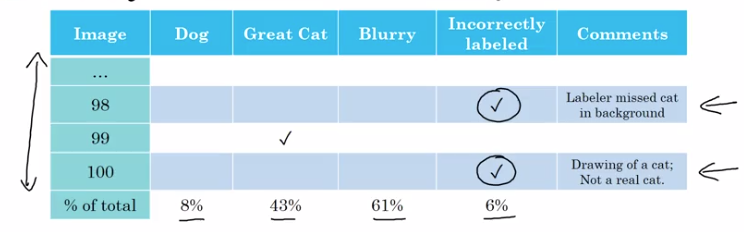
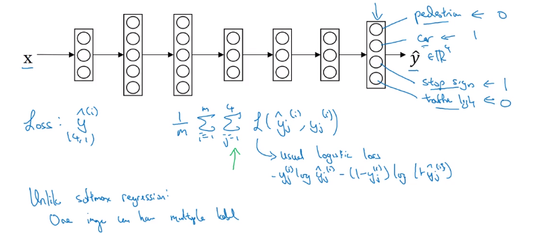

# Week 2

## Learning Objectives
* Understand what multi-task learning and transfer learning are
* Recognize bias, variance and data-mismatch by looking at the performances of your algorithm on train/dev/test sets

## Error Analysis

If performance is not yet human level, then manually examining mistakes can give insights as to what to do next. This process is called *error analysis*.

Example: Classifier with 10% error is misclassifying some dogs as cats.

What path to take?
* Collect more dog pictures?
* Design features specific to dogs?

It could take months to work on the dog problem, and there may not be sufficient benefit.

Error analysis can tell whether or not it is worth the effort.

Error Analysis:
1. Get about 100 mislabelled Dev set examples
1. Manually count up how many are dogs

Suppose 5 mislabelled images are dogs. This means that even if the dog problem were solved, it would only affect 5 out of 100 misclassifications.

The best error reduction based on dogs would be from 10% down to 9.5%, or a 5% relative decrease in error.

This 5% gives a ceiling or upper bound on how much performance can be increased by working on dog misclassifications.

It may well be worth while working on the largest case of misclassifications rather than dogs.

Sometimes in ML it is disparaged to hand engineer things, but if building applied systems, this simple counting procedure can save a lot of time deciding what is the most important problem to focus on.

### Error analysis on multiple ideas in parallel

Ideas for improving cat detection:

* Fix dogs being recognised as cats
* Fix big cats (lions, etc) being misrecognised
* Improve performance on blurry images

Create a spreadsheet with columns:

Count up how many fall into each class to get a percentage. Make up new classes of error if useful if there seems to be more commonality.

The above analysis will take a maximum of a couple of hours, but could save months of working on something that may only make a minor difference.

## Cleaning up incorrectly labelled data

Andrew uses "mislabelled examples" for where prediction $\hat y \ne y$, but "incorrectly labelled examples" where the data set label $y$ is wrong.

### Training set errors

DL algorithms are relatively robust to random or near-random training data set errors, eg keyboard input errors in labelling.

There's no harm in fixing incorrect labels, but things may be ok even if you don't as long as the total data set size is big enough and the number of errors is not too high.

Caveat: DL algorithms are less robust to systematic errors (eg most small white dogs are incorrectly labelled cats).

### Dev / Test errors

Add a column to the error analysis spreadsheet for "incorrectly labelled".

Advice: Only relabel if it makes a significant difference to the ability to evaluate models on the Dev set.

Look at the:

* Overall Dev set error
* Overall error due to incorrect labels
* Overall error due to other causes

If the overall error of other causes are higher, then look at working on those areas first.

Remember the purpose of the dev set is to rank performance of algorithms.  Assume classifier A has an error of 2.1% and classifier B has an error of 1.9%, with 0.6% error coming from incorrect labels. In this case the incorrect labels will hide which model has the best performance. In this case, work on the labels.

### If correcting labels

* Apply the same process to both Dev and Test sets to ensure they come from the same distribution.
* Examine the examples the algorithm got right as well as the examples it got wrong.  If not, there is a more biased estimate of the performance of the algorithm.  Perhaps some of the predictions would have been wrong given correct labelling.
  * This isn't always done as generally there's a lot more data in the 9X% that is correctly predicted.
* It is less important to correct non-systematic mislabelling in the training set. It's a lot of work as it's a much larger set. See later this week for when Train is a different distribution to Dev/Test. Learning algorithms are quite robust to having Train be a slightly different distribution. 

### Error analysis wrap up
* It is easy to throw data at a deep learning algorithm. In building practical systems, There is more manual error analysis and human intuition required than deep learning researchers like to acknowledge.
* Some engineers and researchers are reluctant to manually inspect errors. Andrew does this himself when leading teams to get the required information for prioritising the next actions.

## Build quickly, then iterate

If working on a brand-new ML application, build quickly, then iterate.
1. Setup dev/test set and evaluation metric
1. Build the initial system quickly to be able to evaluate it
1. Use Bias/Variance Analysis and Error Analysis to prioritise the next steps

"Build quickly, then iterate" advice applies less strongly if working in an area of significant prior experience, or if there is a significant amount of academic material on the problem.

Most teams over-think and build something too complicated rather than too simple.

## Mismatched Training and Dev/Test sets

### Training and testing on different distributions

Given the hunger for training set data, using data from as many sources as possible (different distribution to the Dev/Test sets) is common.

There are some subtleties and best practices to be aware of.

The more easily available data should all go into the Train set. The Dev and Test sets define the target performance, and should be based on the harder-to-come-by data that will actually be encountered. Use option 2 below:

For example, for a speech recognition app, general utterances should go into the Train set, and domain-specific utterances should go into the Dev/Test sets.

### Bias and Variance with mismatched data distributions

*Data mismatch* - the algorithm has learned to perform well on data that doesn't match the target data.

If using different data for Train and Dev, we can no longer be sure that the difference between Train and Dev performance is due to variance or overfitting.

The performance difference could be that the Train data is from a different distribution (eg clear hi-res vs fuzzy, or generic vs domain-specific).

Causes for Train / Dev performance differences:
1. Overfitting and not generalising well to unseen data
1. Difference in the dataset distributions

Introduce a Training-Dev set having the same distribution as the Train set, but not used in training.

To measure:
* Variance / overfitting
  * Compare Train with Train-Dev
* Data mismatch
  * Compare Train-Dev with Dev

Summary:

If overfitting to the Dev set, consider getting more Dev set data.

It's possible to have the Dev error smaller than the Train-Dev error if the expected data is more easily classifiable.

Here the red indicates what was seen above. For a complete error overview, it could be useful to include the human level performance and Training error on the domain-specific data also.

## Addressing data mismatch

It is important that the Dev and Test sets have the closest possible distribution to “real”-data. It is also important for the Train set to contain enough “real”-data to avoid having a data-mismatch problem.

There is no systematic approach, but there are things that can be tried:

* Manual error analysis - understand difference between train and dev sets
  * Eg, in-car background noise
* Make training data more similar / collect more data similar to dev/test set
  * Eg, simulate in-car noise (artificial data synthesis)

### Artificial data synthesis

Generally: ensure that the synthesised data is not simulating just a tiny subset of all the possible examples.

Two examples:

#### In-car audio
If there is 10,000 hours of audio and only 1 hour of background noise to synthesise with, it's possible to overfit to the 1 hour of background noise, even though it sounds the same to the human ear.

Getting more background noise could help. (Ravi: or perhaps randomising the 1 hour better through the training examples?)

#### Car recognition
Some people have tried to use video game renditions of cars to train on. The issue is that there are often only approx 20 other types of cars and it's very easy to over fit to them.

# Learning from multiple tasks

## Transfer learning
Learning from one task can be applied to another task. The network's learnings can be adapted or transferred to the new task. Generally transfer learning is used when it's more difficult to get data for the new task than for the original task.

Low-level features can be shared for different tasks. Example: Cat classifier applied to X-ray scans diagnosis

Implementation: Change last output layer of original model: randomly initialise $w^{[L]}$ and $b^{[L]}$ of last layer(s) and retrain the network.

Rule of thumb: given a small dataset, only retrain last layer's parameters (or the last couple of layers).

Instead of resetting the weights of the last layers to random values, new layers (plural) can be added on in place of the original output layer.

**Terminology**
*Pre-training*: The training of the network on the initial, non-target dataset
*Fine-tuning*: Training on the target dataset with some of the parameters learned in pre-training

The smaller the difference between the datasets, the more effective the transfer learning will be. 

For example detection of edges, dots, lines, corners, and curves will be common among pictures. Maybe even parts of objects.

Instead of resetting the weights of the last layers to random values, new layers (plural) can be added on in place of the original output layer.
Depending on how much data you have, you might just retrain the new layers of the network, or maybe you could retrain even more layers of this neural network. 

[Transfer learning: How and why retrain only final layers of a network?]( https://stats.stackexchange.com/q/349138/162527 )

Transfer learning only makes sense when there is a lot of data in the problem transferring *from*, and relatively little data for the problem transferring *to*.

When to use transfer learning from task A to B: 

* Task A and B have the same type of input
* There is a lot of data for task A, relatively small amount of data for task B
  (The task B data is a lot more valuable - the task A learnings won't be as useful)
* Low level features of task A could be helpful for task B

If task A has less data than task B, then there would be minimal meaningful gain.

## Multi-task learning
In Transfer learning there is a sequential learning of Task A and then task B.

In multi-task learning, many tasks are learned in parallel, and each task hopefully helps the other tasks. 

Example: self-driving car with multiple kinds of objects to detect:

Train the network without SoftMax so that it can learn all objects simultaneously:

Above, the loss function is summed over each element of the output vector.

[Difference between loss, cost and objective functions](https://stats.stackexchange.com/a/179027/162527)

The above neural network is solving 4 problems simultaneously (it has 4 output nodes). 4 separate networks could have been trained, but if some of the features learned in the first few layers can be shared in all 4 problems, then it's better to train a single network. Training one network to do 4 things results in better performance than training 4 completely separate neural networks to do the 4 tasks separately.

Multi-task learning still works if some images are only labelled with some of the objects contained therein.  Some images could be labelled '?' instead of 0/1 for the absence/presence of an object.

To implement partially labelled images, in the sum above, only sum over values of $j$ which are non-'?'.

When does multi-task learning make sense?

* Training on a set of tasks which could benefit from having shared lower-level features
* (Usually, but not hard and fast rule:) The amount of data available for each task is quite similar
  * The other tasks in aggregate need to have a lot more data than any given single task, so that the transfer learning effect applies
* When you can train a NN big enough to do well on all the tasks
  * Researcher Richke? Rarner? found that the only time multi-task learning should hurt performance is when the NN isn't big enough. 

In practice, multi-task learning is used much less often than transfer learning. It's rarer to have a set of similar-ish tasks that all can be trained together with about the same amount of data for each task.

Multi-task learning is more common in computer vision object detection. 

## End-to-End Deep Learning

### What is End-to-End deep learning 

Some data processing or learning systems require a pipeline of multiple stages of processing, and E2E can replace these with (usually) a single NN.

Side effect: Some researchers devoted their careers to designing individual steps of the pipeline and it was very challenging to have their work replaced by a black box which obsoleted their research.

Speech Recognition: 

A lot of data may be required for good performance.

For example, on 3,000 hours the traditional pipeline approach works well. With DL, between 10,000 to 100,000 hours would be required for parity performance.

In an intermediate approach with a medium amount of data, a few sequential stages of the pipeline could be replaced with an NN.

#### Facial recognition
Currently the best facial recognition performance comes when this task is broken down into two steps:

1. Locate the face within the image
2. Pass the cropped face image to a NN for identity classification.
  * Ie, a NN takes two images, and compares the presented face with each image on file, determining if the similarity is sufficient.

Why a two-step process?

1. The two individual tasks are simpler
1. There is a lot of labelled data for training on each of the two subtasks
  * There is a lot less data for the end-to-end task.

#### Machine translation

Translating English to French used to go via structural analysis and a lot of other steps.

These days there is a sufficiently large dataset of $(x, y)$ pairs to train a NN to go directly from English to French.

#### Estimating a child's age from X-ray

There isn't enough data today to go from an image to an age.

Instead, the bones and their lengths are identified, and from there the age is estimated. There is more data available for training on the individual tasks.

### Pros and Cons of End-to-End Deep Learning

Pros and cons of end-to-end deep learning:

Benefits:
* Lets the data speak for itself - the NN will learn the best mapping from $x$ to $y$ given enough $(x,y)$ pairs.
  * Removes human preconceptions of how a task has traditionally been performed
* Less hand-design of intermediate components is required

Drawbacks:
* May need a large amount of data
* Excludes potential useful hand-designed components
  * If there is not a lot of data, backprop may not be able to learn useful features for the problem.
  * Hand-designing components is a way to inject human knowledge into the algorithm.

Learning algorithms have two sources of knowledge:
1. The data itself
2. Hand-designed components/features

When there is less data, the hand-designed source of knowledge is useful to allow humans to inject learning into an algorithm.

### When to use End-to-End Deep Learning

The key question is:

Is sufficient data available to learn a function of the complexity needed to map from x to y?

An example of lower "complexity" is determining what part of an image is a face, vs also recognising whose face it is at the same time.

#### Drive.ai example

* Use DL to learn individual components
* Choose $ x \to y $ mappings depending on what tasks have data easily available
* Given current data availability and the types of things we can learn with NNs today, an image to steering E2E solution is not the most promising approach

## Quiz questions

The answers to Q8 and Q10 were debated in the forums. I overfitted to the grading system :)
