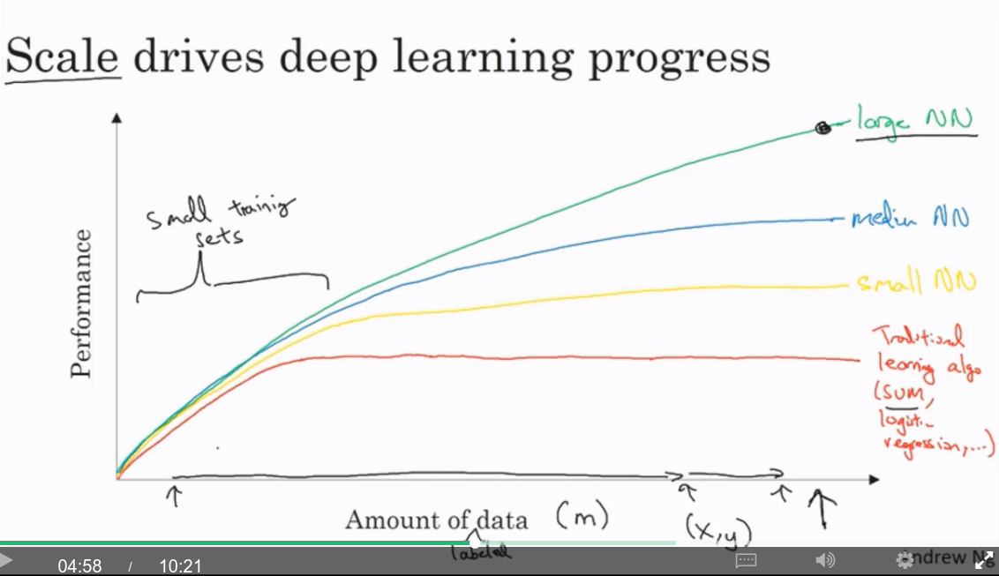

# Coursera Neural Networks and Deep Learning 

## Week 1

### Introduction

Courses:
1. Deep Learning and Neural Networks
 1. Intoduction (this week)
 1. Basics of NN programming (fwd & back prop)
 1. Single hidden layer network
 1. Deep NN
1. Hyperparameter tuning, Regularisation, Optimisation
1. Structuring a machine learning project
  * Splitting into Train, Dev / Cross validation, and Test sets
  * End-to-end deep learning
1. Convolutional Neural Networks (CNNs)
1. Sequence data models (RNNs, LSTMs)
  * Natural Language Processing
  * Speech recognition
  * Music generation

### Introduction to Deep Learning

#### What is a neural network?

ReLU = Rectified Linear Unit = $max(0, input)$

#### Supervised learning with Neural Networks
Almost all economic value has been created through supervised learning.

* Images: CNN
* Sequence data (temporal component): RNN

Structured data: Each feature has a well-defined meaning. Eg, Databases
Unstructured data: Images, audio, text

Most economic value so far has been on structured data.

##### Why is Deep Learning taking off?

The amount of available data is ever increasing.

Performance as available labeled data ($m$) increases:
* SVM / logistic regression - performance plateaus very quickly
* Small NNs - performance flattens more slowly
* Large NNs - performance takes a long time to plateau

Scale of both NN size and data set size has been driving NN performance.

On small datasets, it is more the feature selection than the algorithm / network size which is more important.

Eventually a NN becomes so big that it takes too long to train.

Drivers for scale:
* Data
* Computation
* Algorithms (improvements in accuracy or speed)

One algorithmic improvement was replacing the sigmoid activation function with ReLU as sigmoid has a very small gradient with inputs $< -4$ or $> 4$, and suffers from vanishing gradients. This makes gradent descent work much faster.

##### Development Cycle

An iterative approach is required:
* Idea
* Code
* Experiment

Because this cycle needs to be repeated many times, it's important that the computation speed is high, or conversely, the time to run the expirment (train the network) is low.

#### Support

Forum and also feedback@deeplearning.ai

### Heros of Deep Learning - Geoffrey Hinton

1987 Hinton, McLeland? Recirculation algorithm

Generative Adversarial Nets are currently a new idea

Advice for breaking into DL:

Read the literature, but don't read too much of it.

For creativity, read enough to notice something you believe everything is doing wrong, where it just doesn't feel right, and then figure out how to do it right. And when people tell you that's no good, just keep at it. 

Hinton's principle for helping people keep at it:

> Either your intuitions are good or they're not. If you intuitions are good, you should follow them and you'll eventually be successful. If your intuitions are not good, it doesn't matter what you do. You might as well trust your intuitions. There's no point not trusting them.

> In summary, read enough to develop your intuitions, and then trust your intuitions. Go for it. Don't be too worried if everyone else says it's nonsense.

> If you think it's a really good idea and other people tell you it's complete nonsense, then you know you're really onto something. ... That's the sign of a really good idea.

Ng recommends people replicate results in papers. Hinton says this ensures you know all the little trick required to make it work.

Hinton's other advice: Never stop programming. Work around any issues that come up.

See if you can find an advisor who has beliefs and interests similar to yours. They they will give a lot of good advice and time. 

Right now there aren't enough academics to train the people needed in industry. 

Our relationship to computers has changed. Instead of programming them, we show them and they figure it out. Most faculties don't have anything near a 50-50 balance.

Google is training brain residents. 

### Paradigms for AI:

1950s: Von Neumann and Turing didn't believe in symbolic AI. They were far more inspried by the brain, but they died too young and their voice wasn't heard. In the early days, people were convinced that the representations needed for intelligence were symbolic expressions, or cleaned up logic and that intelligence was reasoning.

Now the view is that a thought is a vector of neural activity, rather than a symbolic expression. Words come in, words go out, so people assumed that what was in the middle was a string of words/symbols.  Hinton belives that what's inbetween is nothing like that. Big vectors cause other big vectors, and that's totally unlike the view that thoughts are symbolic expressions.

Some of AI is coming around to this viewpoint, but too slowly in Hinton's opinion.
