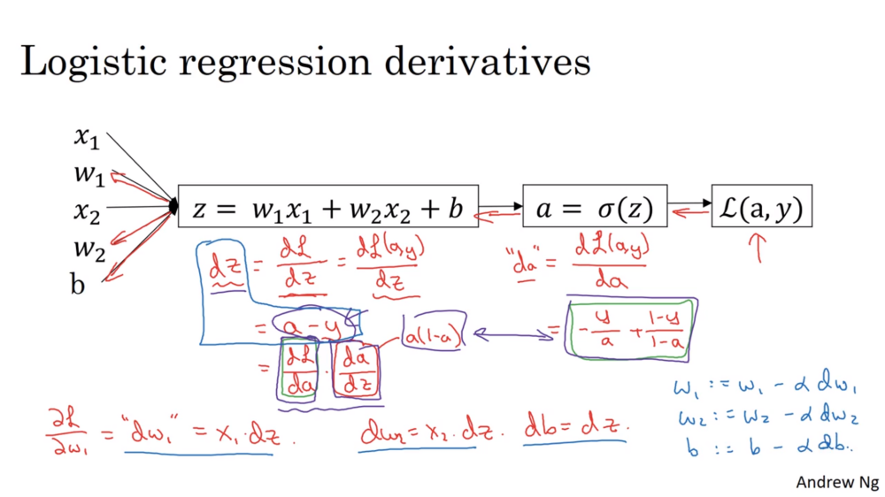
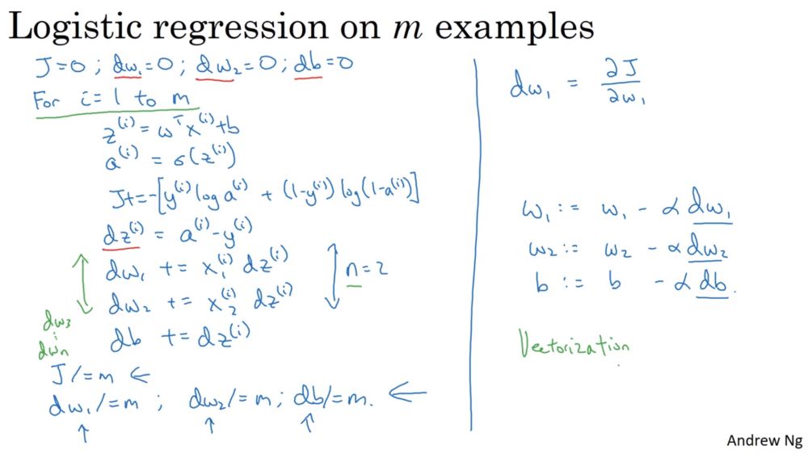

# Week 2

Logisitic regression is an algorithm for binary classifiction: detecting the presence vs absence of something.

For each red, green, blue matrix representing the image, concatenate all values to get a feature vector.

$n_x$ = the dimension of the vector $x$. Sometimes just $n$.

A single training example is represented by: $(x,y)$ where: $x \in \mathbb R^{n_x}$ and $y \in {0,1}$

$m$ = number of training example, the $i$-th represented as $(x^{(i)}, y^{(i)})$

The training set matrix, $X$, is organised with the columns being the individual training examples.  $X \in \mathbb R^{(n_x, m)}$
This organisation will make the implementation much easier.

    X.shape == (n, m)

$Y$ is also organised with the examples in columns.

## Logistic Regression

Logistic regression can be seen as a very small neural network.

$y$ is the "ground truth" label, given from the training set.
$\hat y$ is the predicted value of $y$ from the network.

Given $x$ get $\hat y = P(y=1|x)$

Paremeters: $w \in \mathbb R^{n_x}, b$

For easier implementation, we keeep $w$ and $b$ separate. $b$ is the bias or intercept term. 

In the previous course, $w_0$ was equal to $b$ and $x_0$ was always 1 ($x \in \mathbb R^{n_x+1}$).

$\hat y \ne z = w^Tx + b$ as this can be negative, or greater than one (this would be linear regression)

Instead, we use $\hat y = \sigma(z)$ to map the range to $(0,1)$.

$\sigma(z) = \frac{1}{1 + e^-z}$

Objective: find $w$ and $b$ such that $\hat y \approx y$, ie, $\hat y$ is a good estimate of the probabilty that $y = 1$

### Loss (Error) / Cost function

To train $w$ and $b$, we first need to define the loss function.

Logistic Regression doesn't use the squared error as this can have more than one minimum.  Instead we use:

$ P(y|x) = \hat y^y (1 -\hat y)^{1-y}$

Because $y$ can only take the value of $0$ or $1$.

The $log_e$ function is monotonically increasing. Maximimising $ln P(y|x)$ will be the same as maximising $P(y|x)$.

$ln P(y|x) = y\ln \hat y + (1 - y)\ln (1 -\hat y)$ 

We want to make probabilities large, but minimise loss, so we take the negative of the above:

$ \mathcal L(\hat y,y) = - \Big(y\ln \hat y + (1 - y)\ln (1 -\hat y)\Big) $ 

Terminology: The *loss* functions is applied to only a single example, whereas the *cost* function is the is applied to the parameters.

Cost function:

$$\begin{align*}
J(w,b) &= \displaystyle \frac 1 m \sum_{i=1}^{m}{\mathcal L(\hat y^{(i)},y^{(i)})} \\
    &= -\frac{1}{m} \sum_{i=1}^{m}\left(y^{(i)}\log\hat y^{(i)} + (1-y^{(i)})\log(1-\hat y^{(i)})\right)
\end{align*}$$

This uses maximum liklihood estimation. The $\frac 1 m$ term isn't averaging, it's actually scaling the cost the same order of magnitude as the individual costs.

#### L1 and L2 loss functions

These are probably used with linear regression, and come from the first `.ipynb`.

 $$L_1(\hat{y}, y) = \sum_{i=0}^m\left|y^{(i)} - \hat{y}^{(i)}\right| \\[6pt]$$

 $$L_2(\hat{y},y) = \sum_{i=0}^m(y^{(i)} - \hat{y}^{(i)})^2 $$

## Gradient Descent

We want to find values of $w$ and $b$ which minimise $J(w,b)$.

One of the reasons we chose the cost function as we do is because it is [guaranteed to be convex](http://mathgotchas.blogspot.co.uk/2011/10/why-is-error-function-minimized-in.html), so all negative gradients point at the minimum.

Until convergence (within a $\epsilon$ value), we repeatedly change each element $w_i$ to be:

$\displaystyle w_i' := w_i - \alpha \frac {\delta J(w_i,b)} {\delta \ w_i}$

Where $\alpha$ is the learning rate, or size of the step towards the minimum. (The analogous update is done for $b$.)

$\delta$ is used to represent the partial derivitive (the term on the top depends on more variables than the one given on the bottom).

Convention: `dw` is used to represent the derivitive term

### Normalisation

Gradient descent will work faster if the input data is normalised. 

Each example can be divided by its norm, giving each vector unit length. 

    x_norm = np.linalg.norm(x, ord = 2, axis = 0, keepdims = True) 

Using [`linalg.norm`](https://docs.scipy.org/doc/numpy/reference/generated/numpy.linalg.norm.html) `ord=2` will return the 2-norm of the vector, a.k.a. the Euclidean norm, which is the SRSS or Square Root of Sum of Squares.

Alternatively:

One common preprocessing step in machine learning is to center and standardize your dataset, meaning that you substract the mean of the whole numpy array from each example, and then divide each example by the standard deviation of the whole numpy array. This is called *Z-scoring*.

But for picture datasets, it is simpler and more convenient and works almost as well to just divide every row of the dataset by 255 (the maximum value of a pixel channel).

## Derivitives

* In python, instead of writing `dFinalOutputVariable_dVar` we just write `dvar`.
* [Derivative Calculator](https://www.derivative-calculator.net/) provides worked examples and rules
* [Wolfram Alpha](https://www.wolframalpha.com/) can calculate derivatives (but doesn't simplify sigmoid fully).
* [Fully worked example of derivatives of logistic regression loss function](http://ronny.rest/blog/post_2017_08_12_logistic_regression_derivative/)

Given $a=\sigma(z)$, then the [derivative of the sigmoid function](https://math.stackexchange.com/questions/78575/derivative-of-sigmoid-function-sigma-x-frac11e-x) is:

$$\frac{da}{dz} = a(1-a)$$

[More friendly sigmoid derivation](http://ronny.rest/blog/post_2017_08_10_sigmoid/)

Given the loss function (from above):
$$ \mathcal L(a,y) = - \Big(y\log a + (1 - y)\log (1 -a)\Big) $$

The [derivative](https://stats.stackexchange.com/questions/278771/how-is-the-cost-function-from-logistic-regression-derivated) is:

$$\frac{\delta \mathcal L(a, y)}{\delta a} = - \frac y a + \frac{1-y}{1-a}$$

Multiplying these two with the chain rule, we get:

$$ \frac{d \mathcal L}{dz} = \frac{d \mathcal L}{da} \cdot \ \frac{da}{dz} = a-y $$

------

Given the cost function (from above):

$$\begin{align*}
J(w,b) &= \displaystyle \frac 1 m \sum_{i=1}^{m}{ \mathcal L(\hat y^{(i)},y^{(i)})}

  \\
    &= -\frac{1}{m} \sum_{i=1}^{m}\left(y^{(i)}\log a^{(i)} + (1-y^{(i)})\log(1-a^{(i)})\right)
\end{align*}$$

[The derivative of the cost function is](https://stats.stackexchange.com/questions/278771/how-is-the-cost-function-from-logistic-regression-derivated):
$$ \frac{1}{m}\sum_{i=1}^m\left[h_\theta\left(x^{(i)}\right)-y^{(i)}\right]\,x_j^{(i)} $$

## Logistic regression with $m$ training examples

* The derivatives are averaged over the $m$ training examples.
* This slide implements a single step of gradient descent. It will need to be run multiple times until convergence.
* The two `for` loops marked in green should be vectorised for efficiency (especially important with large training sets)

---------------

## Python and Vectorisation

Vectorisation is about removing explicit loops from code for efficency.

`np.dot(x,y)` is equivalent to $x^T \cdot y$ - the transpose is not required.

Using `np.dot` is about 300x faster than implementing with a `for` loop.

Both GPUs and CPUs have SIMD instructions - Single Instruction Multiple Data which are utilised for parallelisation by the heavily optimised math libraries.

### Removing loop over training examples

Given array $X$ arranged as follows:

$$ X = 
  \begin{bmatrix}
      | & | & & | \\
      x^{(1)} & x^{(2)} & \ldots & x^{(n)} \\
      | & | & & | 
\end{bmatrix}$$

Then $Z$ is a *row* vector of $z^{(i)}$ values calculated by:
$$ Z = \vec w^TX + \vec b$$

Where $\vec b \in \mathbb R^{1 \times m}$ and each element is equal to the scalar $b$.

In python: `Z = np.dot(w.T, X) + b` (python will "broadcast" scalar `b` to each element)

## Vectorising Logistic Regression Gradients

Given:

$ A = \left[a^{(1)}\ a^{(2)} \cdots \ a^{(m)}\right]$ and $ Y = \left[y^{(1)}\ y^{(2)} \cdots \ y^{(m)}\right]$

Then the python `dZ` is simply:
 $dZ = A - Y$

| Formula | Python |
|:--------|:-------|
|$\displaystyle db = \frac 1 m \sum_{i=1}^m dZ_i$ | `db = 1/m * np.sum(dZ)` 
|$\displaystyle dw = \frac 1 m X \cdot dZ^T$    | `dw = 1/m * np.dot(X, dZ.T)`
<!-- |$\displaystyle \begin{align}dw &= \sum_{i=1}^m \sum_{j=1}^n x{}  \\ &= \frac 1 m X \cdot dZ^T \end{align}$    | `dw = 1/m * np.dot(X, dZ.T)` -->

## Python broadasting

`.sum(axis = 0)` will sum the columns.

`.reshape` is $\mathcal O(1)$ so it is very cheap to call. Andrew sometimes puts in an explicit `reshape` as documentation. `reshape` will fail if trying to change the number of elements.

## Python / numpy vectors

A "rank 1 array" is neither a row vector nor a column vector. 
It's transpose is identical to itself.

Python will tranform it into whatever is expected for vector operations. 

Eg:

    >>> a = np.array([0, 1, 2, 3, 4])
    >>> a.shape
    (5,) # Note: trailing comma
    >>> np.dot(a,a.T)
    30  # Not an outer product giving an array as expected

To reduce bugs, commit to either a column or row vector.

To reshape an array to a column vector:
    >>> a.reshape(-1, 1)
    array([[0],
          [1],
          [2],
          [3],
          [4]])
    >>> a.reshape(-1, 1).shape
    (5, 1) # Note: no trailing comma

It's probably better to reshape to explicit dimensions to document and reduce bugs.

### Assertions

Enforce the size of an matrix to be as expected:

    assert(a.shape == (5,1))
This also helps to document the code.

### Softmax

All rows sum to 1.

$$ \begin{align} \displaystyle
softmax(x) &= softmax\begin{bmatrix}
    x_{11} & x_{12} & x_{13} & \dots  & x_{1n} \\
    x_{21} & x_{22} & x_{23} & \dots  & x_{2n} \\
    \vdots & \vdots & \vdots & \ddots & \vdots \\
    x_{m1} & x_{m2} & x_{m3} & \dots  & x_{mn}
\end{bmatrix} \\[12pt]
&= \begin{bmatrix}
    \frac{e^{x_{11}}}{\sum_{j}e^{x_{1j}}} & \frac{e^{x_{12}}}{\sum_{j}e^{x_{1j}}} & \frac{e^{x_{13}}}{\sum_{j}e^{x_{1j}}} & \dots  & \frac{e^{x_{1n}}}{\sum_{j}e^{x_{1j}}} \\
    \frac{e^{x_{21}}}{\sum_{j}e^{x_{2j}}} & \frac{e^{x_{22}}}{\sum_{j}e^{x_{2j}}} & \frac{e^{x_{23}}}{\sum_{j}e^{x_{2j}}} & \dots  & \frac{e^{x_{2n}}}{\sum_{j}e^{x_{2j}}} \\
    \vdots & \vdots & \vdots & \ddots & \vdots \\
    \frac{e^{x_{m1}}}{\sum_{j}e^{x_{mj}}} & \frac{e^{x_{m2}}}{\sum_{j}e^{x_{mj}}} & \frac{e^{x_{m3}}}{\sum_{j}e^{x_{mj}}} & \dots  & \frac{e^{x_{mn}}}{\sum_{j}e^{x_{mj}}}
\end{bmatrix} = \begin{pmatrix}
    softmax\text{(first row of x)}  \\
    softmax\text{(second row of x)} \\
    ...  \\
    softmax\text{(last row of x)} \\
\end{pmatrix}
\end{align} $$

## Learnings from assignment

* If the learning rate is too large (0.01), the cost may oscillate up and down. It may even diverge (though in this example, using 0.01 still eventually ends up at a good value for the cost).
* A lower cost doesn't mean a better model. You have to check if there is possibly overfitting. It happens when the training accuracy is a lot higher than the test accuracy.
* In deep learning, we usually recommend that you:
	* Choose the learning rate that better minimizes the cost function.
	* If your model overfits, use other techniques to reduce overfitting. (We'll talk about this in later videos.)

## Other

[Precision vs recall with venn diagrams](http://ronny.rest/blog/post_2018_01_26_precision_recall/)

[Swish function like ReLU but differentiable at all points](https://www.derivative-calculator.net/#expr=x%2A%281%2F%281%2Be%5E-x%29)

## TODO

* Last vid on stats and product of probs

[Yes you should understand backprop - Andrej Karpathy](https://medium.com/@karpathy/yes-you-should-understand-backprop-e2f06eab496b)
