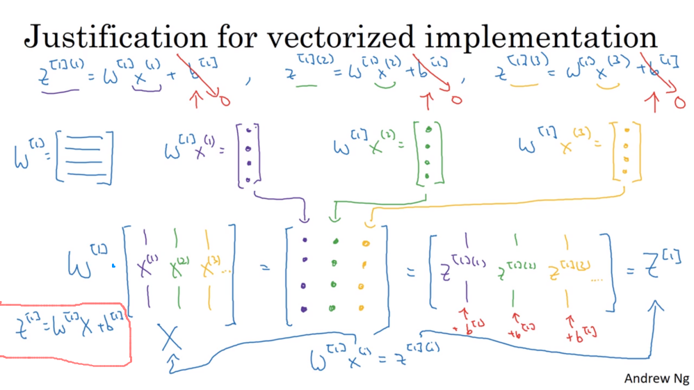
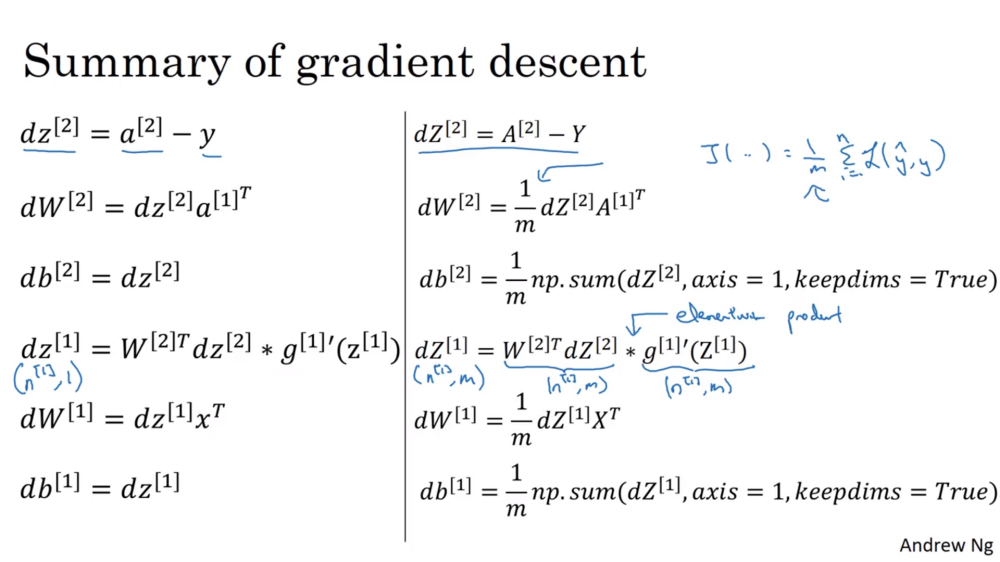
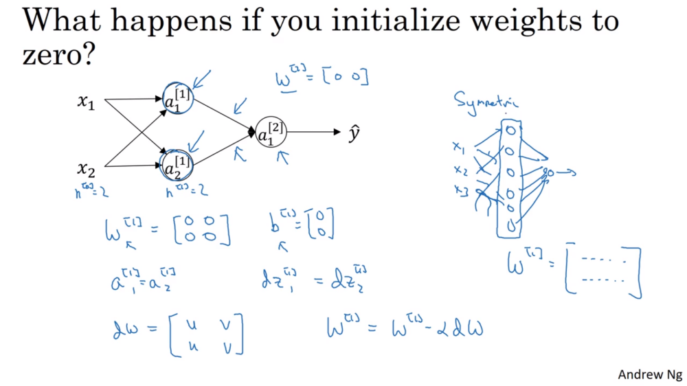

# Shallow Neural Networks

These are built from chaining together logistic regression units.

This week is concerned with a single hidden layer, and of course input and output layers.

## Notation

Superscript $[l]$ refers to the $l$-th layer.  Round bracket superscripts still refer to training examples, and come after square brackets if both are used.

$L$ is the number of layers in the network (excluding the input layer).  A 2-layer neural network has an input, hidden and output layer.

$n^{[l]}$ is the number of hidden units in the $l$-th layer. Numbering starts at 0 for the input layer. $n^{L}$ is the number of units in the output layer.

$a^{[l]}$ is the activation of the $l$-th layer. $a^{[0]}$ is the input "activation" and equivalent to $X$.

$a_i^{[l]}$ refers to the activation of the $i$-th unit in layer $l$.

## Computing a Neural Network's output for a single input

With a single logistic unit, $z = w^Tx + b$, the weights being organised as a row vector, multiplied by $x$, a column vector. 

With multiple units in a layer, the weights for each unit are still organised as rows of $W$, one for each unit.

$ z^{[l]} = W^{[l]}a^{[l-1]} + b^{[1]} $

Where $z$, $a$ and $b$ are vectors.

The superscripts of a layer's $z$, $w$ and $b$ simply correspond to the layer itself, different to the previous course.

If there is a single output layer unit, then this acts as logistic regression from the previous week where the inputs come from the previous layer ($x$ is analogous to $a^{[1]}$)and $W^{[2]}$ will be the same shape as $w^T$.

And then like logistic regression:

$ a^{[l]} = \sigma(z^{[l]})$

## Vectorising for multiple examples

$W$ has each unit's weights arranged in rows, and this is multiplied by $A^{[l-1]}$ where the activations are arranged in $m$ columns, one for each training example.

$Z^{[l]} = W^{[l]}A^{[l-1]} + b^{[l]}$

This still has the same layout as  $z = w^Tx + b$, the weights being organised as a row vector, multiplied by $x$, a column vector.

If interested in dimensions and crazy notation: $W^{[l]} \in \mathbb R^{a_h^{[l]} \times a_h^{[l-1]}}$ and $A^{[l-1]} \in \mathbb R^{a_h^{[l-1]} \times m}$ and $WA \in \mathbb R^{ a_h^{[l]} \times m}$ 

$Z$ and $A$ matrices are arranged like the network topology itself. The rows are the nodes, and the columns are the examples flowing left to right through the network.

$W$ also is arranged like the network topology, with the weights defining each node's pre-bias activation being the rows.

## NN Vectorised Gradient Descent

## Activation Functions

Tanh almost always works better than sigmoid as an activation function. The only exception would be the output layer with binary classification where a range of $[0, 1]$ is preferable.

$$tanh = \frac {e^z - e^{-z}} {e^z + e^{-z}}$$

This is a mathematically shifted version of sigmoid, passing through the origin and with range $[-1, 1]$. The activations will centre around $0$ rather than sigmoid's $0.5$, making learning for the next layer a bit easier. Tanh has maximum gradient $1$ compared to sigmoid's $0.25$.

$g(Z)$ denotes the activation function applied to $Z$. If there are different activation functions, $g^{[l]}(Z)$ denotes the activation function for the $l$-th layer.

The disadvantage of both sigmoid and tanh is that if the input values are very large or very small, then then gradient is very close to $0$, which can slow down gradient descent.

#### ReLU
The Rectified Linear Unit or ReLU doesn't suffer from the vanishing gradient problem, and is also fast to calculate.

ReLU = $max(0,z)$

ReLU's derivative is 0 if the input is negative and 1 otherwise. (Technically it's undefined at $z=0$).

One disadvantage of ReLU is that the gradient $=0$ if the input is negative. In practice this works just fine.  This usually works better than the ReLU, but it's not used as much in practice. 

Andrew recommends if there is a need to pick between the functions, to use plain ReLU.

Leaky ReLU has a slight negative gradient if $z<0$, solving the [dead ReLU units problem](https://datascience.stackexchange.com/q/5706/47791).

Andrew says that most people are using ReLU over tanh these days.

One problem characteristic to relu activation - dead neurons: if a given neuron happened to be initialized in a way that it doesn't fire for any input (its activation is zero), its gradient would also be zero, and hence it would never be activated.

From [this answer](https://stats.stackexchange.com/a/176905/162527):

> One may hypothesize that the hard saturation at 0 may hurt optimization by blocking gradient back-propagation.  To evaluate the potential impact of this effect we also investigate the softplus activation: $ \text{softplus}(x) = \log(1 + e^x) $ (Dugas et al., 2001), a smooth version of the rectifying non-linearity.  We lose the exact sparsity, but may hope to gain easier training.  However, experimental results tend to contradict that hypothesis, suggesting that hard zeros can actually help supervised training.  We hypothesize that the hard non-linearities do not hurt so long as the gradient can propagate along some paths, i.e., that some of the hidden units in each layer are non-zero With the credit and blame assigned to these ON units rather than distributed more evenly, we hypothesize that optimization is easier.  

See also [Comprehensive list of activation functions in neural networks with pros/cons](https://stats.stackexchange.com/questions/115258/comprehensive-list-of-activation-functions-in-neural-networks-with-pros-cons/229015#229015)

#### ELU

ELU = [Exponential Linear Unit](https://arxiv.org/abs/1511.07289). The graph is rounded where ReLU has a sharp corner.

## Why is a non-linear activation function needed?

There is no point in having hidden layers if the final output neuron(s) could simply calculate a linear function directly from the input. The composition of two (or more) linear functions is itself a linear function, so if something more interesting is required, non-linear functions are also needed.

Having a single hidden layer with linear activation functions and a sigmoid output neuron is likewise no more expressive than a single logistic regression function.

The only place a linear activation function (actually the identity activation function $g(z)= z$) could be used is in a regression problem where the output is a continuous real number over some range (eg housing prices). In this case, any hidden units should not use linear activation functions.

## Derivatives of activation functions

$g'(z)$ is pronounced "g prime of z" and is the same as $ \frac d {dz}g(z)$.

#### Sigmoid

$$ sigmoid = g(z) = \frac 1 {1 + e^{-z}}$$
$$ g'(z) = g(z)(1-g(z))$$

Note that $a$ is used instead of $z$ to show that a pre-calculated value $a = g(z)$ can be reused.

#### Tanh

$$tanh = g(z) = \frac {e^z - e^{-z}} {e^z + e^{-z}}$$
$$g'(z) = 1 - (tanh(z)^2)$$

#### ReLU

$$ReLU = g(z) = max(0, z)$$
$$g'(z) = \begin{cases}
  0 & \text{if } z < 0 \\
  1 & \text{otherwise}
\end{cases} $$

We fudge the undefined gradient case where $z=0$

#### Leaky ReLU

$$ReLU = g(z) = max(0.01z, z)$$
$$g'(z) = \begin{cases}
  0.01 & \text{if } z < 0 \\
  1 & \text{otherwise}
\end{cases} $$

We fudge the undefined gradient case where $z=0$

#### ELU

$$ELU = g(z) = \begin{cases}
  x & \text{if } z \gt 0 \\
  \alpha \cdot \left(e^z -1\right) & \text{otherwise}
\end{cases} $$

$$g'(z) = \begin{cases}
  1 & z \gt 0 \\
  g(z) + \alpha & \text{otherwise}
\end{cases} $$

ELU is not continuously differentiable if $x \ne 0$. The [CELU](https://arxiv.org/abs/1704.07483) solves this.

## NN weight initialisation

(It's ok to initialise weights to 0 for logistic regression)

It's important not to initialise a neural network's weights to zeros, but rather initialise them randomly.  The biases can be all zero.

If initial weights are equal, then all the activations and $dz$ vectors will be equal, all rows of $dw$ will be equal and all the neurons in the layer will update by the same amount, remaining symmetrical. All hidden units are then computing the same thing, and there's no point having more than one.

Get a Gaussian/normal distribution with mean $0$ and variance $1$ ([for maximum sigmoid / tanh gradient](https://stackoverflow.com/questions/47240308/differences-between-numpy-random-rand-vs-numpy-random-randn-in-python)), and then scale it down (to avoid the smaller gradients at the tail ends):

    w = np.random.randn(w.shape) * 0.01

For a deep neural network, a different constant may be better (see next week), but it will still be a small number.

The scaling only needs to be done for sigmoid and tanh. Using ReLU, half the gradients will be $0$ (the initial weights will be $\lt 0$.

Note that `random.rand` (no final `n`) gives *uniform* values over interval $[0,1)$.
